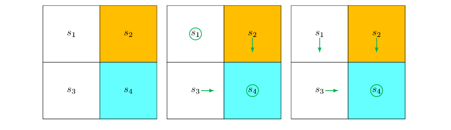

## 4.1. 价值迭代

本章介绍的算法被称为**动态规划**算法，这些算法需要系统模型。这些算法是后续章节中介绍的无模型强化学习算法的重要基础。例如，通过扩展本章介绍的策略迭代算法，可以直接得到第 5 章中介绍的蒙特卡洛算法。

### 4.1 价值迭代

本节介绍**价值迭代**算法。它正是上一章（定理 3.3）介绍的，由压缩映射定理建议的用于求解贝尔曼最优方程的算法。具体来说，该算法是：

$$
v_{k+1} = \max_{\pi \in \Pi} (r_{\pi} + \gamma P_{\pi} v_k), \quad k = 0, 1, 2, ...
$$

定理 3.3 保证了当 $k \to \infty$ 时，$v_k$ 和 $\pi_k$ 分别收敛到最优状态价值和一个最优策略。

该算法是迭代的，在每次迭代中包含两个步骤。每次迭代的第一步是**策略更新**步骤。在数学上，它旨在找到一个能够解决以下优化问题的策略：

$$
\pi_{k+1} = \arg \max_{\pi} (r_{\pi} + \gamma P_{\pi} v_k)
$$

其中 $v_k$ 是在上次迭代中获得的。第二步被称为**价值更新**步骤。在数学上，它通过以下方式计算一个新的价值 $v_{k+1}$：

$$
v_{k+1} = r_{\pi_{k+1}} + \gamma P_{\pi_{k+1}} v_k \quad (4.1)
$$

其中 $v_{k+1}$ 将用于下一次迭代。

上面介绍的价值迭代算法是矩阵-向量形式的。为了实现这个算法，我们需要进一步研究其逐元素形式。虽然矩阵-向量形式有助于理解算法的核心思想，但逐元素形式对于解释实现细节是必要的。

#### 4.1.1 逐元素形式与实现

考虑时间步 $k$ 和状态 $s$。
首先，**策略更新**步骤 $\pi_{k+1} = \arg \max_{\pi} (r_{\pi} + \gamma P_{\pi} v_k)$ 的逐元素形式是：

$$
\pi_{k+1}(s) = \arg \max_{\pi} \sum_a \pi(a|s) \underbrace{\left( \sum_r p(r|s,a)r + \gamma \sum_{s'} p(s'|s,a)v_k(s') \right)}_{q_k(s,a)}, \quad s \in S.
$$

我们在 3.3.1 节中已经表明，能够解决上述优化问题的最优策略是

$$
\pi_{k+1}(a|s) = \begin{cases} 1, & a=a^*_k(s), \\ 0, & a \neq a^*_k(s), \end{cases} \quad (4.2)
$$

其中 $a^*_k(s) = \arg \max_a q_k(s,a)$。如果 $a^*_k(s) = \arg \max_a q_k(s,a)$ 有多个解，我们可以选择其中任何一个，而不会影响算法的收敛性。由于新策略 $\pi_{k+1}$ 选择了具有最大 $q_k(s,a)$ 的动作，这样的策略被称为**贪婪**策略。

其次，**价值更新**步骤 $v_{k+1} = r_{\pi_{k+1}} + \gamma P_{\pi_{k+1}} v_k$ 的逐元素形式是

$$
v_{k+1}(s) = \sum_a \pi_{k+1}(a|s) \underbrace{\left( \sum_r p(r|s,a)r + \gamma \sum_{s'} p(s'|s,a)v_k(s') \right)}_{q_k(s,a)}, \quad s \in S.
$$

将 (4.2) 代入上式可得

$$
v_{k+1}(s) = \max_a q_k(s,a).
$$

综上所述，以上步骤可以概括为

$$
v_k(s) \to q_k(s,a) \to \text{新的贪婪策略} \pi_{k+1}(s) \to \text{新的价值} v_{k+1}(s) = \max_a q_k(s,a)
$$

实现细节总结在算法 4.1 中。

一个可能会让人困惑的问题是，(4.1) 中的 $v_k$ 是否是状态价值。答案是否定的。尽管 $v_k$ 最终会收敛到最优状态价值，但它并不保证满足任何策略的贝尔曼方程。例如，它通常不满足 $v_k = r_{\pi_{k+1}} + \gamma P_{\pi_{k+1}} v_k$ 或 $v_k = r_{\pi_k} + \gamma P_{\pi_k} v_k$。它仅仅是算法生成的一个中间值。此外，由于 $v_k$ 不是状态价值，所以 $q_k$ 也不是动作价值。

#### 4.1.2 示例说明

接下来，我们通过一个例子来说明价值迭代算法的逐步实现。这个例子是一个二乘二的网格，其中有一个禁区。目标区域是 $s_4$。奖励设置为 $r_{boundary} = r_{forbidden} = -1$ 和 $r_{target} = 1$。折扣率为 $\gamma=0.9$。

---

**算法 4.1：价值迭代算法**

**初始化：**
所有 $(s, a)$ 的概率模型 $p(r|s,a)$ 和 $p(s'|s,a)$ 已知。
初始猜测 $v_0$。

**目标：**
寻找最优状态价值和最优策略以求解贝尔曼最优方程。

**当 $v_k$ 尚未收敛（即 $\|v_k - v_{k-1}\|$ 大于预定义的小阈值）时，对于第 $k$ 次迭代，执行：**

**对于每个状态 $s \in S$，执行：**

- **对于每个动作 $a \in A(s)$，执行：**
  - **q-值：** $q_k(s,a) = \sum_r p(r|s,a)r + \gamma \sum_{s'} p(s'|s,a)v_k(s')$
- **最大动作价值：** $a^*_k(s) = \arg \max_a q_k(s,a)$
- **策略更新：** 如果 $a=a^*_k$，则 $\pi_{k+1}(a|s) = 1$，否则 $\pi_{k+1}(a|s) = 0$
- **价值更新：** $v_{k+1}(s) = \max_a q_k(s,a)$

---

该示例的网格布局和策略演变过程在原始文本的图 4.1 中有可视化展示。每个状态-动作对的 q-值表达式如表 4.1 所示。

|                                                | $a_1$                | $a_2$                | $a_3$                | $a_4$                | $a_5$                |
| :--------------------------------------------- | :--------------------- | :--------------------- | :--------------------- | :--------------------- | :--------------------- |
| **s1**                                   | $-1 + \gamma v(s_1)$ | $-1 + \gamma v(s_2)$ | $0 + \gamma v(s_3)$  | $-1 + \gamma v(s_1)$ | $0 + \gamma v(s_1)$  |
| **s2**                                   | $-1 + \gamma v(s_2)$ | $-1 + \gamma v(s_2)$ | $1 + \gamma v(s_4)$  | $0 + \gamma v(s_1)$  | $-1 + \gamma v(s_2)$ |
| **s3**                                   | $0 + \gamma v(s_1)$  | $1 + \gamma v(s_4)$  | $-1 + \gamma v(s_3)$ | $-1 + \gamma v(s_3)$ | $0 + \gamma v(s_3)$  |
| **s4**                                   | $-1 + \gamma v(s_2)$ | $-1 + \gamma v(s_4)$ | $-1 + \gamma v(s_4)$ | $0 + \gamma v(s_3)$  | $1 + \gamma v(s_4)$  |
| **表 4.1：示例中 $q(s,a)$ 的表达式。** |                        |                        |                        |                        |                        |

##### k = 0:

不失一般性，选择初始值为 $v_0(s_1) = v_0(s_2) = v_0(s_3) = v_0(s_4) = 0$。

**q-值计算：** 将 $v_0(s_i)$ 代入表 4.1，得到如表 4.2 所示的 q-值。

|                                            | $a_1$ | $a_2$ | $a_3$ | $a_4$ | $a_5$ |
| :----------------------------------------- | :------ | :------ | :------ | :------ | :------ |
| **s1**                               | -1      | -1      | 0       | -1      | 0       |
| **s2**                               | -1      | -1      | 1       | 0       | -1      |
| **s3**                               | 0       | 1       | -1      | -1      | 0       |
| **s4**                               | -1      | -1      | -1      | 0       | 1       |
| **表 4.2：k=0 时 $q(s,a)$ 的值。** |         |         |         |         |         |

**策略更新：** 通过为每个状态选择 q-值最大的动作来获得 $\pi_1$：

$$
\pi_1(a_5|s_1) = 1, \quad \pi_1(a_3|s_2) = 1, \quad \pi_1(a_2|s_3) = 1, \quad \pi_1(a_5|s_4) = 1.
$$

这个策略在原始文本的图 4.1 的中间子图中有可视化展示。很明显，这个策略不是最优的，因为它在 $s_1$ 处选择原地不动。值得注意的是，$(s_1, a_5)$ 和 $(s_1, a_3)$ 的 q-值实际上是相同的，我们可以随机选择其中一个动作。

**价值更新：** 通过将每个状态的 v-值更新为最大的 q-值来获得 $v_1$：

$$
v_1(s_1) = 0, \quad v_1(s_2) = 1, \quad v_1(s_3) = 1, \quad v_1(s_4) = 1.
$$

##### k = 1:

**q-值计算：** 将 $v_1(s_i)$ 代入表 4.1，得到如表 4.3 所示的 q-值。

|                                            | $a_1$                 | $a_2$                 | $a_3$                 | $a_4$                 | $a_5$                 |
| :----------------------------------------- | :---------------------- | :---------------------- | :---------------------- | :---------------------- | :---------------------- |
| **s1**                               | $-1 + \gamma \cdot 0$ | $-1 + \gamma \cdot 1$ | $0 + \gamma \cdot 1$  | $-1 + \gamma \cdot 0$ | $0 + \gamma \cdot 0$  |
| **s2**                               | $-1 + \gamma \cdot 1$ | $-1 + \gamma \cdot 1$ | $1 + \gamma \cdot 1$  | $0 + \gamma \cdot 0$  | $-1 + \gamma \cdot 1$ |
| **s3**                               | $0 + \gamma \cdot 0$  | $1 + \gamma \cdot 1$  | $-1 + \gamma \cdot 1$ | $-1 + \gamma \cdot 1$ | $0 + \gamma \cdot 1$  |
| **s4**                               | $-1 + \gamma \cdot 1$ | $-1 + \gamma \cdot 1$ | $-1 + \gamma \cdot 1$ | $0 + \gamma \cdot 1$  | $1 + \gamma \cdot 1$  |
| **表 4.3：k=1 时 $q(s,a)$ 的值。** |                         |                         |                         |                         |                         |

**策略更新：** 通过选择最大的 q-值获得 $\pi_2$：

$$
\pi_2(a_3|s_1) = 1, \quad \pi_2(a_3|s_2) = 1, \quad \pi_2(a_2|s_3) = 1, \quad \pi_2(a_5|s_4) = 1.
$$

这个策略在原始文本的图 4.1 的右侧子图中有可视化展示。

**价值更新：** 通过将每个状态的 v-值更新为最大的 q-值来获得 $v_2$：

$$
v_2(s_1) = \gamma \cdot 1, \quad v_2(s_2) = 1 + \gamma \cdot 1, \quad v_2(s_3) = 1 + \gamma \cdot 1, \quad v_2(s_4) = 1 + \gamma \cdot 1.
$$

##### k = 2, 3, 4, ...

值得注意的是，如原始文本图 4.1 所示的策略 $\pi_2$ 已经是最优的了。因此，在这个简单的例子中，我们只需要运行两次迭代就可以获得最优策略。对于更复杂的例子，我们需要运行更多的迭代，直到 $v_k$ 的值收敛（例如，直到 $\|v_{k+1} - v_k\|$ 小于预先设定的阈值）。

## 4.2 策略迭代

本节介绍另一个重要的算法：**策略迭代**。与价值迭代不同，策略迭代不直接用于求解贝尔曼最优方程。然而，它与价值迭代有着密切的关系，后面将会展示。此外，策略迭代的思想非常重要，因为它在强化学习算法中被广泛使用。

### 4.2.1 算法分析

策略迭代是一种迭代算法。每次迭代有两个步骤。

第一步是**策略评估**步骤。顾名思义，这一步通过计算相应的状态价值来评估一个给定的策略。也就是说，求解下面的贝尔曼方程：

$$
v_{\pi_k} = r_{\pi_k} + \gamma P_{\pi_k} v_{\pi_k}, \quad (4.3)
$$

其中 $\pi_k$ 是上一次迭代中得到的策略，$v_{\pi_k}$ 是待计算的状态价值。$r_{\pi_k}$ 和 $P_{\pi_k}$ 的值可以从系统模型中获得。

第二步是**策略改进**步骤。顾名思义，这一步用于改进策略。具体来说，一旦在第一步中计算出了 $v_{\pi_k}$，就可以得到一个新的策略 $\pi_{k+1}$，如下所示：

$$
\pi_{k+1} = \arg \max_{\pi} (r_{\pi} + \gamma P_{\pi} v_{\pi_k}).
$$

在上述算法描述之后，自然会产生三个问题。

1. 在策略评估步骤中，如何求解状态价值 $v_{\pi_k}$？
2. 在策略改进步骤中，为什么新策略 $\pi_{k+1}$ 比 $\pi_k$ 更好？
3. 为什么这个算法最终能收敛到最优策略？

接下来我们逐一回答这些问题。

**在策略评估步骤中，如何计算 $v_{\pi_k}$？**

我们在第 2 章中介绍了两种求解 (4.3) 中贝尔曼方程的方法。我们在此简要回顾这两种方法。第一种方法是**封闭形式解**：

$$
v_{\pi_k} = (I - \gamma P_{\pi_k})^{-1} r_{\pi_k}.
$$

这个封闭形式解对于理论分析很有用，但实现效率不高，因为它需要其他数值算法来计算矩阵的逆。第二种方法是一种可以轻松实现的**迭代算法**：

$$
v^{(j+1)}_{\pi_k} = r_{\pi_k} + \gamma P_{\pi_k} v^{(j)}_{\pi_k}, \quad j = 0, 1, 2, ... \quad (4.4)
$$

其中 $v^{(j)}_{\pi_k}$ 表示对 $v_{\pi_k}$ 的第 $j$ 次估计。从任何初始猜测 $v^{(0)}_{\pi_k}$ 开始，可以保证当 $j \to \infty$ 时，$v^{(j)}_{\pi_k} \to v_{\pi_k}$。详情可见 2.7 节。

有趣的是，策略迭代是一个迭代算法，其策略评估步骤中嵌入了另一个迭代算法 (4.4)。理论上，这个嵌入的迭代算法需要**无限**次步骤（即 $j \to \infty$）才能收敛到真实的状态价值 $v_{\pi_k}$。然而，这在现实中是不可能实现的。在实践中，当满足某个特定准则时，迭代过程就会终止。例如，终止准则可以是 $\|v^{(j+1)}_{\pi_k} - v^{(j)}_{\pi_k}\|$ 小于预设的阈值，或者 $j$ 超过预设的值。

如果我们不运行无限次迭代，我们只能得到一个不精确的 $v_{\pi_k}$ 值，这个值将在后续的策略改进步骤中使用。这会导致问题吗？答案是否定的。原因将在稍后 4.3 节介绍截断策略迭代算法时变得清晰。

**在策略改进步骤中，为什么 $\pi_{k+1}$ 比 $\pi_k$ 更好？**

策略改进步骤可以改进给定的策略，如下所示。

**引理 4.1 (策略改进).** 如果 $\pi_{k+1} = \arg \max_{\pi} (r_{\pi} + \gamma P_{\pi} v_{\pi_k})$，那么 $v_{\pi_{k+1}} \ge v_{\pi_k}$。

这里，$v_{\pi_{k+1}} \ge v_{\pi_k}$ 意味着对于所有的 $s$，都有 $v_{\pi_{k+1}}(s) \ge v_{\pi_k}(s)$。该引理的证明在框 4.1 中给出。

---

**框 4.1：引理 4.1 的证明**

因为 $v_{\pi_{k+1}}$ 和 $v_{\pi_k}$ 是状态价值，它们满足贝尔曼方程：

$$
v_{\pi_{k+1}} = r_{\pi_{k+1}} + \gamma P_{\pi_{k+1}} v_{\pi_{k+1}},
$$

$$
v_{\pi_k} = r_{\pi_k} + \gamma P_{\pi_k} v_{\pi_k}.
$$

因为 $\pi_{k+1} = \arg \max_{\pi} (r_{\pi} + \gamma P_{\pi} v_{\pi_k})$，我们知道

$$
r_{\pi_{k+1}} + \gamma P_{\pi_{k+1}} v_{\pi_k} \ge r_{\pi_k} + \gamma P_{\pi_k} v_{\pi_k}.
$$

由此可得

$$
v_{\pi_k} - v_{\pi_{k+1}} = (r_{\pi_k} + \gamma P_{\pi_k} v_{\pi_k}) - (r_{\pi_{k+1}} + \gamma P_{\pi_{k+1}} v_{\pi_{k+1}})
$$

$$
\le (r_{\pi_{k+1}} + \gamma P_{\pi_{k+1}} v_{\pi_k}) - (r_{\pi_{k+1}} + \gamma P_{\pi_{k+1}} v_{\pi_{k+1}})
$$

$$
\le \gamma P_{\pi_{k+1}} (v_{\pi_k} - v_{\pi_{k+1}}).
$$

因此，

$$
v_{\pi_k} - v_{\pi_{k+1}} \le \gamma^2 P^2_{\pi_{k+1}} (v_{\pi_k} - v_{\pi_{k+1}}) \le ... \le \gamma^n P^n_{\pi_{k+1}} (v_{\pi_k} - v_{\pi_{k+1}})
$$

$$
\le \lim_{n \to \infty} \gamma^n P^n_{\pi_{k+1}} (v_{\pi_k} - v_{\pi_{k+1}}) = 0.
$$

这个极限是由于当 $n \to \infty$ 时 $\gamma^n \to 0$ 且对于任何 $n$，$P^n_{\pi_{k+1}}$ 都是一个非负随机矩阵。这里，随机矩阵指的是一个非负矩阵，其所有行的行和都等于 1。

---

**为什么策略迭代算法最终能找到最优策略？**

策略迭代算法生成两个序列。第一个是策略序列：$\{ \pi_0, \pi_1, ..., \pi_k, ... \}$。第二个是状态价值序列：$\{ v_{\pi_0}, v_{\pi_1}, ..., v_{\pi_k}, ... \}$。

假设 $v^*$ 是最优状态价值。那么，对于所有的 $k$ 都有 $v_{\pi_k} \le v^*$。由于根据引理 4.1，策略是持续改进的，我们知道

$$
v_{\pi_0} \le v_{\pi_1} \le v_{\pi_2} \le \dots \le v_{\pi_k} \le \dots \le v^*.
$$

因为 $v_{\pi_k}$ 是非递减的且总是有上界 $v^*$，根据单调收敛定理 [12]（附录 C），当 $k \to \infty$ 时，$v_{\pi_k}$ 收敛到一个常数值，记为 $v_{\infty}$。下面的分析表明 $v_{\infty} = v^*$。

**定理 4.1 (策略迭代的收敛性).** 由策略迭代算法生成的状态价值序列 $\{v_{\pi_k}\}_{k=0}^{\infty}$ 收敛到最优状态价值 $v^*$。因此，策略序列 $\{ \pi_k \}_{k=0}^{\infty}$ 收敛到一个最优策略。

该定理的证明在框 4.2 中给出。该证明不仅显示了策略迭代算法的收敛性，还揭示了策略迭代和价值迭代算法之间的关系。粗略地说，如果两种算法从相同的初始猜测开始，由于策略评估步骤中嵌入了额外的迭代，策略迭代会比价值迭代收敛得更快。当我们在 4.3 节介绍截断策略迭代算法时，这一点会变得更加清晰。

---

**框 4.2：定理 4.1 的证明**

证明的思路是表明策略迭代算法比价值迭代算法收敛得更快。

具体来说，为了证明 $\{v_{\pi_k}\}_{k=0}^{\infty}$ 的收敛性，我们引入另一个由下式生成的序列 $\{v_k\}_{k=0}^{\infty}$：

$$
v_{k+1} = f(v_k) = \max_{\pi} (r_{\pi} + \gamma P_{\pi} v_k).
$$

这个迭代算法正是价值迭代算法。我们已经知道，对于任何初始值 $v_0$，$v_k$ 都会收敛到 $v^*$。

对于 $k=0$，我们总能找到一个 $v_0$ 使得对于任何 $\pi_0$ 都有 $v_{\pi_0} \ge v_0$。

接下来我们用归纳法证明对于所有的 $k$ 都有 $v_k \le v_{\pi_k} \le v^*$。

对于 $k \ge 0$，假设 $v_{\pi_k} \ge v_k$。

对于 $k+1$，我们有

$$
v_{\pi_{k+1}} - v_{k+1} = (r_{\pi_{k+1}} + \gamma P_{\pi_{k+1}} v_{\pi_{k+1}}) - \max_{\pi} (r_{\pi} + \gamma P_{\pi} v_k)
$$

$$
\ge (r_{\pi_{k+1}} + \gamma P_{\pi_{k+1}} v_{\pi_k}) - \max_{\pi} (r_{\pi} + \gamma P_{\pi} v_k) \quad (\text{因为根据引理 4.1 } v_{\pi_{k+1}} \ge v_{\pi_k} \text{ 且 } P_{\pi_{k+1}} \ge 0)
$$

$$
= (r_{\pi_{k+1}} + \gamma P_{\pi_{k+1}} v_{\pi_k}) - (r_{\pi'_k} + \gamma P_{\pi'_k} v_k) \quad (\text{假设 } \pi'_k = \arg\max_{\pi} (r_{\pi} + \gamma P_{\pi} v_k))
$$

$$
\ge (r_{\pi'_k} + \gamma P_{\pi'_k} v_{\pi_k}) - (r_{\pi'_k} + \gamma P_{\pi'_k} v_k) \quad (\text{因为 } \pi_{k+1} = \arg\max_{\pi} (r_{\pi} + \gamma P_{\pi} v_{\pi_k}))
$$

$$
= \gamma P_{\pi'_k} (v_{\pi_k} - v_k).
$$

因为 $v_{\pi_k} - v_k \ge 0$ 且 $P_{\pi'_k}$ 是非负的，我们有 $P_{\pi'_k} (v_{\pi_k} - v_k) \ge 0$，因此 $v_{\pi_{k+1}} - v_{k+1} \ge 0$。

因此，我们可以通过归纳法证明对于任何 $k \ge 0$ 都有 $v_k \le v_{\pi_k} \le v^*$。由于 $v_k$ 收敛到 $v^*$，所以 $v_{\pi_k}$ 也收敛到 $v^*$。

---

### 4.2.2 逐元素形式与实现

为了实现策略迭代算法，我们需要研究其逐元素形式。

首先，**策略评估**步骤通过使用 (4.4) 中的迭代算法从 $v_{\pi_k} = r_{\pi_k} + \gamma P_{\pi_k} v_{\pi_k}$ 求解 $v_{\pi_k}$。该算法的逐元素形式是

$$
v^{(j+1)}_{\pi_k}(s) = \sum_a \pi_k(a|s) \left( \sum_r p(r|s,a)r + \gamma \sum_{s'} p(s'|s,a)v^{(j)}_{\pi_k}(s') \right), \quad s \in S,
$$

其中 $j=0, 1, 2, ...$。

其次，**策略改进**步骤求解 $\pi_{k+1} = \arg \max_{\pi} (r_{\pi} + \gamma P_{\pi} v_{\pi_k})$。该方程的逐元素形式是

$$
\pi_{k+1}(s) = \arg \max_{\pi} \sum_a \pi(a|s) \underbrace{\left( \sum_r p(r|s,a)r + \gamma \sum_{s'} p(s'|s,a)v_{\pi_k}(s') \right)}_{q_{\pi_k}(s,a)}, \quad s \in S,
$$

其中 $q_{\pi_k}(s,a)$ 是策略 $\pi_k$ 下的动作价值。令 $a^*_k(s) = \arg \max_a q_{\pi_k}(s,a)$。那么，贪婪最优策略是

$$
\pi_{k+1}(a|s) = \begin{cases} 1, & a=a^*_k(s), \\ 0, & a \neq a^*_k(s). \end{cases}
$$

实现细节总结在算法 4.2 中。

---

**算法 4.2：策略迭代算法**

**初始化：**

- 系统模型，$p(r|s,a)$ 和 $p(s'|s,a)$ 对所有 $(s,a)$ 已知。
- 初始猜测 $\pi_0$。

**目标：**

- 寻找最优状态价值和最优策略。

**当 $v_{\pi_k}$ 尚未收敛时，对于第 $k$ 次迭代，执行：**

- **策略评估：**

  - **初始化：** 一个任意的初始猜测 $v^{(0)}_{\pi_k}$。
  - **当 $v^{(j)}_{\pi_k}$ 尚未收敛时，对于第 $j$ 次迭代，执行：**
    - **对于每个状态 $s \in S$，执行：**
      $$
      v^{(j+1)}_{\pi_k}(s) = \sum_a \pi_k(a|s) \left[ \sum_r p(r|s,a)r + \gamma \sum_{s'} p(s'|s,a)v^{(j)}_{\pi_k}(s') \right]
      $$
- **策略改进：**

  - **对于每个状态 $s \in S$，执行：**
    - **对于每个动作 $a \in A$，执行：**
      $$
      q_{\pi_k}(s,a) = \sum_r p(r|s,a)r + \gamma \sum_{s'} p(s'|s,a)v_{\pi_k}(s')
      $$
    - $$
      a^*_k(s) = \arg \max_a q_{\pi_k}(s,a)
      $$
    - 如果 $a=a^*_k$，则 $\pi_{k+1}(a|s) = 1$，否则 $\pi_{k+1}(a|s) = 0$

---
