# 第 5 章

## 蒙特卡洛方法

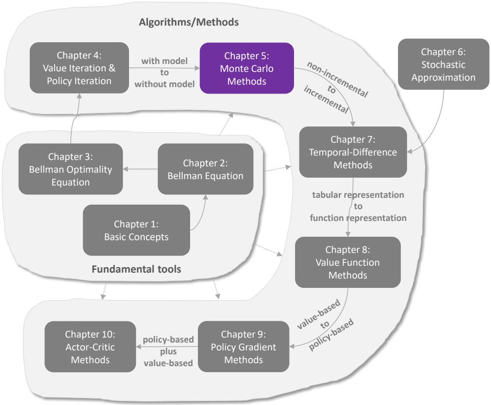
图 5.1：我们在本书中的位置

在上一章中，我们介绍了能够基于系统模型寻找最优策略的算法。本章开始，我们将介绍不预设系统模型的无模型强化学习算法。

虽然这是本书首次引入无模型算法，但我们需要填补一个知识空白：如何在无模型情况下寻找最优策略？其理念很简单：如果没有模型，就必须有数据；如果没有数据，就必须有模型。如果两者皆无，则无法找到最优策略。强化学习中的"数据"通常指智能体与环境的交互经验。

为展示如何从数据而非模型中学习，本章首先介绍均值估计问题——通过样本估计随机变量的期望值。理解该问题对于掌握从数据学习的核心理念至关重要。

随后我们将介绍三种基于蒙特卡洛（MC）方法的算法。这些算法能够从经验样本中学习最优策略。首个也是最简单的算法称为MC Basic，可通过修改上一章的策略迭代算法直接获得。理解该算法对于掌握基于MC的强化学习基本思想至关重要。通过扩展该算法，我们进一步介绍了另外两种更复杂但更高效的算法。

### 5.1 示例引入：均值估计

接下来我们介绍均值估计问题，以展示如何从数据中学习而非从模型中学习。我们将看到，均值估计可以通过蒙特卡洛方法实现，这类技术泛指使用随机样本来解决估计问题的广泛方法。读者可能会疑惑为何要关注均值估计问题。这仅仅是因为状态值和动作值都被定义为回报的均值。估计状态值或动作值实际上就是一个均值估计问题。

考虑一个随机变量 $X$，其取值来自一个有限的实数集合 $\mathcal{X}$。假设我们的任务是计算 $X$ 的均值或期望值：$\mathbb{E}[X]$。有两种方法可以计算 $\mathbb{E}[X]$：

- **第一种方法是基于模型的**。这里的模型指的是 $X$ 的概率分布。如果模型已知，则可以直接根据期望值的定义计算均值：

  $$
  \mathbb{E}[X] = \sum_{x \in \mathcal{X}} p(x) x.
  $$

  在本书中，我们交替使用期望值、均值和平均值这些术语。
- **第二种方法是免模型的**。当 $X$ 的概率分布（即模型）未知时，假设我们有一些 $X$ 的样本 $\{x_1, x_2, \ldots, x_n\}$。那么，均值可以近似为

  $$
  \mathbb{E}[X] \approx \bar{x} = \frac{1}{n} \sum_{j=1}^{n} x_j.
  $$

  当 $n$ 较小时，这种近似可能不准确。但随着 $n$ 增大，近似会变得越来越精确。当 $n \to \infty$ 时，有 $\bar{x} \to \mathbb{E}[X]$：

  这一点由大数定律保证：大量样本的平均值会接近期望值。大数定律在专栏 5.1 中介绍。

以下示例说明了上述两种方法。考虑一个抛硬币游戏。令随机变量 $X$ 表示硬币落地时朝上的一面。$X$ 有两个可能的值：当正面朝上时 $X = 1$，当反面朝上时 $X = -1$。假设 $X$ 的真实概率分布（即模型）为

$$
p(X = 1) = 0.5, \quad p(X = -1) = 0.5.
$$

如果概率分布已知，我们可以直接计算均值为

$$
\mathbb{E}[X] = 0.5 \cdot 1 + 0.5 \cdot (-1) = 0.
$$

如果概率分布未知，那么我们可以多次抛硬币并记录抽样结果 $\{x_i\}_{i=1}^{n}$。通过计算样本的平均值，我们可以得到均值的估计。如图 5.2 所示，随着样本数量的增加，估计的均值变得越来越精确。

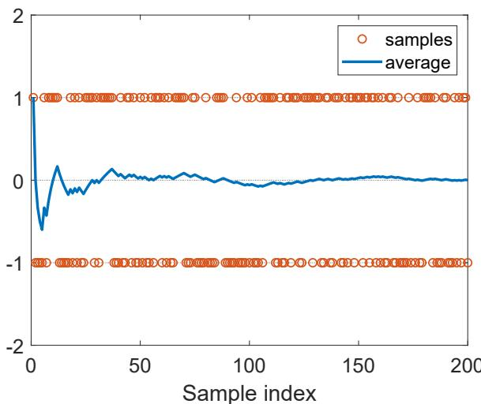
**图 5.2：** 演示大数定律的示例。此处样本从 $\{+1, -1\}$ 中按照均匀分布抽取。随着样本数量的增加，样本的平均值逐渐收敛到零，即真实的期望值。

值得一提的是，用于均值估计的样本必须是独立同分布的。否则，如果抽样值之间存在相关性，可能无法正确估计期望值。一个极端情况是，无论第一个样本值是多少，所有后续样本值都与第一个相同。在这种情况下，无论我们使用多少样本，样本的平均值始终等于第一个样本值。

### 5.1：大数定律

对于随机变量 $X$，假设 $\{ x _ { i } \} _ { i = 1 } ^ { n }$ 是若干独立同分布样本。令 $\bar { x } = \frac { 1 } { n } \sum _ { i = 1 } ^ { n } x _ { i }$ 表示样本均值。则有：

$$
\begin{aligned}
\mathbb{E}[\bar{x}] &= \mathbb{E}[X], \\
\mathrm{var}[\bar{x}] &= \frac{1}{n} \mathrm{var}[X].
\end{aligned}
$$

上述两个等式表明 $\bar{x}$ 是 $\mathbb{E}[X]$ 的无偏估计，且其方差随着 $n$ 趋于无穷大而趋近于零。

证明如下。

**首先，**

$$
\mathbb{E}[\bar{x}] = \mathbb{E}\left[ \sum_{i=1}^{n} x_i / n \right] = \sum_{i=1}^{n} \mathbb{E}[x_i] / n = \mathbb{E}[X],
$$

最后一个等号成立是因为样本同分布（即 $\mathbb{E}[x_i] = \mathbb{E}[X]$）。

**其次，**

$$
\begin{aligned}
\mathrm{var}(\bar{x}) &= \mathrm{var}\left[ \sum_{i=1}^{n} x_i / n \right] \\
&= \sum_{i=1}^{n} \mathrm{var}[x_i] / n^2 \\
&= (n \cdot \mathrm{var}[X]) / n^2 \\
&= \mathrm{var}[X] / n,
\end{aligned}
$$

其中第二个等号成立是因为样本相互独立，第三个等号成立是因为样本同分布（即 $\mathrm{var}[x_i] = \mathrm{var}[X]$）。

### **5.2 MC 基础：最简单的基于 MC 的算法**

本节介绍第一个也是最简单的基于蒙特卡洛的强化学习算法。该算法通过将第 4.2 节介绍的策略迭代算法中基于模型的策略评估步骤替换为无模型的 MC 估计步骤而得到。

#### 5.2.1 将策略迭代转换为无模型方法

策略迭代算法（参见第4.2节）的每次迭代包含两个步骤。第一步是策略评估，旨在通过求解 $v_{\pi_k} = r_{\pi_k} + \gamma P_{\pi_k} v_{\pi_k}$ 来计算 $v_{\pi_k}$。第二步是策略改进，旨在计算贪婪策略 $\pi_{k+1} = \arg \max_{\pi} (r_{\pi} + \gamma P_{\pi} v_{\pi_k})$。策略改进步骤的逐元素形式为：

$$
\begin{aligned}
\pi_{k+1}(s) &= \arg \max_{\pi} \sum_{a} \pi(a|s) \left[ \sum_{r} p(r|s,a)r + \gamma \sum_{s^{\prime}} p(s^{\prime}|s,a) v_{\pi_k}(s^{\prime}) \right] \\
&= \arg \max_{\pi} \sum_{a} \pi(a|s) q_{\pi_k}(s,a), \quad s \in \mathcal{S}.
\end{aligned}
$$

必须注意，动作价值函数是这两个步骤的核心。具体而言，在第一步中，计算状态价值函数的目的是为了计算动作价值函数。在第二步中，新策略是基于计算得到的动作价值函数生成的。让我们重新思考如何计算动作价值函数。有两种可用方法。

$\diamond$ **第一种是基于模型的方法**。这是策略迭代算法采用的方法。具体来说，我们可以首先通过求解贝尔曼方程来计算状态价值 $v_{\pi_k}$。然后，我们可以使用以下公式计算动作价值：

$$
q_{\pi_k}(s,a) = \sum_{r} p(r|s,a)r + \gamma \sum_{s^{\prime}} p(s^{\prime}|s,a) v_{\pi_k}(s^{\prime}).
$$

这种方法需要已知系统模型 $\{p(r|s,a), p(s^{\prime}|s,a)\}$。

$\diamond$ **第二种是无模型方法**。回顾动作价值函数的定义：

$$
\begin{aligned}
q_{\pi_k}(s,a) &= \mathbb{E}[G_t | S_t = s, A_t = a] \\
&= \mathbb{E}[R_{t+1} + \gamma R_{t+2} + \gamma^2 R_{t+3} + \ldots | S_t = s, A_t = a],
\end{aligned}
$$

这是从 $(s,a)$ 出发所获得的期望回报。由于 $q_{\pi_k}(s,a)$ 是一个期望值，它可以如第5.1节所示通过蒙特卡洛方法进行估计。为此，从 $(s,a)$ 出发，智能体可以遵循策略 $\pi_k$ 与环境交互，然后获得一定数量的路径。假设有 $n$ 个路径，且第 $i$ 个路径的回报为 $g_{\pi_k}^{(i)}(s,a)$。那么，$q_{\pi_k}(s,a)$ 可以近似为：

$$
q_{\pi_k}(s,a) = \mathbb{E}[G_t | S_t = s, A_t = a] \approx \frac{1}{n} \sum_{i=1}^{n} g_{\pi_k}^{(i)}(s,a).
$$

我们已经知道，如果路径的数量 $n$ 足够大，根据大数定律，该近似将足够精确。

基于蒙特卡洛的强化学习的基本思想是使用无模型方法来估计动作价值函数，如公式(5.2)所示，以取代策略迭代算法中基于模型的方法。

#### 5.2.2 MC Basic 算法

我们现在准备介绍第一个基于蒙特卡洛的强化学习算法。从初始策略 $\pi_0$ 开始，该算法在第 $k$ 次迭代（$k = 0, 1, 2, \ldots$）中包含两个步骤：

**步骤 1：策略评估**

此步骤用于估计所有 $(s, a)$ 的 $q_{\pi_k}(s, a)$。具体来说，对于每个 $(s, a)$，我们收集足够多的路径，并使用回报的平均值（记为 $q_k(s, a)$）来近似 $q_{\pi_k}(s, a)$。

**步骤 2：策略改进**

此步骤对所有 $s \in S$ 求解：

$$
\pi_{k+1}(s) = \arg \max_{\pi} \sum_a \pi(a|s) q_k(s, a)
$$

贪心最优策略为 $\pi_{k+1}(a_k^*|s) = 1$，其中 $a_k^* = \arg \max_a q_k(s, a)$。

这是最简单的基于蒙特卡洛的强化学习算法，本书称之为 MC Basic。MC Basic 算法的伪代码在算法 5.1 中给出。可以看出，它与策略迭代算法非常相似。唯一的区别在于它直接从经验样本计算动作值，而策略迭代首先计算状态值，然后基于系统模型计算动作值。需要注意的是，无模型算法直接估计动作值。否则，如果它估计的是状态值，我们仍然需要使用系统模型根据这些状态值计算动作值，如 (5.1) 所示。

由于策略迭代是收敛的，当给定足够样本时，MC Basic 也是收敛的。也就是说，对于每个 $(s, a)$，假设有足够多的路径从 $(s, a)$ 开始。那么，这些路径的回报的平均值可以准确近似 $(s, a)$ 的动作值。在实践中，我们通常没有足够多的路径覆盖每个 $(s, a)$。因此，动作值的近似可能不准确。尽管如此，该算法通常仍然可以工作。这与截断策略迭代算法类似，在后者中动作值也没有被精确计算。

最后，MC Basic 过于简单，样本效率低，因此不实用。我们介绍此算法的目的是让读者掌握基于蒙特卡洛的强化学习的核心思想。在学习本章后面介绍的更复杂算法之前，理解好这个算法非常重要。我们将看到，通过扩展 MC Basic 算法，可以轻松获得更复杂且样本效率更高的算法。

---

**算法 5.1: MC Basic（策略迭代的无模型变体）**

**初始化：** 初始猜测 $\pi_0$

**目标：** 搜索最优策略

**对于** 第 $k$ 次迭代（$k = 0, 1, 2, \ldots$），**执行**：

- **对于** 每个状态 $s \in S$，**执行**：
  - **对于** 每个动作 $a \in A(s)$，**执行**：
    - 遵循 $\pi_k$ 收集从 $(s, a)$ 开始的足够多的路径
    - **策略评估：**
      - $q_{\pi_k}(s, a) \approx q_k(s, a) =$ 所有从 $(s, a)$ 开始的路径的平均回报
  - **策略改进：**
    - 基于估计的动作值更新策略

#### 5.2.3 示例说明

**简单示例：分步实现**

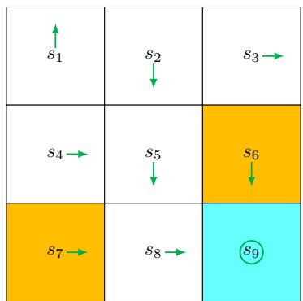
**图 5.3:** 用于说明 MC Basic 算法的示例。

接下来我们通过一个示例来演示 MC Basic 算法的实现细节。奖励设置为 $r_{\mathrm{boundary}} = r_{\mathrm{forbidden}} = -1$ 和 $r_{\mathrm{target}} = 1$。折扣率为 $\gamma = 0.9$。初始策略 $\pi_0$ 如图 5.3 所示。该初始策略对于 $s_1$ 或 $s_3$ 并非最优。

虽然需要计算所有动作值，但由于篇幅限制，我们仅展示 $s_1$ 的动作值计算。在 $s_1$ 处有五个可能的动作。对于每个动作，我们需要收集足够长的多个路径来有效近似动作值。然而，由于该示例在策略和模型方面都是确定性的，多次运行会生成相同的轨迹。因此，每个动作值的估计仅需单个路径。

遵循 $\pi_0$，我们可以分别从 $(s_1, a_1)$、$(s_1, a_2)$、...、$(s_1, a_5)$ 出发得到以下路径：

- **从 $(s_1, a_1)$ 开始：** 路径为 $s_1 \xrightarrow{a_1} s_1 \xrightarrow{a_1} s_1 \xrightarrow{a_1} \ldots$。动作值等于该路径的折扣回报：

  $$
  q_{\pi_0}(s_1, a_1) = -1 + \gamma(-1) + \gamma^2(-1) + \cdots = \frac{-1}{1-\gamma}.
  $$
- **从 $(s_1, a_2)$ 开始：** 路径为 $s_1 \xrightarrow{a_2} s_2 \xrightarrow{a_3} s_5 \xrightarrow{a_3} \ldots$。动作值等于该路径的折扣回报：

  $$
  q_{\pi_0}(s_1, a_2) = 0 + \gamma 0 + \gamma^2 0 + \gamma^3(1) + \gamma^4(1) + \cdots = \frac{\gamma^3}{1-\gamma}.
  $$
- **从 $(s_1, a_3)$ 开始：** 路径为 $s_1 \xrightarrow{a_3} s_4 \xrightarrow{a_2} s_5 \xrightarrow{a_3} \ldots$。动作值等于该路径的折扣回报：

  $$
  q_{\pi_0}(s_1, a_3) = 0 + \gamma 0 + \gamma^2 0 + \gamma^3(1) + \gamma^4(1) + \cdots = \frac{\gamma^3}{1-\gamma}.
  $$
- **从 $(s_1, a_4)$ 开始：** 路径为 $s_1 \xrightarrow{a_4} s_1 \xrightarrow{a_1} s_1 \xrightarrow{a_1} \ldots$。动作值等于该路径的折扣回报：

  $$
  q_{\pi_0}(s_1, a_4) = -1 + \gamma(-1) + \gamma^2(-1) + \cdots = \frac{-1}{1-\gamma}.
  $$
- **从 $(s_1, a_5)$ 开始：** 路径为 $s_1 \xrightarrow{a_5} s_1 \xrightarrow{a_1} s_1 \xrightarrow{a_1} \ldots$。动作值等于该路径的折扣回报：

  $$
  q_{\pi_0}(s_1, a_5) = 0 + \gamma(-1) + \gamma^2(-1) + \cdots = \frac{-\gamma}{1-\gamma}.
  $$

通过比较五个动作值，我们发现

$$
q_{\pi_0}(s_1, a_2) = q_{\pi_0}(s_1, a_3) = \frac{\gamma^3}{1-\gamma} > 0
$$

是最大值。因此，新策略可以确定为

$$
\pi_1(a_2|s_1) = 1 \quad \mathrm{或} \quad \pi_1(a_3|s_1) = 1.
$$

直观来看，在 $s_1$ 处选择 $a_2$ 或 $a_3$ 的改进策略是最优的。因此，在这个简单示例中，我们仅通过一次迭代就成功获得了最优策略。在此简单示例中，初始策略对于除 $s_1$ 和 $s_3$ 外的所有状态已经是最优的。因此，策略仅需一次迭代即可达到最优。当策略对其他状态非最优时，则需要更多次迭代。

**一个综合性示例：回合长度与稀疏奖励问题**

接下来我们通过一个更全面的示例来探讨 MC Basic 算法的一些有趣特性。该示例是一个 5×5 的网格世界（图 5.4）。奖励设置如下：

- $r_{\mathrm{boundary}} = -1$（边界奖励）
- $r_{\mathrm{forbidden}} = -10$（禁区奖励）
- $r_{\mathrm{target}} = 1$（目标奖励）

折扣率设为 $\gamma = 0.9$。

**回合长度的影响**

首先我们证明回合长度会显著影响最终的最优策略。图 5.4 展示了使用不同回合长度的 MC Basic 算法生成的最终结果。

当每个回合的长度过短时，策略和价值估计都无法达到最优（见图 5.4(a)-(d)）。在极端情况下，当回合长度为 1 时，只有与目标相邻的状态具有非零价值，而其他所有状态的价值都为零，因为每个回合都太短，无法到达目标或获得正奖励（见图 5.4(a)）。

随着回合长度的增加，策略和价值估计逐渐接近最优解（见图 5.4(h)）。

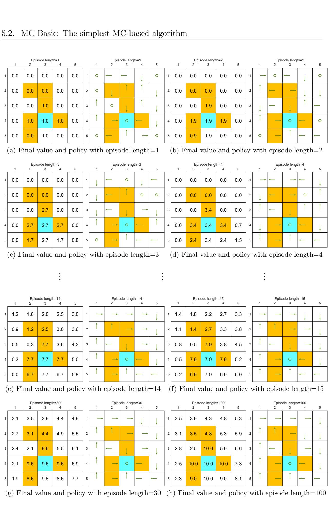

*图 5.4：在不同回合长度下，MC Basic 算法获得的策略和状态价值。只有当每个回合的长度足够长时，状态价值才能被准确估计。*

**空间模式的涌现**

随着回合长度的增加，一个有趣的空间模式逐渐显现。即距离目标较近的状态会先于较远的状态获得非零价值。

产生这种现象的原因如下：从某个状态出发，智能体必须至少经过一定步数才能到达目标状态并获得正奖励。如果回合长度小于所需的最小步数，那么回报必然为零，状态价值的估计值也就为零。

在此示例中，回合长度必须不小于 15，这是从左下角状态出发到达目标所需的最小步数。

**回合长度要求**

虽然上述分析表明每个回合必须足够长，但回合长度并非需要无限长。如图 5.4(g)所示，当长度为 30 时，算法已经能够找到最优策略，尽管价值估计尚未达到最优。

**稀疏奖励问题**

上述分析与一个重要的奖励设计问题相关：**稀疏奖励**，即除非到达目标，否则无法获得任何正奖励的场景。

稀疏奖励设置要求回合足够长以到达目标。当状态空间很大时，这一要求难以满足。因此，稀疏奖励问题会降低学习效率。

解决该问题的一个简单技术是设计非稀疏奖励。例如，在上述网格世界示例中，我们可以重新设计奖励设置，使智能体在到达目标附近的状态时获得小的正奖励。通过这种方式，可以在目标周围形成"吸引力场"，使智能体更容易找到目标。

关于稀疏奖励问题的更多信息可参考文献 [17-19]。

### 5.3 蒙特卡洛探索起点法

接下来我们将扩展 MC Basic 算法，得到另一种基于蒙特卡洛的强化学习算法。该算法稍显复杂，但具有更高的样本效率。

#### 5.3.1 更高效地利用样本

基于蒙特卡洛的强化学习的一个重要方面是如何更高效地利用样本。具体来说，假设我们有一个通过遵循策略 $\pi$ 获得的样本片段：

$$
s _ { 1 } \ { \overset { a _ { 2 } } { \longrightarrow } } \ s _ { 2 } \ { \overset { a _ { 4 } } { \longrightarrow } } \ s _ { 1 } \ { \overset { a _ { 2 } } { \longrightarrow } } \ s _ { 2 } \ { \overset { a _ { 3 } } { \longrightarrow } } \ s _ { 5 } \ { \overset { a _ { 1 } } { \longrightarrow } } \ \dots
$$

其中下标指的是状态或动作的索引，而非时间步。每次一个状态-动作对在一个片段中出现时，称为对该状态-动作对的访问。可以采用不同的策略来利用这些访问。

第一种也是最简单的策略是使用首次访问。也就是说，一个片段仅用于估计该片段起始的初始状态-动作对的动作价值。对于（5.3）中的示例，首次访问策略仅估计 $( s _ { 1 } , a _ { 2 } )$ 的动作价值。MC Basic 算法利用了首次访问策略。然而，这种策略的样本效率不高，因为该片段还访问了许多其他状态-动作对，例如 $( s _ { 2 } , a _ { 4 } )$、$\left( { { s _ { 2 } } , { a _ { 3 } } } \right)$ 和 $( s _ { 5 } , a _ { 1 } )$。这些访问也可以用来估计相应的动作价值。特别地，我们可以将（5.3）中的片段分解为多个子片段：

$$
\begin{array} { r l r } 
s _ { 1 } \xrightarrow [ ] { a _ { 2 } } s _ { 2 } \xrightarrow [ ] { a _ { 4 } } s _ { 1 } \xrightarrow [ ] { a _ { 2 } } s _ { 2 } \xrightarrow [ ] { a _ { 3 } } s _ { 5 } \xrightarrow [ ] { a _ { 1 } } \dots & { [ \mathrm { 原始片段 } ] } \\
s _ { 2 } \xrightarrow [ ] { a _ { 4 } } s _ { 1 } \xrightarrow [ ] { a _ { 2 } } s _ { 2 } \xrightarrow [ ] { a _ { 3 } } s _ { 5 } \xrightarrow [ ] { a _ { 1 } } \dots & { [ \mathrm { 起始于~} ( s _ { 2 } , a _ { 4 } ) \mathrm{~的子片段} ] } \\
s _ { 1 } \xrightarrow [ ] { a _ { 2 } } s _ { 2 } \xrightarrow [ ] { a _ { 3 } } s _ { 5 } \xrightarrow [ ] { a _ { 1 } } \dots & { [ \mathrm { 起始于~} ( s _ { 1 } , a _ { 2 } ) \mathrm{~的子片段} ] } \\
s _ { 2 } \xrightarrow [ ] { a _ { 3 } } s _ { 5 } \xrightarrow [ ] { a _ { 1 } } \dots & { [ \mathrm { 起始于~} ( s _ { 2 } , a _ { 3 } ) \mathrm{~的子片段} ] } \\
s _ { 5 } \xrightarrow [ ] { a _ { 1 } } \dots & { [ \mathrm { 起始于~} ( s _ { 5 } , a _ { 1 } ) \mathrm{~的子片段} ] }
\end{array}
$$

访问一个状态-动作对后生成的轨迹可以视为一个新的片段。这些新片段可以用来估计更多的动作价值。通过这种方式，可以更高效地利用片段中的样本。

此外，一个状态-动作对在一个片段中可能被多次访问。例如，在（5.3）的片段中，$( s _ { 1 } , a _ { 2 } )$ 被访问了两次。如果我们只计算第一次访问，这称为首次访问策略。如果我们计算状态-动作对的每一次访问，这样的策略称为每次访问策略 [20]。

就样本使用效率而言，每次访问策略是最好的。如果一个片段足够长，以至于它可以多次访问所有的状态-动作对，那么使用每次访问策略，这个单一的片段可能足以估计所有的动作价值。然而，通过每次访问策略获得的样本是相关的，因为从第二次访问开始的轨迹仅仅是从第一次访问开始的轨迹的一个子集。尽管如此，如果两次访问在轨迹中相距较远，相关性就不会很强。

#### 5.3.2 更高效地更新策略

基于蒙特卡洛的强化学习的另一个方面是何时更新策略。有两种可用策略。

> 第一种策略是，在策略评估步骤中，收集从相同状态-动作对开始的所有回合，然后使用这些回合的平均回报来近似动作价值。这种策略被 MC Basic 算法采用。

**算法 5.2：MC 探索性起点（MC Basic 的高效变体）**

- **初始化**：对所有 (s,a) 初始化策略 π₀(a|s) 和初始值 q(s,a)。对所有 (s,a) 设置 Returns(s,a) = 0 和 Num(s,a) = 0。
- **目标**：寻找最优策略。
- **对每个回合，执行**：
  - **回合生成**：选择一个起始状态-动作对 (s₀,a₀)，并确保所有对都有可能被选择（这是探索性起点条件）。遵循当前策略，生成长度为 T 的回合：s₀,a₀,r₁,...,sₜ₋₁,aₜ₋₁,rₜ。
  - **每个回合的初始化**：g ← 0
  - **对回合的每一步**，t = T-1,T-2,...,0，执行：
    - g ← γg + rₜ₊₁
    - Returns(sₜ,aₜ) ← Returns(sₜ,aₜ) + g
    - Num(sₜ,aₜ) ← Num(sₜ,aₜ) + 1
  - **策略评估**

这种策略的缺点是，智能体必须等到所有回合都被收集后才能更新估计值。

可以克服这一缺点的第二种策略是使用单个回合的回报来近似相应的动作价值。通过这种方式，当我们收到一个回合时，可以立即获得一个粗略的估计。然后，策略可以以逐回合的方式改进。

由于单个回合的回报不能准确近似相应的动作价值，人们可能会怀疑第二种策略是否有效。事实上，这种策略属于上一章介绍的广义策略迭代的范畴。也就是说，即使价值估计不够准确，我们仍然可以更新策略。

#### 5.3.3 算法描述

我们可以运用第5.3.1节和5.3.2节中介绍的技术来提升MC Basic算法的效率。这样就能得到一种新算法——MC探索性出发算法。

MC探索性出发算法的具体细节如算法5.2所示。该算法采用每次访问策略。值得注意的是，在计算从每个状态-动作对出发获得的折现回报时，该过程从终止状态开始反向回溯至起始状态。这种技术能提升算法效率，但同时也增加了算法复杂度。这就是为什么首先介绍无需此类技术的MC Basic算法，以揭示基于蒙特卡洛的强化学习的核心思想。

探索性出发条件要求存在足够多的从每个状态-动作对开始的幕序列。只有当每个状态-动作对都被充分探索后，我们才能准确估计其动作价值（根据大数定律），从而成功找到最优策略。反之，如果某个动作未被充分探索，其动作价值可能被错误估计，即使它确实是最优动作，也可能不会被策略选中。MC Basic和MC Exploring Starts算法都需要满足这一条件。

然而，这一条件在许多实际应用中难以满足，特别是涉及与环境进行物理交互的场景。我们能否移除探索性出发的要求呢？答案是肯定的，具体内容将在下一节展开说明。

### 5.4 MC $\epsilon$-贪心：无需探索起点的学习

接下来我们通过移除探索起点条件来扩展MC探索起点算法。该条件实际上要求每个状态-动作对都能被充分访问多次，这也可以通过基于软策略的方式实现。

#### 5.4.1 $\epsilon$-贪婪策略

如果某个策略在任意状态下采取任意动作的概率均为正，则该策略是软性策略。考虑一个极端情况：我们仅有一个 episode。在软性策略下，一个足够长的 episode 可以多次访问每个状态-动作对（参见图 5.8 中的示例）。因此，我们不需要从不同的状态-动作对开始生成大量 episode，这样就能免除探索性起点的要求。

一种常见的软性策略是 $\epsilon$-贪婪策略。$\epsilon$-贪婪策略是一种随机策略，它以较高概率选择贪婪动作，同时以相同的非零概率选择其他任意动作。此处的贪婪动作指的是具有最大动作值的动作。特别地，假设 $\epsilon \in [0,1]$，对应的 $\epsilon$-贪婪策略具有如下形式：

$$
\pi(a|s) = \left\{ \begin{array}{ll} 
\displaystyle 1 - \frac{\epsilon}{|{\cal A}(s)|}(|{\cal A}(s)| - 1), & \mathrm{对于贪婪动作}, \\ 
\\ 
\displaystyle \frac{\epsilon}{|{\cal A}(s)|}, & \mathrm{对于其他~}|{\cal A}(s)| - 1~\mathrm{个动作},
\end{array} \right.
$$

其中 $|{\mathcal{A}}(s)|$ 表示状态 $s$ 对应的动作数量。

当 $\epsilon = 0$ 时，$\epsilon$-贪婪策略退化为贪婪策略。当 $\epsilon = 1$ 时，采取任意动作的概率均为 $\frac{1}{|{\cal A}(s)|}$。

选择贪婪动作的概率始终大于选择其他任意动作的概率，因为对于任意 $\epsilon \in [0,1]$：

$$
1 - \frac{\epsilon}{|{\cal A}(s)|}(|{\cal A}(s)| - 1) = 1 - \epsilon + \frac{\epsilon}{|{\cal A}(s)|} \geq \frac{\epsilon}{|{\cal A}(s)|}
$$

虽然 $\epsilon$-贪婪策略是随机策略，但如何根据此类策略选择动作？我们可以首先按照均匀分布生成一个 $[0,1]$ 区间内的随机数 $x$。若 $x \geq \epsilon$，则选择贪婪动作；若 $x < \epsilon$，则以 $\frac{1}{|{\cal A}(s)|}$ 的概率从 ${\mathcal{A}}(s)$ 中随机选择一个动作（此时可能再次选中贪婪动作）。通过这种方式，选择贪婪动作的总概率为 $1 - \epsilon + \frac{\epsilon}{|{\cal A}(s)|}$，选择其他任意动作的概率为 $\frac{\epsilon}{|{\cal A}(s)|}$。

#### 5.4.2 算法描述

要将 $\epsilon$-贪心策略集成到蒙特卡洛学习中，我们只需将策略改进步骤从贪心改为 $\epsilon$-贪心。

具体来说，MC Basic 或 MC Exploring Starts 中的策略改进步骤旨在求解

$$
\pi_{k+1}(s) = \arg \max_{\pi \in \Pi} \sum_a \pi(a|s) q_{\pi_k}(s,a),
$$

其中 $\Pi$ 表示所有可能策略的集合。我们知道 (5.4) 的解是一个贪心策略：

$$
\pi_{k+1}(a|s) = \begin{cases}
1, & a = a_k^*, \\
0, & a \neq a_k^*,
\end{cases}
$$

其中 $a_k^* = \arg \max_a q_{\pi_k}(s,a)$。

现在，策略改进步骤改为求解

$$
\pi_{k+1}(s) = \arg \max_{\pi \in \Pi_\epsilon} \sum_a \pi(a|s) q_{\pi_k}(s,a),
$$

其中 $\Pi_\epsilon$ 表示具有给定 $\epsilon$ 值的所有 $\epsilon$-贪心策略的集合。通过这种方式，我们强制策略为 $\epsilon$-贪心。(5.5) 的解是

$$
\pi_{k+1}(a|s) = \begin{cases}
1 - \frac{|A(s)| - 1}{|A(s)|} \epsilon, & a = a_k^*, \\
\frac{1}{|A(s)|} \epsilon, & a \neq a_k^*,
\end{cases}
$$

其中 $a_k^* = \arg \max_a q_{\pi_k}(s,a)$。通过上述更改，我们得到了另一个称为 MC $\epsilon$-贪心的算法。该算法的详细信息在算法 5.3 中给出。这里采用了每次访问策略以更好地利用样本。

**算法 5.3: MC $\epsilon$-贪心 (MC Exploring Starts 的一个变体)**

**初始化:** 初始策略 $\pi_0(a|s)$ 和所有 $(s,a)$ 的初始值 $q(s,a)$。所有 $(s,a)$ 的 Returns$(s,a) = 0$ 和 Num$(s,a) = 0$。$\epsilon \in (0,1]$

**目标:** 搜索最优策略。

对每个回合执行：

- **回合生成:** 选择一个起始状态-动作对 $(s_0,a_0)$（不需要探索性起始条件）。遵循当前策略，生成长度为 $T$ 的回合：$s_0,a_0,r_1,\ldots,s_{T-1},a_{T-1},r_T$。
- **每个回合的初始化:** $g \leftarrow 0$
- 对于回合的每一步，$t = T-1,T-2,\ldots,0$，执行：

  - $g \leftarrow \gamma g + r_{t+1}$
  - Returns$(S_t,a_t) \leftarrow$ Returns$(S_t,a_t) + g$
  - Num$(S_t,a_t) \leftarrow$ Num$(S_t,a_t) + 1$
- **策略评估:**

  - $q(S_t,a_t) \leftarrow$ Returns$(S_t,a_t)/$Num$(S_t,a_t)$
- **策略改进:**

  - 令 $a^* = \arg \max_a q(S_t,a)$ 且
    $$
    \pi_{k+1}(a|s) = \begin{cases}
    1 - \frac{|A(s)| - 1}{|A(s)|} \epsilon, & a = a^*, \\
    \frac{1}{|A(s)|} \epsilon, & a \neq a^*,
    \end{cases}
    $$

如果在策略改进步骤中将贪心策略替换为 $\epsilon$-贪心策略，我们还能保证获得最优策略吗？答案是既肯定又否定。肯定的是，当给定足够样本时，算法可以收敛到在集合 $\Pi_\epsilon$ 中最优的 $\epsilon$-贪心策略。否定的是，该策略仅在 $\Pi_\epsilon$ 中是最优的，但在 $\Pi$ 中可能不是最优的。然而，如果 $\epsilon$ 足够小，$\Pi_\epsilon$ 中的最优策略将接近 $\Pi$ 中的最优策略。

#### 5.4.3 示例说明

考虑图5.5所示的网格世界示例。目标是为每个状态找到最优策略。在MC $\epsilon$-贪心算法的每次迭代中，会生成一个包含一百万步的单一回合。这里我们特意考虑仅使用单个回合的极端情况。设置参数 $r_{\mathrm{边界}} = r_{\mathrm{禁区}} = -1$，$r_{\mathrm{目标}} = 1$，以及 $\gamma = 0.9$。

初始策略是一个均匀策略，采取任何动作的概率均为0.2，如图5.5所示。经过两次迭代后即可获得$\epsilon = 0.5$的最优$\epsilon$-贪心策略。虽然每次迭代仅使用单个回合，但由于所有状态-动作对都能被访问到，其价值可以被准确估计，因此策略会逐步改进。

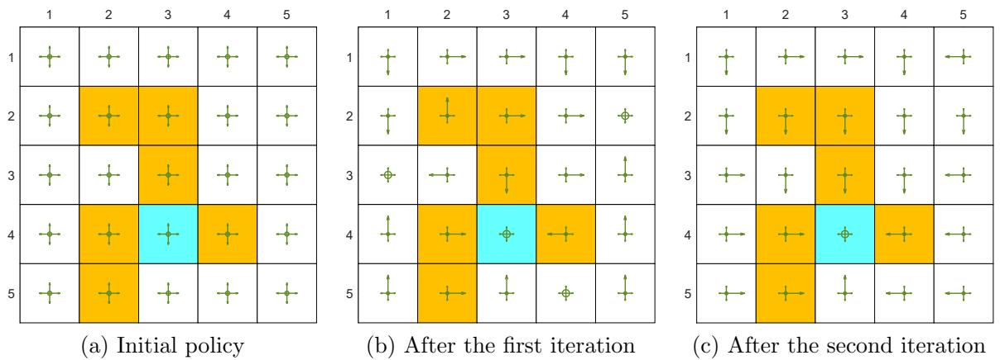

图5.5：基于单回合的MC $\epsilon$-贪心算法演进过程

### 5.5 $\epsilon$-贪婪策略的探索与利用

探索与利用构成了强化学习中的一个基本权衡。这里的探索是指策略可能会尽可能多地采取行动。通过这种方式，可以访问并充分评估所有动作。利用则是指改进后的策略应当采取具有最大动作价值的贪婪动作。然而，由于当前时刻获得的动作价值可能因探索不足而不准确，我们应当在执行利用的同时保持探索，以避免错过最优动作。

$\epsilon$-贪婪策略提供了一种平衡探索与利用的方法。一方面，$\epsilon$-贪婪策略有更高概率采取贪婪动作，从而能够利用估计值；另一方面，该策略也有机会采取其他动作，从而保持探索。$\epsilon$-贪婪策略不仅用于基于蒙特卡洛的强化学习，也应用于其他强化学习算法（如第7章将介绍的时序差分学习）。

利用与最优性相关，因为最优策略应当是贪婪的。$\epsilon$-贪婪策略的基本思想是通过牺牲最优性/利用来增强探索。如果我们希望增强利用和最优性，就需要减小$\epsilon$的值；如果我们希望增强探索，则需要增大$\epsilon$的值。

接下来我们将通过几个有趣的示例来讨论这种权衡关系。这里的强化学习任务是一个5×5的网格世界。奖励设置为：$r_{\mathrm{boundary}} = -1$（边界奖励）、$r_{\mathrm{forbidden}} = -10$（禁区奖励）和$r_{\mathrm{target}} = 1$（目标奖励）。折扣率设为$\gamma = 0.9$。

#### $\epsilon$-贪心策略的最优性

接下来我们将证明，当$\epsilon$增大时，$\epsilon$-贪心策略的最优性会变差。

首先，图5.6(a)展示了一个贪心最优策略及其对应的最优状态值。一些一致的$\epsilon$-贪心策略的状态值如图5.6(b)-(d)所示。

- (a) 最优$\epsilon$-贪心策略及其状态值：$\epsilon = 0$
- (b) 最优$\epsilon$-贪心策略及其状态值：$\epsilon = 0.1$
- (c) 最优$\epsilon$-贪心策略及其状态值：$\epsilon = 0.2$
- (d) 最优$\epsilon$-贪心策略及其状态值：$\epsilon = 0.5$

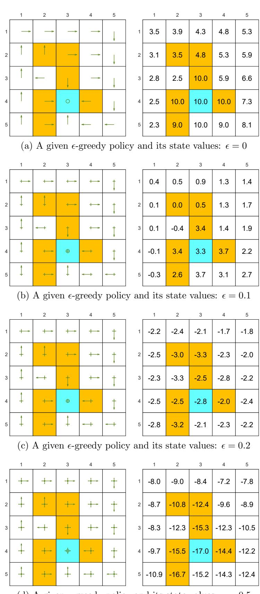

(d) 给定$\epsilon$-贪心策略及其状态值：$\epsilon = 0.5$

**图5.6**：一些$\epsilon$-贪心策略的状态值。这些$\epsilon$-贪心策略在具有最大概率的动作相同这个意义上是彼此一致的。可以看出，当$\epsilon$值增大时，$\epsilon$-贪心策略的状态值会减小，因此它们的最优性会变差。

|   | 1 | 2 | 3 | 4 | 5  |   | 1   | 2    | 3    | 4    | 5   |
| - | - | - | - | - | -- | - | --- | ---- | ---- | ---- | --- |
| 1 |   |   |   |   | √ | 1 | 3.5 | 3.9  | 4.3  | 4.8  | 5.3 |
| 2 |   |   |   |   | V  | 2 | 3.1 | 3.5  | 4.8  | 5.3  | 5.9 |
| 3 | 4 | 4 |   |   | √ | 3 | 2.8 | 2.5  | 10.0 | 5.9  | 6.6 |
| 4 |   |   | 4 |   | V  | 4 | 2.5 | 10.0 | 10.0 | 10.0 | 7.3 |
| 5 | 4 |   |   |   |    | 5 | 2.3 | 9.0  | 10.0 | 9.0  | 8.1 |

|   | 1  | 2 | 3  | 4 | 5  | 1 | 2    | 3    | 4   | 5   |
| - | -- | - | -- | - | -- | - | ---- | ---- | --- | --- |
| 1 | +  | + | +  | + | ↑ | 1 | 0.4  | 0.5  | 0.9 | 1.3 |
| 2 | 4  | + | +  | + | ↑ | 2 | 0.1  | 0.0  | 0.5 | 1.3 |
| 3 | 丨 | + | ↑ | + | ↑ | 3 | 0.1  | -0.4 | 3.4 | 1.4 |
| 4 | ← | + | 田 |   | ↑ | 4 | -0.1 | 3.4  | 3.3 | 3.7 |
| 5 |    | + | 丨 | + | +  | 5 | -0.3 | 2.6  | 3.7 | 3.1 |

|   | 1 | 2 | 3  | 4 | 5  | 1 | 2    | 3    | 4    | 5    |
| - | - | - | -- | - | -- | - | ---- | ---- | ---- | ---- |
| 1 | . | + | +  | + | +  | 1 | -1.1 | -1.5 | -1.1 | -0.6 |
| 2 | 4 | + | +  | + | 田 | 2 | -1.5 | -2.2 | -2.3 | -1.0 |
| 3 | + | + | +  |   | → | 3 | -1.2 | -2.4 | -2.2 | -1.5 |
| 4 | 4 | + | 由 | + | +  | 4 | -1.6 | -2.3 | -2.6 | -1.4 |
| 5 | 4 | + | +  | + | 田 | 5 | -2.0 | -3.0 | -1.8 | -1.4 |

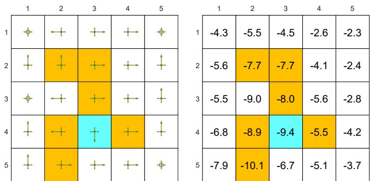

**图5.7**：不同$\epsilon$值下的最优$\epsilon$-贪心策略及其对应的状态值。这里的$\epsilon$-贪心策略在所有$\epsilon$-贪心策略（具有相同$\epsilon$值）中是最优的。可以看出，当$\epsilon$值增大时，最优$\epsilon$-贪心策略不再与(a)中的最优策略保持一致。

这里，如果两个$\epsilon$-贪心策略中具有最大概率的动作相同，则称它们是一致的。

随着$\epsilon$值的增大，$\epsilon$-贪心策略的状态值会减小，这表明这些$\epsilon$-贪心策略的最优性变差。值得注意的是，当$\epsilon$增大到0.5时，目标状态的值变得最小。这是因为当$\epsilon$较大时，从目标区域开始的智能体可能以更高的概率进入周围的禁止区域，从而获得负奖励。

$\diamond$ 其次，图5.7展示了最优$\epsilon$-贪心策略（它们在$\Pi_{\epsilon}$中是最优的）。当$\epsilon = 0$时，该策略是贪心的，并且在所有策略中是最优的。当$\epsilon$小到0.1时，最优$\epsilon$-贪心策略与最优贪心策略是一致的。然而，当$\epsilon$增大到例如0.2时，得到的$\epsilon$-贪心策略与最优贪心策略不一致。因此，如果我们想获得与最优贪心策略一致的$\epsilon$-贪心策略，$\epsilon$的值应该足够小。

为什么当$\epsilon$较大时，$\epsilon$-贪心策略与最优贪心策略不一致？我们可以通过考虑目标状态来回答这个问题。在贪心情况下，目标状态的最优策略是保持静止以获得正奖励。然而，当$\epsilon$较大时，有很大概率进入禁止区域并获得负奖励。因此，在这种情况下，目标状态的最优策略是逃离而不是保持静止。

#### $\epsilon$-贪心策略的探索能力

接下来我们将说明，当$\epsilon$较大时，$\epsilon$-贪心策略具有强大的探索能力。

首先考虑$\epsilon = 1$的$\epsilon$-贪心策略（见图5.5(a)）。在这种情况下，由于该策略在任何状态选择任何动作的概率均为0.2，其探索能力非常强。从$(s_1, a_1)$出发，由该$\epsilon$-策略生成的轨迹如图5.8(a)-(c)所示。可以看出，由于策略的强探索能力，当轨迹足够长时，单条轨迹就能多次访问所有状态-动作对。而且如图5.8(d)所示，各状态-动作对被访问的次数几乎均匀分布。

其次考虑$\epsilon = 0.5$的$\epsilon$-策略（见图5.6(d)）。此时$\epsilon$-贪心策略的探索能力较$\epsilon = 1$时更弱。从$(s_1, a_1)$出发，由该$\epsilon$-策略生成的轨迹如图5.8(e)-(g)所示。虽然当轨迹足够长时每个动作仍能被访问到，但访问次数的分布可能极不均匀。例如在包含一百万步的轨迹中，某些动作被访问超过25万次，而大多数动作仅被访问数百次甚至数十次，如图5.8(h)所示。

上述示例表明，随着$\epsilon$减小，$\epsilon$-贪心策略的探索能力会减弱。一种常用技术是初始设置较大的$\epsilon$值以增强探索，然后逐渐减小$\epsilon$以确保最终策略的最优性[21-23]。

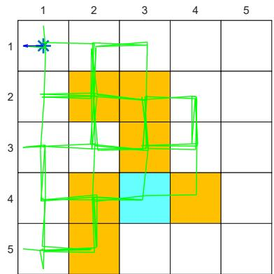

(a) $\epsilon = 1$，100步轨迹
(e) $\epsilon = 0.5$，100步轨迹
(b) $\epsilon = 1$，1000步轨迹
(f) $\epsilon = 0.5$，1000步轨迹
(g) $\epsilon = 0.5$，10000步轨迹
(d) $\epsilon = 1$，100万步内各动作被访问次数

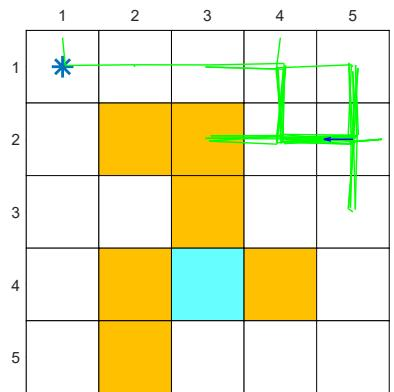

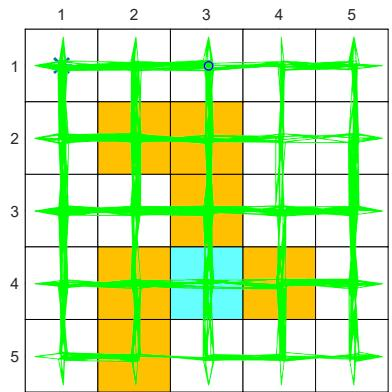

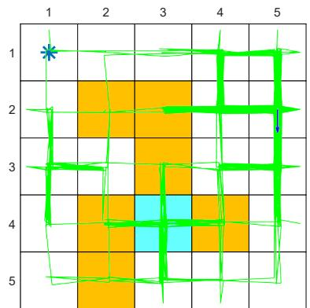

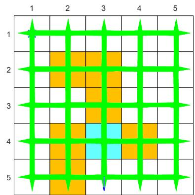

(c) $\epsilon = 1$，10000步轨迹

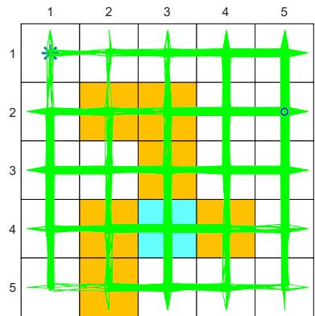

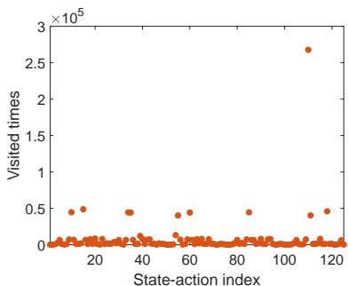

(h) $\epsilon = 0.5$，100万步内各动作被访问次数

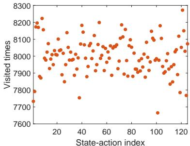

**图5.8:** 不同$\epsilon$取值下$\epsilon$-贪心策略的探索能力

### 5.6 本章小结

本章介绍的算法是本书首次介绍的无模型强化学习算法。我们首先通过研究一个重要的均值估计问题，介绍了蒙特卡洛估计的思想。随后介绍了三种基于蒙特卡洛的算法。

#### 算法概览

- **MC Basic**：这是最简单的基于蒙特卡洛的强化学习算法。该算法通过将策略迭代算法中基于模型的策略评估步骤替换为基于蒙特卡洛的无模型估计组件而得到。在给定足够样本的情况下，可以保证该算法能够收敛到最优策略和最优状态值。
- **MC Exploring Starts**：该算法是 MC Basic 的变体。它可以通过在 MC Basic 算法中使用首次访问或每次访问策略来更高效地利用样本。
- **MC ε-贪婪**：该算法是 MC Exploring Starts 的变体。具体来说，在策略改进步骤中，它会搜索最优的 ε-贪婪策略而非贪婪策略。通过这种方式，策略的探索能力得到增强，从而可以取消探索起点的条件。

#### 探索与利用的权衡

最后，通过分析 ε-贪婪策略的特性，我们介绍了探索与利用之间的权衡关系。随着 ε 值的增大，ε-贪婪策略的探索能力会增强，而对贪婪动作的利用会减弱。另一方面，如果 ε 值减小，我们能更好地利用贪婪动作，但探索能力会受到影响。

### 5.7 问答环节

#### 问答列表

◇ **问：什么是蒙特卡洛估计？**

**答：** 蒙特卡洛估计是指一类广泛的技术，它使用随机样本来解决近似问题。

---

**问：什么是均值估计问题？**

**答：** 均值估计问题是指基于随机样本计算随机变量的期望值。

---

**问：如何解决均值估计问题？**

**答：** 有两种方法：基于模型的和无模型的。具体来说，如果已知随机变量的概率分布，则可以根据其定义计算期望值。如果概率分布未知，我们可以使用蒙特卡洛估计来近似期望值。当样本数量很大时，这种近似是准确的。

---

$\diamond$ **问：为什么均值估计问题对强化学习很重要？**

**答：** 状态值和动作值都被定义为回报的期望值。因此，估计状态值或动作值本质上是一个均值估计问题。

---

**问：基于无模型蒙特卡洛的强化学习的核心思想是什么？**

**答：** 核心思想是将策略迭代算法转换为无模型的算法。具体来说，策略迭代算法旨在基于系统模型计算值，而基于蒙特卡洛的强化学习则将策略迭代算法中基于模型的策略评估步骤替换为基于无模型蒙特卡洛的策略评估步骤。

---

$\diamond$ **问：什么是首次访问、首次出现和每次访问策略？**

**答：** 它们是在一个回合中利用样本的不同策略。一个回合可能会访问许多状态-动作对。首次访问策略使用整个回合来估计初始状态-动作对的动作值。每次访问和首次出现策略可以更好地利用给定的样本。如果在每次访问状态-动作对时，都使用回合的剩余部分来估计其动作值，这种策略称为每次访问。如果我们只统计状态-动作对在回合中第一次被访问的情况，这种策略称为首次出现。

---

$\diamond$ **问：什么是探索性起点？为什么它很重要？**

**答：** 探索性起点要求从每个状态-动作对开始时，生成无限（或足够多）的回合。理论上，探索性起点条件是找到最优策略所必需的。也就是说，只有当每个动作值都被充分探索时，我们才能准确评估所有动作，然后正确选择最优动作。

---

$\diamond$ **问：避免探索性起点的思路是什么？**

**答：** 基本思路是使策略变得"软"。软策略是随机的，使得一个回合能够访问许多状态-动作对。这样，我们就不需要从每个状态-动作对开始的大量回合。

---

$\diamond$ **问：$\epsilon$-贪心策略可以是最优的吗？**

**答：** 答案既是肯定的也是否定的。肯定的是，如果给定足够的样本，MC $\epsilon$-贪心算法可以收敛到一个最优的$\epsilon$-贪心策略。否定的是，收敛的策略仅仅是在所有$\epsilon$-贪心策略（具有相同的$\epsilon$值）中最优的。

---

$\diamond$ **问：是否可能使用一个回合访问所有的状态-动作对？**

**答：** 是的，这是可能的。如果策略是软的（例如，$\epsilon$-贪心）并且回合足够长。

---

**问：MC Basic、MC Exploring Starts 和 MC eGreedy 之间有什么关系？**

**答：** MC Basic 是最简单的基于蒙特卡洛的强化学习算法。它很重要，因为它揭示了基于无模型蒙特卡洛的强化学习的基本思想。MC Exploring Starts 是 MC Basic 的一个变体，它调整了样本使用策略。此外，MC $\epsilon$-贪心是 MC Exploring Starts 的一个变体，它移除了探索性起点的要求。因此，虽然基本思想很简单，但当我们想要实现更好性能时，复杂性就出现了。将核心思想与可能分散初学者注意力的复杂性分开是很重要的。
