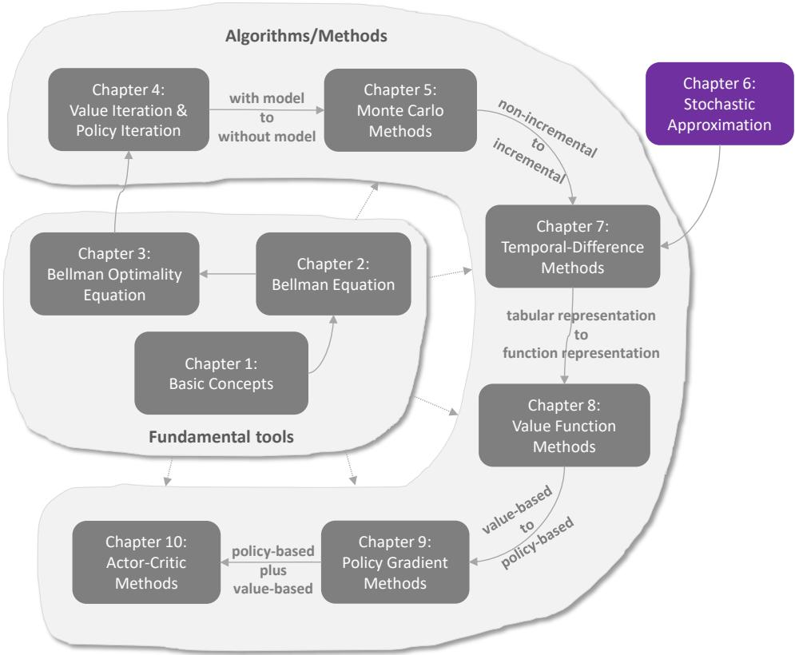
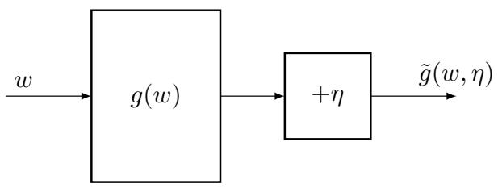
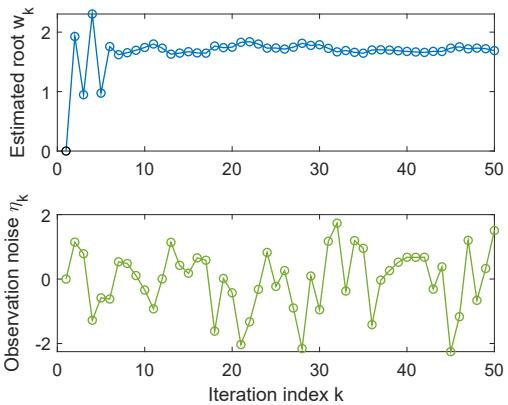
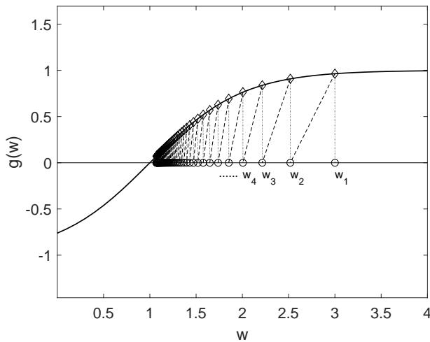

# 第 6 章

# 随机逼近

**图 6.1：** 我们在本书中的位置。

第五章介绍了第一类基于蒙特卡洛估计的无模型强化学习算法。在下一章（第七章）中，我们将介绍另一类无模型强化学习算法：时序差分学习。然而，在进入下一章之前，我们需要按下暂停键以做好更充分的准备。这是因为时序差分算法与我们迄今所研究的算法截然不同。许多初次接触时序差分算法的读者常常会疑惑：这些算法最初是如何设计的？它们为何能有效工作？实际上，前后章节之间存在一个知识断层：我们迄今研究的算法是非增量式的，而后续章节将要研究的算法则是增量式的。

本章将通过介绍随机逼近的基础知识来填补这一知识断层。虽然本章不会介绍任何具体的强化学习算法，但它为学习后续章节奠定了必要的基础。我们将在第七章看到，时序差分算法可被视为特殊的随机逼近算法。机器学习中广泛使用的著名随机梯度下降算法也将在本章介绍。

# 6.1 示例动机：均值估计

接下来我们通过研究均值估计问题，演示如何将非增量算法转换为增量算法。

考虑一个随机变量 $X$，其取值来自有限集合 $\mathcal{X}$。我们的目标是估计 $\mathbb{E}[X]$。假设我们有一个独立同分布的样本序列 $\{x_i\}_{i=1}^n$。$X$ 的期望值可以通过下式近似：

$$
\mathbb{E}[X] \approx \bar{x} \doteq \frac{1}{n} \sum_{i=1}^n x_i.
$$

(6.1) 中的近似是蒙特卡洛估计的基本思想，如第 5 章所述。根据大数定律，当 $n \to \infty$ 时，$\bar{x} \to \mathbb{E}[X]$。

接下来我们展示两种计算 (6.1) 中 $\bar{x}$ 的方法。第一种非增量方法先收集所有样本，然后计算平均值。这种方法的缺点是，如果样本数量很大，我们可能需要等待很长时间直到所有样本都被收集。第二种方法可以避免这个缺点，因为它以增量方式计算平均值。具体来说，假设

$$
w_{k+1} \doteq \frac{1}{k} \sum_{i=1}^k x_i, \quad k = 1, 2, \ldots.
$$

因此

$$
w_k = \frac{1}{k-1} \sum_{i=1}^{k-1} x_i, \quad k = 2, 3, \ldots.
$$

那么，$w_{k+1}$ 可以用 $w_k$ 表示为

$$
w_{k+1} = \frac{1}{k} \sum_{i=1}^k x_i = \frac{1}{k} \left( \sum_{i=1}^{k-1} x_i + x_k \right) = \frac{1}{k} ((k-1)w_k + x_k) = w_k - \frac{1}{k}(w_k - x_k).
$$

因此，我们得到以下增量算法：

$$
w_{k+1} = w_k - \frac{1}{k}(w_k - x_k).
$$

该算法可用于以增量方式计算均值 $\bar{x}$。可以验证

$$
\begin{array}{rl}
& w_1 = x_1, \\
& w_2 = w_1 - \frac{1}{1}(w_1 - x_1) = x_1, \\
& w_3 = w_2 - \frac{1}{2}(w_2 - x_2) = x_1 - \frac{1}{2}(x_1 - x_2) = \frac{1}{2}(x_1 + x_2), \\
& w_4 = w_3 - \frac{1}{3}(w_3 - x_3) = \frac{1}{3}(x_1 + x_2 + x_3), \\
& \vdots \\
& w_{k+1} = \frac{1}{k} \sum_{i=1}^k x_i.
\end{array}
$$

(6.2) 的优点是，每次收到一个样本时，可以立即计算平均值。这个平均值可以用来近似 $\bar{x}$，从而近似 $\mathbb{E}[X]$。值得注意的是，由于初始样本不足，近似值在开始时可能不准确。但有总比没有好。随着获得更多样本，根据大数定律，估计精度会逐渐提高。此外，我们还可以发现两者没有显著差异。在这种情况下，相应的迭代算法是

$$
w_{k+1} = w_k - \frac{1}{1+k}(w_k - x_{k+1}).
$$

更进一步，考虑一个具有更一般表达式的算法：

$$
w_{k+1} = w_k - \alpha_k(w_k - x_k).
$$

这个算法很重要，在本章中经常使用。除了系数 $1/k$ 被替换为 $\alpha_k > 0$ 外，它与 (6.2) 相同。由于没有给出 $\alpha_k$ 的表达式，我们无法像 (6.3) 那样得到 $w_k$ 的显式表达式。但我们将在下一节证明，如果 $\{\alpha_k\}$ 满足某些温和条件，当 $k \to \infty$ 时，$w_k \to \mathbb{E}[X]$。在第 7 章中，我们将看到时序差分算法具有类似（但更复杂）的表达式。

# 6.2 罗宾斯-蒙罗算法

随机逼近是一类用于求解求根或优化问题的随机迭代算法的总称[24]。与基于梯度等许多其他求根算法相比，随机逼近的强大之处在于它不需要目标函数或其导数的解析表达式。

罗宾斯-蒙罗（RM）算法是随机逼近领域的开创性工作[24-27]。著名的随机梯度下降算法是RM算法的一种特殊形式，如第6.4节所示。接下来我们将介绍RM算法的细节。

假设我们要求解方程的根：

$$
g(w) = 0,
$$

其中 $w \in \mathbb{R}$ 是未知变量，$g : \mathbb{R} \rightarrow \mathbb{R}$ 是一个函数。许多问题都可以表述为求根问题。例如，如果 $J(w)$ 是要优化的目标函数，这个优化问题可以转化为求解 $g(w) \doteq \nabla_{w} J(w) = 0$。此外，像 $g(w) = c$（其中 $c$ 是常数）这样的方程也可以通过将 $g(w) - c$ 重写为新函数来转换为上述方程。

如果已知 $g$ 或其导数的表达式，可以使用许多数值算法。然而，我们面临的问题是函数 $g$ 的表达式未知。例如，该函数可能由一个结构和参数未知的人工神经网络表示。此外，我们只能获得 $g(w)$ 的带噪声观测值：

$$
\tilde{g}(w, \eta) = g(w) + \eta,
$$

其中 $\eta \in \mathbb{R}$ 是观测误差，可能服从也可能不服从高斯分布。总之，这是一个黑箱系统，只有输入 $w$ 和带噪声的输出 $\tilde{g}(w, \eta)$ 是已知的（见图6.2）。我们的目标是使用 $w$ 和 $\tilde{g}$ 来求解 $g(w) = 0$。

  
**图6.2**：通过 $w$ 和 $\tilde{g}$ 求解 $g(w) = 0$ 的问题示意图。

能够求解 $g(w) = 0$ 的RM算法为：

$$
w_{k+1} = w_k - a_k \tilde{g}(w_k, \eta_k), \qquad k = 1, 2, 3, \ldots
$$

其中 $w_k$ 是第 $k$ 次对根的估计，$\tilde{g}(w_k, \eta_k)$ 是第 $k$ 次带噪声的观测值，$a_k$ 是一个正系数。可以看出，RM算法不需要关于函数的任何信息，只需要输入和输出。

  
**图6.3**：RM算法的说明性示例。

为了说明RM算法，考虑一个例子，其中 $g(w) = w^3 - 5$。真实的根是 $5^{1/3} \approx 1.71$。现在，假设我们只能观测到输入 $w$ 和输出 $\tilde{g}(w) = g(w) + \eta$，其中 $\eta$ 是独立同分布的，服从均值为零、标准差为 $1$ 的标准正态分布。初始猜测为 $w_1 = 0$，系数为 $a_k = 1/k$。$w_k$ 的演化过程如图6.3所示。即使观测值被噪声 $\eta_k$ 干扰，估计值 $w_k$ 仍然能够收敛到真实的根。注意，对于 $g(w) = w^3 - 5$ 这个特定函数，必须适当选择初始猜测 $w_1$ 以确保收敛。在下面的小节中，我们将给出RM算法对于任何初始猜测都能收敛的条件。

# 6.2.1 收敛性质

为什么（6.5）中的RM算法能够找到 $g(w) = 0$ 的根？我们接下来通过一个例子说明其思想，然后提供严格的收敛性分析。

考虑图6.4所示的例子。在这个例子中，$g(w) = \tanh(w - 1)$。$g(w) = 0$ 的真实根是 $w^{*} = 1$。我们应用RM算法，设 $w_1 = 3$ 且 $a_k = 1/k$。为了更好地说明收敛的原因，我们简单地设 $\eta_k \equiv 0$，因此 $\tilde{g}(w_k, \eta_k) = g(w_k)$。这种情况下的RM算法是 $w_{k+1} = w_k - a_k g(w_k)$。RM算法生成的 $\{w_k\}$ 如图6.4所示。可以看到 $w_k$ 收敛到真实根 $w^{*} = 1$。

这个简单的例子可以说明RM算法为何收敛。

- 当 $w_k > w^{*}$ 时，我们有 $g(w_k) > 0$。那么，$w_{k+1} = w_k - a_k g(w_k) < w_k$。如果 $a_k g(w_k)$ 足够小，我们有 $w^{*} < w_{k+1} < w_k$。结果，$w_{k+1}$ 比 $w_k$ 更接近 $w^{*}$。

- 当 $w_k < w^{*}$ 时，我们有 $g(w_k) < 0$。那么，$w_{k+1} = w_k - a_k g(w_k) > w_k$。如果 $|a_k g(w_k)|$ 足够小，我们有 $w^{*} > w_{k+1} > w_k$。结果，$w_{k+1}$ 比 $w_k$ 更接近 $w^{*}$。

在任一情况下，$w_{k+1}$ 都比 $w_k$ 更接近 $w^{*}$。因此，直观上 $w_k$ 会收敛到 $w^{*}$。

图6.4：说明RM算法收敛性的一个例子。

上面的例子很简单，因为假设观测误差为零。在存在随机观测误差的情况下分析收敛性则非易事。下面给出一个严格的收敛结果。

**定理 6.1** (Robbins-Monro 定理)。在（6.5）的Robbins-Monro算法中，如果

1. 对所有 $w$，满足 $0 < c_1 \leq \nabla_w g(w) \leq c_2$；
2. $\sum_{k=1}^{\infty} a_k = \infty$ 且 $\sum_{k=1}^{\infty} a_k^2 < \infty$；
3. $\mathbb{E}[\eta_k | \mathcal{H}_k] = 0$ 且 $\mathbb{E}[\eta_k^2 | \mathcal{H}_k] < \infty$；

其中 $\mathcal{H}_k = \{w_k, w_{k-1}, ...\}$，则 $w_k$ 几乎必然收敛到满足 $g(w^{*}) = 0$ 的根 $w^{*}$。

我们将这个定理的证明推迟到第6.3.3节。这个定理依赖于几乎必然收敛的概念，这在附录B中介绍。

定理6.1中的三个条件解释如下。

- 在第一个条件中，$0 < c_1 \le \nabla_w g(w)$ 表明 $g(w)$ 是一个单调递增函数。这个条件确保 $g(w) = 0$ 的根存在且唯一。如果 $g(w)$ 是单调递减的，我们可以简单地将 $-g(w)$ 视为一个新的单调递增函数。

作为一个应用，我们可以将一个目标函数为 $J(w)$ 的优化问题表述为一个求根问题：$g(w) \doteq \nabla_w J(w) = 0$。在这种情况下，$g(w)$ 单调递增的条件表明 $J(w)$ 是凸的，这是优化问题中常用的假设。

不等式 $\nabla_w g(w) \le c_2$ 表明 $g(w)$ 的梯度有上界。例如，$g(w) = \tanh(w - 1)$ 满足这个条件，但 $g(w) = w^3 - 5$ 不满足。

- 关于 $\{a_k\}$ 的第二个条件很有趣。我们在强化学习中经常看到类似的条件。$\sum_{k=1}^{\infty} a_k^2 < \infty$ 意味着 $\lim_{n \to \infty} \sum_{k=1}^{n} a_k^2$ 有上界。它要求 $a_k$ 随着 $k \to \infty$ 收敛到零。条件 $\sum_{k=1}^{\infty} a_k = \infty$ 意味着 $\lim_{n \to \infty} \sum_{k=1}^{n} a_k$ 是无穷大的。它要求 $a_k$ 不应太快地收敛到零。这些条件具有有趣的性质，稍后将详细分析。

- 第三个条件是温和的。它不要求观测误差 $\eta_k$ 是高斯分布的。一个重要的特殊情况是 $\{\eta_k\}$ 是一个独立同分布的随机序列，满足 $\mathbb{E}[\eta_k] = 0$ 和 $\mathbb{E}[\eta_k^2] < \infty$。在这种情况下，第三个条件是有效的，因为 $\eta_k$ 独立于 $\mathcal{H}_k$，因此我们有 $\mathbb{E}[\eta_k | \mathcal{H}_k] = \mathbb{E}[\eta_k] = 0$ 和 $\mathbb{E}[\eta_k^2 | \mathcal{H}_k] = \mathbb{E}[\eta_k^2]$。

我们接下来更仔细地考察关于系数 $\{a_k\}$ 的第二个条件。

## 为什么第二个条件对RM算法的收敛性很重要？

当我们稍后给出上述定理的严格证明时，这个问题自然可以得到解答。这里，我们想提供一些有启发性的直观解释。

首先，$\sum_{k=1}^{\infty} a_k^2 < \infty$ 表明当 $k \to \infty$ 时，$a_k \to 0$。为什么这个条件重要？假设观测值 $\tilde{g}(w_k, \eta_k)$ 总是有界的。由于

$$
w_{k+1} - w_k = -a_k \tilde{g}(w_k, \eta_k),
$$

如果 $a_k \to 0$，那么 $a_k \tilde{g}(w_k, \eta_k) \to 0$，因此 $w_{k+1} - w_k \to 0$，表明当 $k \to \infty$ 时 $w_{k+1}$ 和 $w_k$ 彼此接近。否则，如果 $a_k$ 不收敛，那么当 $k \to \infty$ 时 $w_k$ 可能仍然会波动。

其次，$\sum_{k=1}^{\infty} a_k = \infty$ 表明 $a_k$ 不应太快地收敛到零。为什么这个条件重要？对 $w_2 - w_1 = -a_1 \tilde{g}(w_1, \eta_1)$，$w_3 - w_2 = -a_2 \tilde{g}(w_2, \eta_2)$，$w_4 - w_3 = -a_3 \tilde{g}(w_3, \eta_3)$，... 这些方程的两边求和得到

$$
w_1 - w_{\infty} = \sum_{k=1}^{\infty} a_k \tilde{g}(w_k, \eta_k).
$$

如果 $\sum_{k=1}^{\infty} a_k < \infty$，那么 $\left|\sum_{k=1}^{\infty} a_k \tilde{g}(w_k, \eta_k)\right|$ 也是有界的。设 $b$ 表示有限的上界，使得

$$
|w_1 - w_{\infty}| = \left|\sum_{k=1}^{\infty} a_k \tilde{g}(w_k, \eta_k)\right| \le b.
$$

如果初始猜测 $w_1$ 选择得离 $w^{*}$ 很远，使得 $|w_1 - w^{*}| > b$，那么根据（6.6）式，不可能有 $w_{\infty} = w^{*}$。这表明在这种情况下RM算法无法找到真实解 $w^{*}$。因此，条件 $\sum_{k=1}^{\infty} a_k = \infty$ 对于确保给定任意初始猜测时收敛是必要的。

## 什么样的序列满足 $\sum_{k=1}^{\infty} a_k = \infty$ 和 $\sum_{k=1}^{\infty} a_k^2 < \infty$？

一个典型的序列是

$$
a_k = \frac{1}{k}.
$$

一方面，有

$$
\lim_{n \to \infty} \left(\sum_{k=1}^{n} \frac{1}{k} - \ln n\right) = \kappa,
$$

其中 $\kappa \approx 0.577$ 称为欧拉-马歇罗尼常数（或欧拉常数）[28]。由于当 $n \to \infty$ 时 $\ln n \to \infty$，我们有

$$
\sum_{k=1}^{\infty} \frac{1}{k} = \infty.
$$

实际上，$H_n = \sum_{k=1}^{n} \frac{1}{k}$ 被称为调和数。另一方面，有

$$
\sum_{k=1}^{\infty} \frac{1}{k^2} = \frac{\pi^2}{6} < \infty.
$$

求 $\sum_{k=1}^{\infty} \frac{1}{k^2}$ 的值被称为巴塞尔问题 [30]。

总之，序列 $\{a_k = 1/k\}$ 满足定理6.1中的第二个条件。值得注意的是，轻微的修改，例如 $a_k = 1/(k + 1)$ 或 $a_k = c_k/k$（其中 $c_k$ 有界），也保持这个条件。

在RM算法中，$a_k$ 在许多应用中被选为一个足够小的常数。尽管在这种情况下第二个条件不再满足，因为 $\sum_{k=1}^{\infty} a_k^2 = \infty$ 而不是 $\sum_{k=1}^{\infty} a_k^2 < \infty$，但算法仍然可以在某种意义下收敛 [24, Section 1.5]。此外，图6.3所示例子中的 $g(x) = x^3 - 5$ 不满足第一个条件，但如果初始猜测被适当（非任意）选择，RM算法仍然可以找到根。

# 6.2.2 在均值估计中的应用

接下来我们应用罗宾斯-蒙罗定理来分析均值估计问题，该问题已在第6.1节中讨论过。回顾

$$
w_{k+1} = w_k + \alpha_k (x_k - w_k)
$$

是(6.4)中的均值估计算法。当$\alpha_k = 1/k$时，我们可以得到$w_{k+1}$的解析表达式为$w_{k+1} = \frac{1}{k} \sum_{i=1}^{k} x_i$。然而，当给定一般的$\alpha_k$值时，我们将无法获得解析表达式。在这种情况下，收敛性分析变得非常重要。我们可以证明该算法是罗宾斯-蒙罗算法的一个特例，因此其收敛性自然成立。

具体来说，定义函数为

$$
g(w) \doteq w - \mathbb{E}[X].
$$

原始问题是获取$\mathbb{E}[X]$的值。该问题可以表述为求解$g(w) = 0$的求根问题。给定$w$的值，我们可以获得的带噪声观测值为$\tilde{g} \doteq w - x$，其中$x$是$X$的一个样本。注意$\tilde{g}$可以写为

$$
\begin{aligned}
\tilde{g}(w, \eta) &= w - x \\
&= w - x + \mathbb{E}[X] - \mathbb{E}[X] \\
&= (w - \mathbb{E}[X]) + (\mathbb{E}[X] - x) \doteq g(w) + \eta,
\end{aligned}
$$

其中$\eta \doteq \mathbb{E}[X] - x$。

解决该问题的罗宾斯-蒙罗算法为

$$
w_{k+1} = w_k - \alpha_k \tilde{g}(w_k, \eta_k) = w_k - \alpha_k (w_k - x_k),
$$

这正好是(6.4)中的算法。因此，根据定理6.1，如果$\sum_{k=1}^{\infty} \alpha_k = \infty$，$\sum_{k=1}^{\infty} \alpha_k^2 < \infty$，且$\{x_k\}$是独立同分布的，则可以保证$w_k$几乎必然收敛到$\mathbb{E}[X]$。值得一提的是，该收敛性质不依赖于关于$X$分布的任何假设。

# 6.3 Dvoretzky 收敛定理

到目前为止，RM 算法的收敛性尚未得到证明。为此，我们接下来介绍 Dvoretzky 定理 [31,32]，这是随机逼近领域的一个经典结果。该定理可用于分析 RM 算法和许多强化学习算法的收敛性。

本节涉及稍多的数学内容。对随机算法收敛性分析感兴趣的读者建议学习本节。否则，可以跳过本节。

**定理 6.2** (Dvoretzky 定理). 考虑一个随机过程

$$
\Delta_{k+1} = (1 - \alpha_k) \Delta_k + \beta_k \eta_k,
$$

其中 $\{\alpha_k\}_{k=1}^{\infty}$, $\{\beta_k\}_{k=1}^{\infty}$, $\{\eta_k\}_{k=1}^{\infty}$ 是随机序列。这里对所有 $k$ 有 $\alpha_k \geq 0$, $\beta_k \geq 0$。那么，如果满足以下条件，$\Delta_k$ 几乎必然收敛到零：

1. $\sum_{k=1}^{\infty} \alpha_k = \infty$, $\sum_{k=1}^{\infty} \alpha_k^2 < \infty$, 且 $\sum_{k=1}^{\infty} \beta_k^2 < \infty$ 一致几乎必然成立；

2. $\mathbb{E}[\eta_k \vert \mathcal{H}_k] = 0$ 且 $\mathbb{E}[\eta_k^2 \vert \mathcal{H}_k] \leq C$ 几乎必然成立；

其中

$$
\mathcal{H}_k = \{\Delta_k, \Delta_{k-1}, \ldots, \eta_{k-1}, \ldots, \alpha_{k-1}, \ldots, \beta_{k-1}, \ldots\}.
$$

在给出这个定理的证明之前，我们先澄清一些问题。

在 RM 算法中，系数序列 $\{\alpha_k\}$ 是确定性的。然而，Dvoretzky 定理允许 $\{\alpha_k\}$, $\{\beta_k\}$ 是依赖于 $\mathcal{H}_k$ 的随机变量。因此，它在 $\alpha_k$ 或 $\beta_k$ 是 $\Delta_k$ 的函数的情况下更有用。

在第一个条件中，表述为"一致几乎必然"。这是因为 $\alpha_k$ 和 $\beta_k$ 可能是随机变量，因此它们极限的定义必须是随机意义上的。在第二个条件中，也表述为"几乎必然"。这是因为 $\mathcal{H}_k$ 是一个随机变量序列而不是特定值。因此，$\mathbb{E}[\eta_k \vert \mathcal{H}_k]$ 和 $\mathbb{E}[\eta_k^2 | \mathcal{H}_k]$ 是随机变量。这种情况下条件期望的定义是"几乎必然"意义上的（附录 B）。

定理 6.2 的陈述与 [32] 略有不同，在于定理 6.2 不要求在第一个条件中满足 $\sum_{k=1}^{\infty} \beta_k = \infty$。当 $\sum_{k=1}^{\infty} \beta_k < \infty$ 时，特别是在所有 $k$ 都有 $\beta_k = 0$ 的极端情况下，序列仍然可以收敛。

# 6.3.1 Dvoretzky 定理的证明

Dvoretzky 定理的原始证明于 1956 年给出 [31]。也存在其他证明方法。接下来我们将基于拟鞅（quasimartingale）理论给出证明。借助拟鞅的收敛结果，Dvoretzky 定理的证明变得直接明了。关于拟鞅的更多信息可参阅附录 C。

**Dvoretzky 定理的证明。** 令 $h_k \doteq \Delta_k^2$，则有

$$
\begin{aligned}
h_{k+1} - h_k &= \Delta_{k+1}^2 - \Delta_k^2 \\
&= (\Delta_{k+1} - \Delta_k)(\Delta_{k+1} + \Delta_k) \\
&= (-\alpha_k \Delta_k + \beta_k \eta_k)[(2 - \alpha_k)\Delta_k + \beta_k \eta_k] \\
&= -\alpha_k(2 - \alpha_k)\Delta_k^2 + \beta_k^2 \eta_k^2 + 2(1 - \alpha_k)\beta_k \eta_k \Delta_k.
\end{aligned}
$$

对上述等式两边取条件期望可得

$$
\mathbb{E}[h_{k+1} - h_k | \mathcal{H}_k] = \mathbb{E}[-\alpha_k(2 - \alpha_k)\Delta_k^2 | \mathcal{H}_k] + \mathbb{E}[\beta_k^2 \eta_k^2 | \mathcal{H}_k] + \mathbb{E}[2(1 - \alpha_k)\beta_k \eta_k \Delta_k | \mathcal{H}_k].
$$

首先，由于 $\Delta_k$ 包含于 $\mathcal{H}_k$ 且由其确定，故可从期望中提出（参见引理 B.1 的性质 (e)）。其次，考虑 $\alpha_k, \beta_k$ 由 $\mathcal{H}_k$ 确定的简单情形。例如当 $\{\alpha_k\}$ 和 $\{\beta_k\}$ 是 $\Delta_k$ 的函数或确定性序列时，该情形成立。此时它们也可从期望中提出。因此，(6.7) 式转化为

$$
\mathbb{E}[h_{k+1} - h_k | \mathcal{H}_k] = -\alpha_k(2 - \alpha_k)\Delta_k^2 + \beta_k^2 \mathbb{E}[\eta_k^2 | \mathcal{H}_k] + 2(1 - \alpha_k)\beta_k \Delta_k \mathbb{E}[\eta_k | \mathcal{H}_k].
$$

对于第一项，由于 $\sum_{k=1}^{\infty} \alpha_k^2 < \infty$ 意味着 $\alpha_k \to 0$ 几乎必然成立，故存在有限 $n$ 使得对所有 $k \geq n$ 均有 $\alpha_k \leq 1$。不失一般性，接下来我们仅考虑 $\alpha_k \leq 1$ 的情形。此时有 $-\alpha_k(2 - \alpha_k)\Delta_k^2 \le 0$。对于第二项，根据假设有 $\beta_k^2 \mathbb{E}[\eta_k^2 | \mathcal{H}_k] \le \beta_k^2 C$。第三项为零，因为由假设 $\mathbb{E}[\eta_k | \mathcal{H}_k] = 0$。因此，(6.8) 式转化为

$$
\mathbb{E}[h_{k+1} - h_k | \mathcal{H}_k] = -\alpha_k(2 - \alpha_k)\Delta_k^2 + \beta_k^2 \mathbb{E}[\eta_k^2 | \mathcal{H}_k] \le \beta_k^2 C,
$$

从而可得

$$
\sum_{k=1}^{\infty} \mathbb{E}[h_{k+1} - h_k | \mathcal{H}_k] \leq \sum_{k=1}^{\infty} \beta_k^2 C < \infty.
$$

最后的不等式源于条件 $\sum_{k=1}^{\infty} \beta_k^2 < \infty$。基于附录 C 中的拟鞅收敛定理，我们得出结论：$h_k$ 几乎必然收敛。

接下来我们确定 $\Delta_k$ 的收敛值。由 (6.9) 式可得

$$
\sum_{k=1}^{\infty} \alpha_k(2 - \alpha_k)\Delta_k^2 = \sum_{k=1}^{\infty} \beta_k^2 \mathbb{E}[\eta_k^2 | \mathcal{H}_k] - \sum_{k=1}^{\infty} \mathbb{E}[h_{k+1} - h_k | \mathcal{H}_k].
$$

等式右侧第一项根据假设有界。第二项亦有界，因为 $h_k$ 收敛意味着 $h_{k+1} - h_k$ 可求和。因此左侧的 $\sum_{k=1}^{\infty} \alpha_k(2 - \alpha_k)\Delta_k^2$ 也有界。考虑到 $\alpha_k \leq 1$ 的情形，我们有

$$
\infty > \sum_{k=1}^{\infty} \alpha_k(2 - \alpha_k)\Delta_k^2 \geq \sum_{k=1}^{\infty} \alpha_k \Delta_k^2 \geq 0.
$$

因此 $\sum_{k=1}^{\infty} \alpha_k \Delta_k^2$ 有界。由于 $\sum_{k=1}^{\infty} \alpha_k = \infty$，必有 $\Delta_k \to 0$ 几乎必然成立。

# 6.3.2 在均值估计中的应用

虽然均值估计算法 $w_{k+1} = w_k + \alpha_k (x_k - w_k)$ 已经通过 RM 定理进行了分析，但我们接下来将证明其收敛性也可以直接通过 Dvoretzky 定理来证明。

**证明.** 令 $w^* = \mathbb{E}|X|$。均值估计算法 $w_{k+1} = w_k + \alpha_k (x_k - w_k)$ 可以重写为

$$
w_{k+1} - w^* = w_k - w^* + \alpha_k (x_k - w^* + w^* - w_k).
$$

令 $\Delta \doteq w - w^*$。那么，我们有

$$
\begin{aligned}
\Delta_{k+1} &= \Delta_k + \alpha_k (x_k - w^* - \Delta_k) \\
&= (1 - \alpha_k)\Delta_k + \alpha_k \underbrace{(x_k - w^*)}_{\eta_k}.
\end{aligned}
$$

由于 $\{x_k\}$ 是独立同分布的，我们有 $\mathbb{E}[x_k | \mathcal{H}_k] = \mathbb{E}[x_k] = w^*$。因此，$\mathbb{E}[\eta_k | \mathcal{H}_k] = \mathbb{E}[x_k - w^* | \mathcal{H}_k] = 0$ 且 $\mathbb{E}[\eta_k^2 | \mathcal{H}_k] = \mathbb{E}[x_k^2 | \mathcal{H}_k] - (w^*)^2 = \mathbb{E}[x_k^2] - (w^*)^2$ 在 $x_k$ 的方差有限时是有界的。根据 Dvoretzky 定理，我们得出结论 $\Delta_k$ 收敛到零，因此 $w_k$ 几乎必然收敛到 $w^* = \mathbb{E}|X|$。 □

# 6.3.3 罗宾斯-莫诺定理的应用

我们现在准备使用德沃雷茨基定理来证明罗宾斯-莫诺定理。

**罗宾斯-莫诺定理的证明。** RM算法的目标是找到$g(w) = 0$的根。假设根为$w^{*}$，满足$g(w^{*}) = 0$。RM算法为

$$
\begin{aligned}
w_{k+1} &= w_k - a_k \tilde{g}(w_k, \eta_k) \\
&= w_k - a_k [g(w_k) + \eta_k].
\end{aligned}
$$

那么，我们有

$$
w_{k+1} - w^{*} = w_k - w^{*} - a_k [g(w_k) - g(w^{*}) + \eta_k].
$$

根据中值定理[7,8]，我们有$g(w_k) - g(w^{*}) = \nabla_w g(w_k^{\prime})(w_k - w^{*})$，其中$w_k^{\prime} \in [w_k, w^{*}]$。令$\Delta_k \doteq w_k - w^{*}$。上述方程变为

$$
\begin{aligned}
\Delta_{k+1} &= \Delta_k - a_k [\nabla_w g(w_k^{\prime})(w_k - w^{*}) + \eta_k] \\
&= \Delta_k - a_k \nabla_w g(w_k^{\prime}) \Delta_k + a_k (-\eta_k) \\
&= [1 - \underbrace{a_k \nabla_w g(w_k^{\prime})}_{\alpha_k}] \Delta_k + a_k (-\eta_k).
\end{aligned}
$$

注意到根据假设，$\nabla_w g(w)$有界，满足$0 < c_1 \leq \nabla_w g(w) \leq c_2$。由于假设$\sum_{k=1}^{\infty} a_k = \infty$且$\sum_{k=1}^{\infty} a_k^2 < \infty$，我们知道$\sum_{k=1}^{\infty} \alpha_k = \infty$且$\sum_{k=1}^{\infty} \alpha_k^2 < \infty$。因此，德沃雷茨基定理的所有条件都得到满足，从而$\Delta_k$几乎必然收敛于零。

RM定理的证明展示了德沃雷茨基定理的强大之处。特别地，证明中的$\alpha_k$是一个依赖于$w_k$的随机序列，而非确定性序列。在这种情况下，德沃雷茨基定理仍然适用。

# 6.3.4 Dvoretzky 定理的扩展

接下来我们将 Dvoretzky 定理扩展到一个能处理多变量的更一般定理。这个由[32]提出的通用定理可用于分析如 Q-learning 这类随机迭代算法的收敛性。

**定理 6.3.** 考虑一个实数有限集 $\boldsymbol{S}$。对于随机过程

$$
\Delta_{k+1}(s) = (1 - \alpha_k(s)) \Delta_k(s) + \beta_k(s) \eta_k(s),
$$

若对每个 $s \in S$ 满足以下条件，则对每个 $s \in S$，$\Delta_k(s)$ 必定收敛到零：

(a) $\sum_k \alpha_k(s) = \infty$，$\sum_k \alpha_k^2(s) < \infty$，$\sum_k \beta_k^2(s) < \infty$，且 $\mathbb{E}[\beta_k(s) | \mathcal{H}_k] \le \mathbb{E}[\alpha_k(s) | \mathcal{H}_k]$ 几乎必然一致成立；

(b) $\|\mathbb{E}[\eta_k(s) | \mathcal{H}_k]\|_\infty \leq \gamma \|\Delta_k\|_\infty$，其中 $\gamma \in (0,1)$；

(c) $\mathrm{var}[\eta_k(s) | \mathcal{H}_k] \leq C(1 + \|\Delta_k(s)\|_\infty)^2$，其中 $C$ 为常数。

这里 $\mathcal{H}_k = \{\Delta_k, \Delta_{k-1}, \ldots, \eta_{k-1}, \ldots, \alpha_{k-1}, \ldots, \beta_{k-1}, \ldots\}$ 表示历史信息。项 $\|\cdot\|_\infty$ 指最大范数。

**证明.** 作为扩展，本定理可基于 Dvoretzky 定理进行证明。具体细节可见[32]，此处从略。

下面对该定理作一些说明。

> 我们首先说明定理中的一些符号。变量 $s$ 可视为索引。在强化学习中，它表示状态或状态-动作对。最大范数 $\|\cdot\|_\infty$ 定义在集合上。它与向量的 $L^\infty$ 范数相似但不相同。具体来说，$\|\mathbb{E}[\eta_k(s) | \mathcal{H}_k]\|_\infty \doteq \max_{s \in \mathcal{S}} |\mathbb{E}[\eta_k(s) | \mathcal{H}_k]|$，且 $\|\Delta_k(s)\|_\infty \doteq \max_{s \in \mathcal{S}} |\Delta_k(s)|$。
>
> 本定理比 Dvoretzky 定理更具一般性。首先，由于最大范数运算，它能处理多变量情况。这对具有多个状态的强化学习问题很重要。其次，Dvoretzky 定理要求 $\mathbb{E}[\eta_k(s) | \mathcal{H}_k] = 0$ 且 $\mathrm{var}[\eta_k(s) | \mathcal{H}_k] \le C$，而本定理只要求期望和方差由误差 $\Delta_k$ 界定。
>
> 需要注意，要保证所有 $s \in S$ 的 $\Delta(s)$ 收敛，需要每个 $s \in S$ 都满足条件。因此，在应用本定理证明强化学习算法收敛性时，我们需要证明每个状态（或状态-动作对）都满足条件。

# 6.4 随机梯度下降

本节介绍随机梯度下降（SGD）算法，这些算法在机器学习领域被广泛使用。我们将看到SGD是一种特殊的RM算法，而均值估计算法是一种特殊的SGD算法。

考虑以下优化问题：

$$
\min_{w} J(w) = \mathbb{E}[f(w, X)],
$$

其中 $w$ 是要优化的参数，$X$ 是一个随机变量。期望是关于 $X$ 计算的。这里，$w$ 和 $X$ 可以是标量或向量。函数 $f(\cdot)$ 是一个标量。

解决（6.10）的一个直接方法是梯度下降。具体来说，$\mathbb{E}[f(w, X)]$ 的梯度是 $\nabla_{w} \mathbb{E}[f(w, X)] = \mathbb{E}[\nabla_{w} f(w, X)]$。那么，梯度下降算法是

$$
\boldsymbol{w}_{k+1} = \boldsymbol{w}_{k} - \alpha_{k} \nabla_{\boldsymbol{w}} J(\boldsymbol{w}_{k}) = \boldsymbol{w}_{k} - \alpha_{k} \mathbb{E}[\nabla_{\boldsymbol{w}} f(\boldsymbol{w}_{k}, \boldsymbol{X})].
$$

在一些温和条件下，例如 $f$ 的凸性，这个梯度下降算法可以找到最优解 $w^{*}$。关于梯度下降算法的基础知识可以在附录 D 中找到。

梯度下降算法需要期望值 $\mathbb{E}[\nabla_{w} f(w_{k}, X)]$。获取期望值的一种方法是基于 $X$ 的概率分布。然而，分布在实际中通常是未知的。另一种方法是收集 $X$ 的大量独立同分布样本 $\{x_{i}\}_{i=1}^{n}$，以便期望值可以近似为

$$
\mathbb{E}[\nabla_{w} f(w_{k}, X)] \approx \frac{1}{n} \sum_{i=1}^{n} \nabla_{w} f(w_{k}, x_{i}).
$$

那么，（6.11）变为

$$
w_{k+1} = w_{k} - \frac{\alpha_{k}}{n} \sum_{i=1}^{n} \nabla_{w} f(w_{k}, x_{i}).
$$

（6.12）中算法的一个问题是它在每次迭代中需要所有样本。在实践中，如果样本是一个一个收集的，那么最好在每次收集到一个样本时就更新 $w$。为此，我们可以使用以下算法：

$$
w_{k+1} = w_{k} - \alpha_{k} \nabla_{w} f(w_{k}, x_{k}),
$$

其中 $x_{k}$ 是在时间步 $k$ 收集的样本。这就是著名的随机梯度下降算法。这个算法被称为“随机”是因为它依赖于随机样本 $\{x_{k}\}$。

与（6.11）中的梯度下降算法相比，SGD 用随机梯度 $\nabla_{w} f(w_{k}, x_{k})$ 替换了真实梯度 $\mathbb{E}[\nabla_{w} f(w, X)]$。由于 $\nabla_{w} f(w_{k}, x_{k}) \neq \mathbb{E}[\nabla_{w} f(w, X)]$，这样的替换是否仍然能确保当 $k \to \infty$ 时 $w_{k} \to w^{*}$？答案是肯定的。我们接下来给出一个直观的解释，并将收敛的严格证明推迟到第6.4.5节。

具体来说，由于

$$
\begin{aligned}
\nabla_{w} f(w_{k}, x_{k}) &= \mathbb{E}[\nabla_{w} f(w_{k}, X)] + \left( \nabla_{w} f(w_{k}, x_{k}) - \mathbb{E}[\nabla_{w} f(w_{k}, X)] \right) \\
&\doteq \mathbb{E}[\nabla_{w} f(w_{k}, X)] + \eta_{k},
\end{aligned}
$$

（6.13）中的 SGD 算法可以重写为

$$
w_{k+1} = w_{k} - \alpha_{k} \mathbb{E}[\nabla_{w} f(w_{k}, X)] - \alpha_{k} \eta_{k}.
$$

因此，SGD 算法与常规梯度下降算法相同，只是它有一个扰动项 $\alpha_{k} \eta_{k}$。由于 $\{x_{k}\}$ 是独立同分布的，我们有 $\mathbb{E}_{x_{k}}[\nabla_{w} f(w_{k}, x_{k})] = \mathbb{E}_{X}[\nabla_{w} f(w_{k}, X)]$。因此，

$$
\mathbb{E}[\eta_{k}] = \mathbb{E}\left[ \nabla_{w} f(w_{k}, x_{k}) - \mathbb{E}[\nabla_{w} f(w_{k}, X)] \right] = \mathbb{E}_{x_{k}}[\nabla_{w} f(w_{k}, x_{k})] - \mathbb{E}_{X}[\nabla_{w} f(w_{k}, X)] = 0.
$$

因此，扰动项 $\eta_{k}$ 的均值为零，这直观地表明它可能不会破坏收敛性。SGD 收敛的严格证明在第6.4.5节中给出。

# 6.4.1 在均值估计中的应用

接下来我们应用随机梯度下降（SGD）来分析均值估计问题，并证明(6.4)中的均值估计算法是一种特殊的SGD算法。为此，我们将均值估计问题表述为一个优化问题：

$$
\min_{w} J(w) = \mathbb{E} \left[ \frac{1}{2} \| w - X \|^{2} \right] \doteq \mathbb{E} [ f(w, X) ],
$$

其中 $f(w, X) = \| w - X \|^{2} / 2$，梯度为 $\nabla_{w} f(w, X) = w - X$。通过求解 $\nabla_{w} J(w) = 0$ 可以验证最优解为 $w^{*} = \mathbb{E}[X]$。因此，该优化问题等价于均值估计问题。

$\diamond$ 求解(6.14)的梯度下降算法为

$$
\begin{aligned}
w_{k+1} &= w_{k} - \alpha_{k} \nabla_{w} J(w_{k}) \\
&= w_{k} - \alpha_{k} \mathbb{E} [ \nabla_{w} f(w_{k}, X) ] \\
&= w_{k} - \alpha_{k} \mathbb{E} [ w_{k} - X ].
\end{aligned}
$$

该梯度下降算法不可行，因为等式右侧的 $\mathbb{E} [ w_{k} - X ]$ 或 $\mathbb{E} [X]$ 是未知的（实际上这正是我们需要求解的）。

$\diamond$ 求解(6.14)的SGD算法为

$$
w_{k+1} = w_{k} - \alpha_{k} \nabla_{w} f(w_{k}, x_{k}) = w_{k} - \alpha_{k} (w_{k} - x_{k}),
$$

其中 $x_{k}$ 是在时间步 $k$ 获得的样本。值得注意的是，此SGD算法与(6.4)中的迭代均值估计算法完全相同。因此，(6.4)是专门为解决均值估计问题设计的SGD算法。

# 6.4.2 SGD的收敛模式

SGD算法的核心思想是用随机梯度替代真实梯度。然而，由于随机梯度具有随机性，人们可能会质疑SGD的收敛速度是否较慢或具有随机性。幸运的是，SGD通常能够高效收敛。一个有趣的收敛模式是：当估计值$w_{k}$远离最优解$w^{*}$时，其行为与常规梯度下降算法相似；仅当$w_{k}$接近$w^{*}$时，SGD的收敛才会表现出更强的随机性。

以下将对该模式进行分析并给出示例说明。

## 理论分析

随机梯度与真实梯度之间的相对误差定义为：

$$
\delta_{k} \doteq \frac{|\nabla_{w} f(w_{k}, x_{k}) - \mathbb{E}[\nabla_{w} f(w_{k}, X)]|}{|\mathbb{E}[\nabla_{w} f(w_{k}, X)]|}.
$$

为简化分析，我们考虑$w$和$\nabla_{w} f(w, x)$均为标量的情形。由于$w^{*}$是最优解，有$\mathbb{E}[\nabla_{w} f(w^{*}, X)] = 0$。此时相对误差可改写为：

$$
\delta_{k} = \frac{|\nabla_{w} f(w_{k}, x_{k}) - \mathbb{E}[\nabla_{w} f(w_{k}, X)]|}{|\mathbb{E}[\nabla_{w} f(w_{k}, X)] - \mathbb{E}[\nabla_{w} f(w^{*}, X)]|} = \frac{|\nabla_{w} f(w_{k}, x_{k}) - \mathbb{E}[\nabla_{w} f(w_{k}, X)]|}{|\mathbb{E}[\nabla_{w}^{2} f(\tilde{w}_{k}, X)(w_{k} - w^{*})]|},
$$

其中最后一个等号基于均值定理[7,8]，且$\tilde{w}_{k} \in [w_{k}, w^{*}]$。假设$f$是严格凸函数，即对所有$w, X$满足$\nabla_{w}^{2} f \ge c > 0$。则(6.15)式分母可化为：

$$
\begin{aligned}
& \left|\mathbb{E}[\nabla_{w}^{2} f(\tilde{w}_{k}, X)(w_{k} - w^{*})]\right| = \left|\mathbb{E}[\nabla_{w}^{2} f(\tilde{w}_{k}, X)]\right| \left|(w_{k} - w^{*})\right| \\
& \qquad \geq c |w_{k} - w^{*}|.
\end{aligned}
$$

将上述不等式代入(6.15)可得：

$$
\delta_{k} \leq \frac{\left|\nabla_{w} f(w_{k}, x_{k}) - \mathbb{E}[\nabla_{w} f(w_{k}, X)]\right|}{c |w_{k} - w^{*}|}.
$$

该不等式揭示了SGD一个有趣的收敛特性：相对误差$\delta_{k}$与$|w_{k} - w^{*}|$成反比。因此当$|w_{k} - w^{*}|$较大时，$\delta_{k}$较小，此时SGD的行为类似于梯度下降算法，$w_{k}$会快速收敛至$w^{*}$；而当$w_{k}$接近$w^{*}$时，相对误差$\delta_{k}$可能较大，收敛过程会表现出更强的随机性。

## 示例验证

均值估计问题是验证上述分析的典型案例。考虑(6.14)中的均值估计问题，当$w$和$X$均为标量时，有$f(w, X) = |w - X|^{2}/2$，因此：

$$
\begin{aligned}
& \nabla_{w} f(w, x_{k}) = w - x_{k}, \\
& \mathbb{E}[\nabla_{w} f(w, x_{k})] = w - \mathbb{E}[X] = w - w^{*}.
\end{aligned}
$$

此时相对误差为：

$$
\delta_{k} = \frac{|\nabla_{w} f(w_{k}, x_{k}) - \mathbb{E}[\nabla_{w} f(w_{k}, X)]|}{|\mathbb{E}[\nabla_{w} f(w_{k}, X)]|} = \frac{|(w_{k} - x_{k}) - (w_{k} - \mathbb{E}[X])|}{|w_{k} - w^{*}|} = \frac{|\mathbb{E}[X] - x_{k}|}{|w_{k} - w^{*}|}.
$$

该表达式清晰表明：$\delta_{k}$与$|w_{k} - w^{*}|$成反比。因此当$w_{k}$远离$w^{*}$时，相对误差较小，SGD表现出梯度下降的特性。同时由于$\delta_{k}$与$|\mathbb{E}[X] - x_{k}|$成正比，其均值与$X$的方差成正比。

**图6.5:** 随机梯度下降与小批量梯度下降算法示例。$X \in \mathbb{R}^{2}$的分布是以原点为中心、边长为20的正方形区域内的均匀分布，其均值$\mathbb{E}[X] = 0$。均值估计基于100个独立同分布样本。

图6.5展示了仿真结果。此处$X \in \mathbb{R}^{2}$表示平面上的随机位置，其分布为以原点为中心的正方形区域内的均匀分布，且$\mathbb{E}[X] = 0$。均值估计基于100个独立同分布样本。虽然均值的初始猜测值远离真实值，但可以观察到SGD估计值快速逼近原点邻域。当估计值接近原点时，收敛过程呈现出明显的随机性。

# 6.4.3 确定性形式的 SGD

(6.13) 中的 SGD 公式涉及随机变量。人们可能经常遇到不涉及任何随机变量的确定性 SGD 公式。

特别地，考虑一组实数 $\{ x _ { i } \} _ { i = 1 } ^ { n }$，其中 $x _ { i }$ 不必是任何随机变量的样本。要解决的优化问题是最小化平均值：

$$
\operatorname*{min}_{w} J(w) = \frac{1}{n} \sum_{i=1}^{n} f(w, x_i),
$$

其中 $f(w, x_i)$ 是一个参数化函数，$w$ 是要优化的参数。解决这个问题的梯度下降算法是

$$
w_{k+1} = w_k - \alpha_k \nabla_w J(w_k) = w_k - \alpha_k \frac{1}{n} \sum_{i=1}^{n} \nabla_w f(w_k, x_i).
$$

假设集合 $\{ x _ { i } \} _ { i = 1 } ^ { n }$ 很大，我们每次只能获取一个数字。

在这种情况下，以增量方式更新 $w_k$ 是有利的：

$$
w_{k+1} = w_k - \alpha_k \nabla_w f(w_k, x_k).
$$

必须注意，这里的 $x_k$ 是在时间步 $k$ 获取的数字，而不是集合 $\{ x _ { i } \} _ { i = 1 } ^ { n }$ 中的第 $k$ 个元素。

(6.16) 中的算法与 SGD 非常相似，但其问题表述有细微差别，因为它不涉及任何随机变量或期望值。然后，许多问题出现了。例如，这个算法是 SGD 吗？我们应该如何使用有限的数字集合 $\{ x _ { i } \} _ { i = 1 } ^ { n }$？我们应该按某种顺序对这些数字进行排序然后逐个使用，还是应该从集合中随机抽样一个数字？

对上述问题的快速回答是，尽管上述公式中没有涉及随机变量，但我们可以通过引入随机变量将确定性公式转换为随机公式。特别地，让 $X$ 是定义在集合 $\{ x _ { i } \} _ { i = 1 } ^ { n }$ 上的随机变量。假设其概率分布是均匀的，使得 $p(X = x_i) = 1/n$。那么，确定性优化问题就变成了随机优化问题：

$$
\operatorname*{min}_{w} J(w) = \frac{1}{n} \sum_{i=1}^{n} f(w, x_i) = \mathbb{E}[f(w, X)].
$$

上述等式中的最后一个等式是严格的而不是近似的。因此，(6.16) 中的算法是 SGD，并且如果 $x_k$ 是从 $\{ x _ { i } \} _ { i = 1 } ^ { n }$ 中均匀且独立地抽样的，则估计值收敛。注意，$x_k$ 可能会重复取 $\{ x _ { i } \} _ { i = 1 } ^ { n }$ 中的相同数字，因为它是随机抽样的。

# 6.4.4 BGD、SGD 和小批量梯度下降法

虽然 SGD 在每次迭代中只使用单个样本，接下来我们将介绍小批量梯度下降法（MBGD），它在每次迭代中使用稍多一些样本。当每次迭代使用所有样本时，该算法被称为批量梯度下降法（BGD）。

具体来说，假设给定 $X$ 的一组随机样本 $\{x_i\}_{i=1}^n$，我们希望找到能够最小化 $J(w) = \mathbb{E}[f(w,X)]$ 的最优解。求解该问题的 BGD、SGD 和 MBGD 算法分别为：

$$
\begin{array}{rl}
& w_{k+1} = w_k - \alpha_k \displaystyle \frac{1}{n} \sum_{i=1}^{n} \nabla_w f(w_k, x_i), \\
& w_{k+1} = w_k - \alpha_k \displaystyle \frac{1}{m} \sum_{j \in \mathcal{I}_k} \nabla_w f(w_k, x_j), \\
& w_{k+1} = w_k - \alpha_k \nabla_w f(w_k, x_k).
\end{array}
$$

在 BGD 算法中，每次迭代使用所有样本。当 $n$ 很大时，$\textstyle (1/n) \sum_{i=1}^{n} \nabla_w f(w_k, x_i)$ 接近真实梯度 $\mathbb{E}[\nabla_w f(w_k, X)]$。在 MBGD 算法中，$\mathcal{T}_k$ 是在时刻 $k$ 从 $\{1, \ldots, n\}$ 中获取的子集，集合大小为 $|\mathcal{T}_k| = m$，并假设 $\mathcal{T}_k$ 中的样本是独立同分布的。在 SGD 算法中，$x_k$ 是在时刻 $k$ 从 $\{x_i\}_{i=1}^n$ 中随机采样的。

MBGD 可视为 SGD 和 BGD 的中间版本。与 SGD 相比，MBGD 的随机性更小，因为它使用更多样本而非仅一个样本。与 BGD 相比，MBGD 不需要在每次迭代中使用所有样本，使其更加灵活。如果 $m = 1$，则 MBGD 变为 SGD。但如果 $m = n$，MBGD 可能不会变成 BGD。这是因为 MBGD 使用随机获取的 $n$ 个样本，而 BGD 使用全部 $n$ 个数值。这些随机获取的 $n$ 个样本可能包含重复数值，因此可能无法覆盖 $\{x_i\}_{i=1}^n$ 中的所有 $n$ 个数值。

一般来说，MBGD 的收敛速度比 SGD 更快。这是因为 SGD 使用 $\nabla_w f(w_k, x_k)$ 来近似真实梯度，而 MBGD 使用 $(1/m) \sum_{j \in \mathbb{Z}_k} \nabla_w f(w_k, x_j)$，由于随机性被平均化，该估计更接近真实梯度。MBGD 算法的收敛性证明与 SGD 情况类似。

演示上述分析的一个好例子是均值估计问题。具体来说，给定一些数值 $\{x_i\}_{i=1}^n$，我们的目标是计算均值 $\textstyle \bar{x} = \sum_{i=1}^{n} x_i / n$。该问题可等价表述为以下优化问题：

$$
\operatorname*{min}_w J(w) = \frac{1}{2n} \sum_{i=1}^{n} \|w - x_i\|^2,
$$

其最优解为 $w^* = \bar{x}$。求解该问题的三种算法分别为：

$$
\begin{array}{rl}
& w_{k+1} = w_k - \alpha_k \displaystyle \frac{1}{n} \sum_{i=1}^{n} (w_k - x_i) = w_k - \alpha_k \big(w_k - \bar{x}\big), \qquad \mathrm{(BGD)} \\
& w_{k+1} = w_k - \alpha_k \displaystyle \frac{1}{m} \sum_{j \in \mathcal{T}_k} (w_k - x_j) = w_k - \alpha_k \left(w_k - \bar{x}_k^{(m)}\right), \\
& w_{k+1} = w_k - \alpha_k \big(w_k - x_k\big), \qquad \mathrm{(SGD)}
\end{array}
$$

其中 $\bar{x}_k^{(m)} = \sum_{j \in \mathcal{T}_k} x_j / m$。此外，若 $\alpha_k = 1/k$，上述方程可求解如下：

$$
\begin{array}{l}
\displaystyle w_{k+1} = \frac{1}{k} \sum_{j=1}^{k} \bar{x} = \bar{x}, \\
\displaystyle w_{k+1} = \frac{1}{k} \sum_{j=1}^{k} \bar{x}_j^{(m)}, \\
\displaystyle w_{k+1} = \frac{1}{k} \sum_{j=1}^{k} x_j.
\end{array}
$$

上述方程的推导与（6.3）式类似，此处省略。可以看出，BGD 在每一步给出的估计恰好是最优解 $w^* = \bar{x}$。MBGD 比 SGD 收敛到均值更快，因为 $\bar{x}_k^{(m)}$ 本身已经是一个平均值。

图 6.5 给出了一个仿真示例来演示 MBGD 的收敛性。设 $\alpha_k = 1/k$，结果显示所有不同小批量大小的 MBGD 算法都能收敛到均值。其中 $m = 50$ 的情况收敛最快，而 $m = 1$ 的 SGD 最慢。这与上述分析一致。尽管如此，SGD 的收敛速度仍然很快，特别是当 $w_k$ 远离 $w^*$ 时。

# 6.4.5 SGD的收敛性

SGD收敛性的严格证明如下所述。

**定理 6.4** (SGD的收敛性). 对于算法(6.13)中的SGD，若满足以下条件，则$w_{k}$几乎必然收敛于$\nabla_{\boldsymbol{w}} \mathbb{E}[f(\boldsymbol{w}, \boldsymbol{X})] = 0$的根。

(a) $0 < c_{1} \leq \nabla_{w}^{2} f(w, X) \leq c_{2}$  
(b) $\sum_{k=1}^{\infty} a_{k} = \infty$ 且 $\sum_{k=1}^{\infty} a_{k}^{2} < \infty$  
(c) $\{x_{k}\}_{k=1}^{\infty}$ 独立同分布

下面对定理6.4中的三个条件进行讨论。

**条件(a)** 是关于$f$凸性的要求。它要求$f$的曲率上下有界。此处$w$为标量，$\nabla_{w}^{2} f(w, X)$亦然。该条件可推广至向量情形。当$w$为向量时，$\nabla_{w}^{2} f(w, X)$即著名的Hessian矩阵。

**条件(b)** 与RM算法的条件类似。事实上，SGD算法是一种特殊的RM算法（如框6.1中的证明所示）。实践中常将$a_{k}$选为充分小的常数。虽然此时条件(b)不满足，但算法仍在某种意义下收敛[24, 第1.5节]。

**条件(c)** 是常见要求。

# 框 6.1：定理 6.4 的证明

接下来我们将证明 SGD 算法是 RM 算法的一个特例。因此，SGD 的收敛性自然可以从 RM 定理推导得出。

SGD 要解决的问题是最小化 $J(w) = \mathbb{E}[f(w, X)]$。该问题可以转化为求根问题，即寻找 $\nabla_w J(w) = \mathbb{E}[\nabla_w f(w, X)] = 0$ 的根。令

$$
g(w) = \nabla_w J(w) = \mathbb{E}[\nabla_w f(w, X)].
$$

那么 SGD 的目标就是找到 $g(w) = 0$ 的根。这正是 RM 算法所解决的问题。我们可以测量的量是 $\tilde{g} = \nabla_w f(w, x)$，其中 $x$ 是 $X$ 的一个样本。注意 $\tilde{g}$ 可以改写为

$$
\begin{aligned}
\tilde{g}(w, \eta) & = \nabla_w f(w, x) \\
& = \mathbb{E}[\nabla_w f(w, X)] + \underbrace{\nabla_w f(w, x) - \mathbb{E}[\nabla_w f(w, X)]}_{\eta}.
\end{aligned}
$$

那么，求解 $g(w) = 0$ 的 RM 算法为

$$
w_{k+1} = w_k - a_k \tilde{g}(w_k, \eta_k) = w_k - a_k \nabla_w f(w_k, x_k),
$$

这与 (6.13) 中的 SGD 算法相同。因此，SGD 算法是 RM 算法的一个特例。接下来我们证明定理 6.1 中的三个条件均得到满足。那么，SGD 的收敛性自然可以从定理 6.1 推导得出。

$\diamond$ 由于 $\nabla_w g(w) = \nabla_w \mathbb{E}[\nabla_w f(w, X)] = \mathbb{E}[\nabla_w^2 f(w, X)]$，根据 $c_1 \leq \nabla_w^2 f(w, X) \leq c_2$ 可得 $c_1 \leq \nabla_w g(w) \leq c_2$。因此，定理 6.1 的第一个条件得到满足。定理 6.1 的第二个条件与本定理的第二个条件相同。定理 6.1 的第三个条件要求 $\mathbb{E}[\eta_k | \mathcal{H}_k] = 0$ 且 $\mathbb{E}[\eta_k^2 | \mathcal{H}_k] < \infty$：由于 $\{x_k\}$ 是独立同分布的，对于所有 $k$ 我们有 $\mathbb{E}_{x_k}[\nabla_w f(w, x_k)] = \mathbb{E}[\nabla_w f(w, X)]$。因此，

$$
\mathbb{E}[\eta_k | \mathcal{H}_k] = \mathbb{E}[\nabla_w f(w_k, x_k) - \mathbb{E}[\nabla_w f(w_k, X)] | \mathcal{H}_k].
$$

由于 $\mathcal{H}_k = \{w_k, w_{k-1}, \ldots\}$ 且 $x_k$ 独立于 $\mathcal{H}_k$，右侧第一项变为 $\mathbb{E}[\nabla_w f(w_k, x_k) | \mathcal{H}_k] = \mathbb{E}_{x_k}[\nabla_w f(w_k, x_k)]$。第二项变为 $\mathbb{E}[\mathbb{E}[\nabla_w f(w_k, X)] | \mathcal{H}_k] = \mathbb{E}[\nabla_w f(w_k, X)]$，因为 $\mathbb{E}[\nabla_w f(w_k, X)]$ 是 $w_k$ 的函数。因此，

$$
\mathbb{E}[\eta_k | \mathcal{H}_k] = \mathbb{E}_{x_k}[\nabla_w f(w_k, x_k)] - \mathbb{E}[\nabla_w f(w_k, X)] = 0.
$$

类似地，如果对于任意给定的 $x$ 和所有 $w$ 都有 $|\nabla_w f(w, x)| < \infty$，则可以证明 $\mathbb{E}[\eta_k^2 | \mathcal{H}_k] < \infty$。

由于定理 6.1 中的三个条件均得到满足，SGD 算法的收敛性得证。

# 6.5 本章小结

本章没有介绍新的强化学习算法，而是介绍了随机逼近的预备知识，例如RM算法和SGD算法。与许多其他求根算法相比，RM算法不需要目标函数或其导数的表达式。我们已经证明SGD算法是一种特殊的RM算法。

此外，本章频繁讨论的一个重要问题是均值估计。均值估计算法（6.4）是我们在本书中介绍的第一个随机迭代算法。我们证明了它是一种特殊的SGD算法。在第七章中我们将看到，时序差分学习算法具有类似的表达式。

最后，"随机逼近"这个名称最早由Robbins和Monro于1951年提出[25]。更多关于随机逼近的信息可以在[24]中找到。

# 6.6 问答环节

## 问：什么是随机逼近？

**答：** 随机逼近是指一类广泛的随机迭代算法，用于求解求根或优化问题。

## 问：为什么我们需要研究随机逼近？

**答：** 这是因为将在第7章介绍的时序差分强化学习算法可以被视为随机逼近算法。通过本章介绍的知识，我们可以更好地准备，初次接触这些算法时不会感到突兀。

## 问：为什么本章频繁讨论均值估计问题？

**答：** 这是因为状态值和动作值被定义为随机变量的均值。第7章介绍的时序差分学习算法类似于用于均值估计的随机逼近算法。

## 问：RM算法相比其他求根算法有什么优势？

**答：** 与许多其他求根算法相比，RM算法的强大之处在于它不需要目标函数或其导数的表达式。因此，它是一种黑盒技术，只需要目标函数的输入和输出。著名的SGD算法是RM算法的一种特殊形式。

## 问：SGD的基本思想是什么？

**答：** SGD旨在解决涉及随机变量的优化问题。当给定随机变量的概率分布未知时，SGD仅通过使用样本就能解决这些优化问题。从数学上讲，SGD算法可以通过将梯度下降算法中表示为期望的真实梯度替换为随机梯度而得到。

## 问：SGD能快速收敛吗？

**答：** SGD具有有趣的收敛模式。即，如果估计值远离最优解，则收敛过程很快。当估计值接近解时，随机梯度的随机性变得有影响，收敛速度会降低。

## 问：什么是MBGD？它相比SGD和BGD有什么优势？

**答：** MBGD可以看作是SGD和BGD之间的中间版本。与SGD相比，它的随机性较小，因为它使用更多样本，而不是像SGD那样只使用一个。与BGD相比，它不需要使用所有样本，因此更加灵活。