# 第 8 章

# 值函数方法

  
*图 8.1：我们在本书中的位置*

在本章中，我们将继续研究时序差分学习算法。不过，我们将采用不同的方法来表示状态/动作值。到目前为止，本书中的状态/动作值都是通过表格来表示的。表格方法易于理解，但在处理大型状态或动作空间时效率低下。为了解决这个问题，本章将介绍值函数方法，它已成为表示值的标准方式。这也是将人工神经网络作为函数逼近器融入强化学习的起点。值函数的思想也可以扩展到策略函数，这将在第9章中介绍。

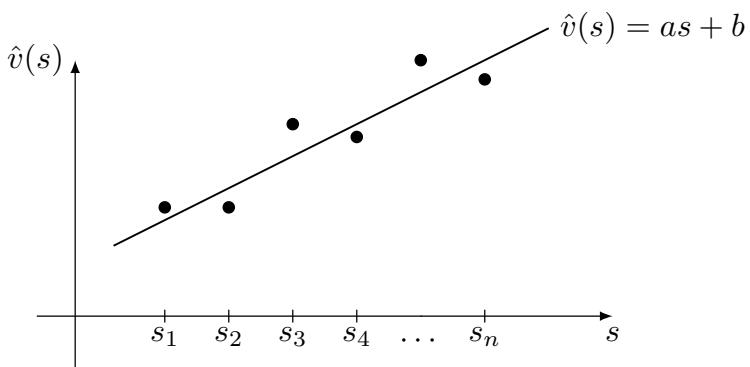  
*图 8.2：函数逼近方法的示意图。x轴和y轴分别对应$s$和$\hat{v}(s)$。*

# 8.1 价值表示：从表格到函数

接下来我们通过一个例子来说明表格化方法和函数逼近方法之间的区别。

假设有 $n$ 个状态 $\{ s _ { i } \} _ { i = 1 } ^ { n }$，其状态价值为 $\{ v _ { \pi } ( s _ { i } ) \} _ { i = 1 } ^ { n }$。这里 $\pi$ 是给定的策略。令 $\{ \hat { v } ( s _ { i } ) \} _ { i = 1 } ^ { n }$ 表示对真实状态价值的估计。如果我们使用表格化方法，估计值可以维护在下面的表格中。这个表格可以作为数组或向量存储在内存中。要检索或更新任何值，我们可以直接读取或重写表格中的相应条目。

| 状态 | S1 | S2 | ... | sn |
|-------|----|----|-----|----|
| 估计值 | $\hat{v}(s_1)$ | $\hat{v}(s_2)$ | ... | $\hat{v}(s_n)$ |

接下来我们展示，上表中的值可以通过一个函数来逼近。具体来说，$\{ \left( s _ { i } , \hat { v } ( s _ { i } ) \right) \} _ { i = 1 } ^ { n }$ 在图 8.2 中显示为 $n$ 个点。这些点可以通过一条曲线来拟合或逼近。最简单的曲线是直线，可以描述为

$$
\hat { v } ( s , w ) = a s + b = \underbrace { [ s , 1 ] } _ { \phi ^ { T } ( s ) } \underbrace { \left[ \begin{array} { l } { a } \\ { b } \end{array} \right] } _ { w } = \phi ^ { T } ( s ) w .
$$

这里，$\hat { v } ( s , w )$ 是一个用于逼近 $v _ { \pi } ( s )$ 的函数。它由状态 $s$ 和参数向量 $w \in \mathbb { R } ^ { 2 }$ 共同决定：$\hat { v } ( s , w )$ 有时也写作 $\hat { v } _ { w } ( s )$。这里，$\phi ( s ) \in \mathbb { R } ^ { 2 }$ 被称为 $s$ 的特征向量。

表格化方法和函数逼近方法之间的第一个显著区别在于它们如何检索和更新一个值。

## 如何检索一个值

当价值用表格表示时，如果我们想检索一个值，可以直接读取表格中对应的条目。然而，当价值用函数表示时，检索一个值就变得稍微复杂一些。具体来说，我们需要将状态索引 $s$ 输入到函数中并计算函数值（图 8.3）。对于 (8.1) 中的例子，我们首先需要计算特征向量 $\phi ( s )$，然后计算 $\phi ^ { T } ( s ) w$。如果函数是一个人工神经网络，则需要从输入到输出进行一次前向传播。

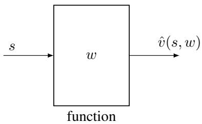
*图 8.3：使用函数逼近方法时检索状态 $s$ 价值的过程示意图。*

由于状态价值的检索方式，函数逼近方法在存储方面更高效。具体来说，虽然表格化方法需要存储 $n$ 个值，但现在我们只需要存储一个低维的参数向量 $w$。因此，存储效率可以显著提高。然而，这种好处并非没有代价。它带来了一个成本：状态价值可能无法被函数精确表示。例如，一条直线无法精确拟合图 8.2 中的点。这就是为什么这种方法被称为逼近。从根本上说，当我们使用低维向量来表示高维数据集时，必然会丢失一些信息。因此，函数逼近方法通过牺牲准确性来提升存储效率。

## 如何更新一个值

当价值用表格表示时，如果我们想更新一个值，可以直接重写表格中对应的条目。然而，当价值用函数表示时，更新值的方式完全不同。具体来说，我们必须更新 $w$ 来间接地改变价值。如何更新 $w$ 以找到最优的状态价值将在后面详细讨论。

由于状态价值的更新方式，函数逼近方法还有另一个优点：其泛化能力比表格化方法更强。原因如下。当使用表格化方法时，如果一个状态在一个回合中被访问到，我们可以更新其对应的价值。未被访问的状态的价值则无法更新。然而，当使用函数逼近方法时，我们需要更新 $w$ 来更新一个状态的价值。$w$ 的更新也会影响其他一些状态的价值，即使这些状态没有被访问过。因此，一个状态的经验样本可以泛化，帮助估计其他一些状态的价值。

上述分析在图 8.4 中进行了说明，其中有三个状态 $\{ s _ { 1 } , s _ { 2 } , s _ { 3 } \}$。假设我们有一个关于 $s _ { 3 }$ 的经验样本，并且想要更新 $\hat { v } ( s _ { 3 } )$：当使用表格化方法时，我们只能更新 $\hat { v } ( s _ { 3 } )$，而不会改变 $\hat { v } ( s _ { 1 } )$ 或 $\hat { v } ( s _ { 2 } )$，如图 8.4(a) 所示。当使用函数逼近方法时，更新 $w$ 不仅可以更新 $\hat { v } ( s _ { 3 } )$，还会改变 $\hat { v } ( s _ { 1 } )$ 和 $\hat { v } ( s _ { 2 } )$，如图 8.4(b) 所示。因此，$s _ { 3 }$ 的经验样本有助于更新其邻近状态的价值。

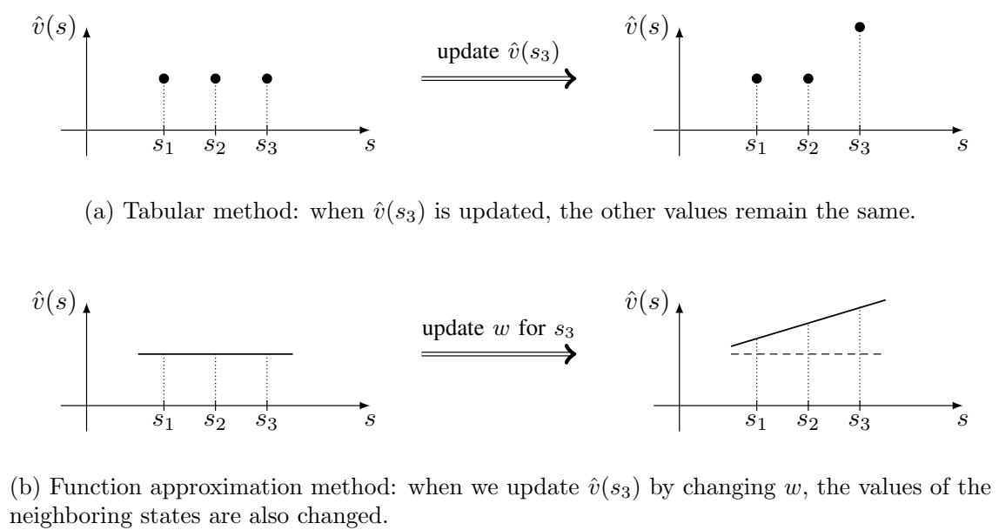
*图 8.4：更新状态价值方式的示意图。*

我们可以使用比直线更复杂、具有更强逼近能力的函数。例如，考虑一个二阶多项式：

$$
\hat { v } ( s , w ) = a s ^ { 2 } + b s + c = \underbrace { [ s ^ { 2 } , s , 1 ] } _ { \phi ^ { T } ( s ) } \underbrace { \left[ \begin{array} { l } { a } \\ { b } \\ { c } \end{array} \right] } _ { w } = \phi ^ { T } ( s ) w .
$$

我们甚至可以使用更高阶的多项式曲线来拟合这些点。随着曲线阶数的增加，逼近精度可以提高，但参数向量的维度也会增加，需要更多的存储和计算资源。

请注意，(8.1) 或 (8.2) 中的 $\hat { v } ( s , w )$ 关于 $w$ 是线性的（尽管它关于 $s$ 可能是非线性的）。这类方法被称为线性函数逼近，是最简单的函数逼近方法。为了实现线性函数逼近，我们需要选择一个合适的特征向量 $\phi ( s )$。也就是说，我们必须决定，例如，是应该使用一阶直线还是二阶曲线来拟合这些点。选择合适的特征向量并非易事。它需要对给定任务有先验知识：我们对任务理解得越好，就能选择越好的特征向量。例如，如果我们知道图 8.2 中的点大致位于一条直线上，我们就可以用一条直线来拟合这些点。然而，这种先验知识在实践中通常是未知的。如果我们没有任何先验知识，一个流行的解决方案是使用人工神经网络作为非线性函数逼近。

另一个重要的问题是如何找到最优的参数向量。如果我们知道 $\{ v _ { \pi } ( s _ { i } ) \} _ { i = 1 } ^ { n }$，这就是一个最小二乘问题。最优参数可以通过优化以下目标函数得到：

$$
\begin{aligned}
J _ { 1 } & = \sum _ { i = 1 } ^ { n } \left( \hat { v } ( s _ { i } , w ) - v _ { \pi } ( s _ { i } ) \right) ^ { 2 } = \sum _ { i = 1 } ^ { n } \left( \phi ^ { T } ( s _ { i } ) w - v _ { \pi } ( s _ { i } ) \right) ^ { 2 } \\
& = \left\| \left[ \begin{array} { c } { \phi ^ { T } ( s _ { 1 } ) } \\ { \vdots } \\ { \phi ^ { T } ( s _ { n } ) } \end{array} \right] w - \left[ \begin{array} { c } { v _ { \pi } ( s _ { 1 } ) } \\ { \vdots } \\ { v _ { \pi } ( s _ { n } ) } \end{array} \right] \right\| ^ { 2 } \doteq \| \Phi w - v _ { \pi } \| ^ { 2 } ,
\end{aligned}
$$

其中

$$
\Phi \doteq \left[ \begin{array} { c } { \phi ^ { T } ( s _ { 1 } ) } \\ { \vdots } \\ { \phi ^ { T } ( s _ { n } ) } \end{array} \right] \in \mathbb { R } ^ { n \times 2 } , \qquad v _ { \pi } \doteq \left[ \begin{array} { c } { v _ { \pi } ( s _ { 1 } ) } \\ { \vdots } \\ { v _ { \pi } ( s _ { n } ) } \end{array} \right] \in \mathbb { R } ^ { n } .
$$

可以验证，这个最小二乘问题的最优解是

$$
w ^ { * } = ( \Phi ^ { T } \Phi ) ^ { - 1 } \Phi v _ { \pi } .
$$

关于最小二乘问题的更多信息可以在 [47, Section 3.3] 和 [48, Section 5.14] 中找到。

本节介绍的曲线拟合示例阐释了价值函数逼近的基本思想。这个思想将在下一节正式介绍。

# 8.2 基于函数近似的状态值TD学习

本节将展示如何将函数近似方法与TD学习相结合，以估计给定策略的状态值。该算法将在8.3节扩展至动作值函数学习和最优策略求解。

本节包含多个小节和大量连贯性内容。在深入细节之前，我们最好先梳理内容框架：

- 函数近似方法以优化问题的形式进行建模。该问题的目标函数将在8.2.1节介绍。用于优化此目标函数的TD学习算法将在8.2.2节阐述。

- 应用TD学习算法需要选择合适的特征向量。8.2.3节将讨论该问题。8.2.4节将通过具体示例演示TD算法及不同特征向量的影响。

- 关于TD算法的理论分析将在8.2.5节给出。该小节数学推导较为密集，读者可根据兴趣选择性阅读。

# 8.2.1 目标函数

令 $v_{\pi}(s)$ 和 $\hat{v}(s, w)$ 分别表示 $s \in S$ 的真实状态值和近似状态值。要解决的问题是找到一个最优的 $w$，使得 $\hat{v}(s, w)$ 能够最好地逼近每个 $s$ 的 $v_{\pi}(s)$。具体而言，目标函数为

$$
J(w) = \mathbb{E}[(v_{\pi}(S) - \hat{v}(S, w))^{2}],
$$

其中期望是关于随机变量 $S \in S$ 计算的。虽然 $S$ 是一个随机变量，但它的概率分布是什么？这个问题对于理解该目标函数至关重要。定义 $S$ 的概率分布有几种方式：

- 第一种方式是使用均匀分布。即通过将每个状态的概率设为 $1/n$，将所有状态视为同等重要。在这种情况下，(8.3) 中的目标函数变为

  $$
  J(w) = \frac{1}{n} \sum_{s \in \mathcal{S}} (v_{\pi}(s) - \hat{v}(s, w))^{2},
  $$

  即所有状态近似误差的平均值。然而，这种方式没有考虑给定策略下马尔可夫过程的真实动态。由于某些状态可能很少被策略访问，将所有状态视为同等重要可能并不合理。

- 第二种方式，也是本章的重点，是使用平稳分布。平稳分布描述了马尔可夫决策过程的长期行为。更具体地说，在智能体执行给定策略足够长的时间后，智能体位于任何状态的概率都可以由该平稳分布描述。感兴趣的读者可以在专栏 8.1 中查看详情。

令 $\{d_{\pi}(s)\}_{s \in \mathcal{S}}$ 表示策略 $\pi$ 下马尔可夫过程的平稳分布。即，智能体在长时间后访问状态 $s$ 的概率为 $d_{\pi}(s)$。根据定义，$\sum_{s \in \mathcal{S}} d_{\pi}(s) = 1$。那么，(8.3) 中的目标函数可以重写为

$$
J(w) = \sum_{s \in \mathcal{S}} d_{\pi}(s) (v_{\pi}(s) - \hat{v}(s, w))^{2},
$$

这是一个加权平均的近似误差。被访问概率较高的状态被赋予更大的权重。

值得注意的是，$d_{\pi}(s)$ 的值不易获得，因为它需要知道状态转移概率矩阵 $P_{\pi}$（见专栏 8.1）。幸运的是，如下一小节所示，我们不需要计算 $d_{\pi}(s)$ 的具体值来最小化该目标函数。此外，在介绍 (8.4) 和 (8.5) 时，我们假设状态数量是有限的。当状态空间连续时，我们可以将求和替换为积分。

# 框文 8.1：马尔可夫决策过程的平稳分布

分析平稳分布的关键工具是 $P_{\pi} \in \mathbb{R}^{n \times n}$，它是在给定策略 $\pi$ 下的概率转移矩阵。如果状态索引为 $s_1, \ldots, s_n$，那么 $[P_{\pi}]_{ij}$ 定义为智能体从 $s_i$ 移动到 $s_j$ 的概率。$P_{\pi}$ 的定义可以在第 2.6 节找到。

## $P_{\pi}^k$ ($k = 1, 2, 3, \ldots$) 的解释

首先有必要检查 $P_{\pi}^k$ 中元素的解释。智能体恰好使用 $k$ 步从 $s_i$ 转移到 $s_j$ 的概率表示为

$$
p_{ij}^{(k)} = \mathrm{Pr}(S_{t_k} = j | S_{t_0} = i),
$$

其中 $t_0$ 和 $t_k$ 分别是初始和第 $k$ 个时间步。首先，根据 $P_{\pi}$ 的定义，我们有

$$
[P_{\pi}]_{ij} = p_{ij}^{(1)},
$$

这意味着 $[P_{\pi}]_{ij}$ 是使用单步从 $s_i$ 转移到 $s_j$ 的概率。其次，考虑 $P_{\pi}^2$。可以验证

$$
[P_{\pi}^2]_{ij} = [P_{\pi}P_{\pi}]_{ij} = \sum_{q=1}^{n} [P_{\pi}]_{iq} [P_{\pi}]_{qj}.
$$

由于 $[P_{\pi}]_{iq} [P_{\pi}]_{qj}$ 是从 $s_i$ 转移到 $s_q$ 然后再从 $s_q$ 转移到 $s_j$ 的联合概率，我们知道 $[P_{\pi}^2]_{ij}$ 是恰好使用两步从 $s_i$ 转移到 $s_j$ 的概率。即

$$
[P_{\pi}^2]_{ij} = p_{ij}^{(2)}.
$$

类似地，我们知道

$$
[P_{\pi}^k]_{ij} = p_{ij}^{(k)},
$$

这意味着 $[P_{\pi}^k]_{ij}$ 是恰好使用 $k$ 步从 $s_i$ 转移到 $s_j$ 的概率。

## 平稳分布的定义

令 $d_0 \in \mathbb{R}^n$ 是一个表示初始时间步状态概率分布的向量。例如，如果总是选择 $s$ 作为起始状态，那么 $d_0(s) = 1$ 且 $d_0$ 的其他条目为 $0$。令 $d_k \in \mathbb{R}^n$ 是从 $d_0$ 开始恰好经过 $k$ 步后获得的概率分布向量。那么，我们有

$$
d_k(s_i) = \sum_{j=1}^{n} d_0(s_j) [P_{\pi}^k]_{ji}, \quad i = 1, 2, \ldots.
$$

这个方程表明智能体在第 $k$ 步访问 $s_i$ 的概率等于智能体恰好使用 $k$ 步从 $\{s_j\}_{j=1}^{n}$ 转移到 $s_i$ 的概率之和。(8.6) 的矩阵-向量形式是

$$
d_k^T = d_0^T P_{\pi}^k.
$$

当我们考虑马尔可夫过程的长期行为时，在一定条件下有

$$
\lim_{k \to \infty} P_{\pi}^k = \mathbf{1}_n d_{\pi}^T,
$$

其中 $\mathbf{1}_n = [1, \ldots, 1]^T \in \mathbb{R}^n$ 且 $\mathbf{1}_n d_{\pi}^T$ 是一个所有行都等于 $d_{\pi}^T$ 的常数矩阵。(8.8) 成立的条件将在后面讨论。将 (8.8) 代入 (8.7) 得到

$$
\lim_{k \to \infty} d_k^T = d_0^T \lim_{k \to \infty} P_{\pi}^k = d_0^T \mathbf{1}_n d_{\pi}^T = d_{\pi}^T,
$$

其中最后一个等式成立是因为 $d_0^T \mathbf{1}_n = 1$。方程 (8.9) 意味着状态分布 $d_k$ 收敛到一个常数值 $d_{\pi}$，这被称为极限分布。极限分布取决于系统模型和策略 $\pi$。有趣的是，它与初始分布 $d_0$ 无关。也就是说，无论智能体从哪个状态开始，经过足够长的时间后，智能体的概率分布总是可以用极限分布来描述。

$d_{\pi}$ 的值可以通过以下方式计算。对 $d_k^T = d_{k-1}^T P_{\pi}$ 两边取极限得到 $\lim_{k \to \infty} d_k^T = \lim_{k \to \infty} d_{k-1}^T P_{\pi}$，因此

$$
d_{\pi}^T = d_{\pi}^T P_{\pi}.
$$

因此，$d_{\pi}$ 是 $P_{\pi}$ 对应于特征值 1 的左特征向量。(8.10) 的解称为平稳分布。对于所有 $s \in S$，有 $\sum_{s \in \mathcal{S}} d_{\pi}(s) = 1$ 且 $d_{\pi}(s) > 0$。$d_{\pi}(s) > 0$（而不是 $d_{\pi}(s) \geq 0$）的原因将在后面解释。

## 平稳分布唯一性的条件

(8.10) 的解 $d_{\pi}$ 通常称为平稳分布，而 (8.9) 中的分布 $d_{\pi}$ 通常称为极限分布。注意 (8.9) 蕴含 (8.10)，但反之不一定成立。具有唯一平稳（或极限）分布的一类常见马尔可夫过程是不可约（或正则）马尔可夫过程。下面给出一些必要的定义。更多细节可以在 [49, Chapter IV] 中找到。

如果存在一个有限整数 $k$ 使得 $[P_{\pi}]_{ij}^k > 0$，则称状态 $s_j$ 可从状态 $s_i$ 到达，这意味着从 $s_i$ 开始的智能体在有限次转移后可能到达 $s_j$。

如果两个状态 $s_i$ 和 $s_j$ 相互可达，则称这两个状态是连通的。

如果一个马尔可夫过程的所有状态都相互连通，则称其为不可约的。换句话说，从任意状态开始的智能体在有限步内可能到达任何其他状态。数学上，这表明对于任意 $s_i$ 和 $s_j$，存在 $k \geq 1$ 使得 $[P_{\pi}^k]_{ij} > 0$（$k$ 的值可能因不同的 $i, j$ 而异）。

如果存在 $k \geq 1$ 使得对于所有 $i, j$ 都有 $[P_{\pi}^k]_{ij} > 0$，则称马尔可夫过程是正则的。等价地，存在 $k \geq 1$ 使得 $P_{\pi}^k > 0$，其中 $>$ 是按元素的。因此，有可能在最多 $k$ 步内从任何其他状态到达每个状态。正则马尔可夫过程也是不可约的，但反之不成立。然而，如果一个马尔可夫过程是不可约的并且存在 $i$ 使得 $[P_{\pi}]_{ii} > 0$，那么它也是正则的。此外，如果 $P_{\pi}^k > 0$，那么对于任何 $k' \geq k$ 都有 $P_{\pi}^{k'} > 0$，因为 $P_{\pi} \geq 0$。然后从 (8.9) 可知，对于每个 $s$ 都有 $d_{\pi}(s) > 0$。

## 可能导致唯一平稳分布的策略

一旦给出策略，马尔可夫决策过程就变成了一个马尔可夫过程，其长期行为由给定的策略和系统模型共同决定。那么，一个重要的问题是，什么样的策略可以导致正则马尔可夫过程？一般来说，答案是探索性策略，例如 $\epsilon$-贪婪策略。这是因为探索性策略在任何状态下都有正概率采取任何动作。因此，当系统模型允许时，状态可以相互通信。

> 图 8.5 给出了一个说明平稳分布的示例。此示例中的策略是 $\epsilon$-贪婪策略，其中 $\epsilon = 0.5$。状态索引为 $s_1, s_2, s_3, s_4$，分别对应网格中的左上、右上、左下和右下单元格。

我们比较两种计算平稳分布的方法。第一种方法是求解 (8.10) 以获得 $d_{\pi}$ 的理论值。第二种方法是通过数值方法估计 $d_{\pi}$：我们从任意初始状态开始，按照给定策略生成一个足够长的回合。然后，$d_{\pi}$ 可以通过回合中每个状态被访问的次数与回合总长度的比率来估计。当回合越长时，估计结果越准确。接下来我们比较理论和估计结果。

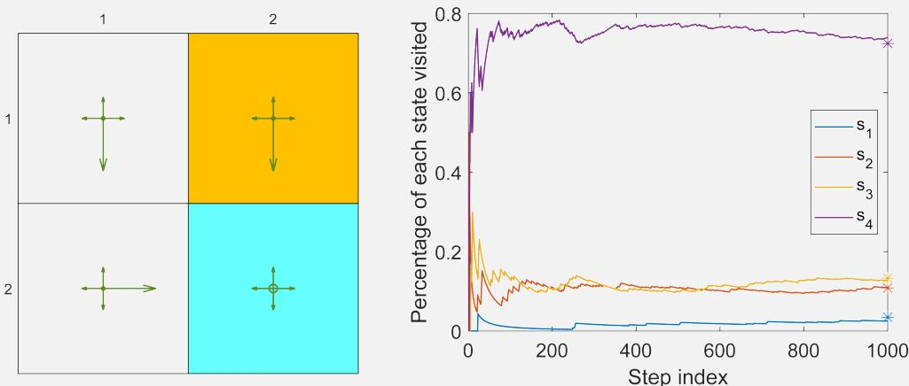
*图 8.5：$\epsilon = 0.5$ 的 $\epsilon$-贪婪策略的长期行为。右图中的星号表示 $d_{\pi}$ 元素的理论值*

### $d_{\pi}$ 的理论值

可以验证，由该策略诱导的马尔可夫过程既是不可约的也是正则的。这是由于以下原因。首先，由于所有状态都是连通的，因此产生的马尔可夫过程是不可约的。其次，由于每个状态都可以转移到自身，因此产生的马尔可夫过程是正则的。从图 8.5 可以看出

$$
P_{\pi}^T = \left[ \begin{array}{cccc}
0.3 & 0.1 & 0.1 & 0 \\
0.1 & 0.3 & 0 & 0.1 \\
0.6 & 0 & 0.3 & 0.1 \\
0 & 0.6 & 0.6 & 0.8
\end{array} \right].
$$

$P_{\pi}^T$ 的特征值可以计算为 $\{-0.0449, 0.3, 0.4449, 1\}$。$P_{\pi}^T$ 对应于特征值 1 的单位长度（右）特征向量是 $[0.0463, 0.1455, 0.1785, 0.9720]^T$。将此向量缩放使其所有元素之和等于 1 后，我们得到 $d_{\pi}$ 的理论值如下：

$$
d_{\pi} = \left[ \begin{array}{l}
0.0345 \\
0.1084 \\
0.1330 \\
0.7241
\end{array} \right].
$$

$d_{\pi}$ 的第 $i$ 个元素对应于智能体在长期运行中访问 $s_i$ 的概率。

## $d_{\pi}$ 的估计值

我们接下来通过在模拟中执行策略足够多的步数来验证上述 $d_{\pi}$ 的理论值。具体来说，我们选择 $s_1$ 作为起始状态，并按照策略运行 1,000 步。过程中每个状态被访问的比例显示在图 8.5 中。可以看出，经过数百步后，比例收敛到 $d_{\pi}$ 的理论值。

# 8.2.2 优化算法

为了最小化（8.3）中的目标函数 $J(w)$，我们可以使用梯度下降算法：

$$
w_{k+1} = w_k - \alpha_k \nabla_w J(w_k),
$$

其中

$$
\begin{array}{rl}
& \nabla_{\boldsymbol{w}} J(\boldsymbol{w}_k) = \nabla_{\boldsymbol{w}} \mathbb{E}[(\boldsymbol{v}_{\pi}(\boldsymbol{S}) - \boldsymbol{\hat{v}}(\boldsymbol{S}, \boldsymbol{w}_k))^2] \\
& = \mathbb{E}[\nabla_{\boldsymbol{w}}(\boldsymbol{v}_{\pi}(\boldsymbol{S}) - \boldsymbol{\hat{v}}(\boldsymbol{S}, \boldsymbol{w}_k))^2] \\
& = 2\mathbb{E}[(\boldsymbol{v}_{\pi}(\boldsymbol{S}) - \boldsymbol{\hat{v}}(\boldsymbol{S}, \boldsymbol{w}_k))(-\nabla_{\boldsymbol{w}}\boldsymbol{\hat{v}}(\boldsymbol{S}, \boldsymbol{w}_k))] \\
& = -2\mathbb{E}[(\boldsymbol{v}_{\pi}(\boldsymbol{S}) - \boldsymbol{\hat{v}}(\boldsymbol{S}, \boldsymbol{w}_k))\nabla_{\boldsymbol{w}}\boldsymbol{\hat{v}}(\boldsymbol{S}, \boldsymbol{w}_k)].
\end{array}
$$

因此，梯度下降算法为

$$
\boldsymbol{w}_{k+1} = \boldsymbol{w}_k + 2\alpha_k \mathbb{E}[(\boldsymbol{v}_{\pi}(\boldsymbol{S}) - \boldsymbol{\hat{v}}(\boldsymbol{S}, \boldsymbol{w}_k))\nabla_{\boldsymbol{w}}\boldsymbol{\hat{v}}(\boldsymbol{S}, \boldsymbol{w}_k)],
$$

其中 $\alpha_k$ 前的系数 2 可以在不失一般性的情况下合并到 $\alpha_k$ 中。（8.11）中的算法需要计算期望值。按照随机梯度下降的思想，我们可以用随机梯度代替真实梯度。于是（8.11）变为

$$
w_{t+1} = w_t + \alpha_t \big(v_{\pi}(s_t) - \hat{v}(s_t, w_t)\big) \nabla_w \hat{v}(s_t, w_t),
$$

其中 $s_t$ 是时刻 $t$ 时 $S$ 的一个样本。

值得注意的是，（8.12）不可实现，因为它需要真实的状态价值 $v_{\pi}$，而这是未知且必须估计的。我们可以用近似值替换 $v_{\pi}(s_t)$ 来使算法可实现。以下两种方法可用于实现这一目标。

$\diamond$ **蒙特卡洛方法**：假设我们有一个回合 $(s_0, r_1, s_1, r_2, \dots)$。令 $g_t$ 为从 $s_t$ 开始的折扣回报。那么，$g_t$ 可以用作 $v_{\pi}(s_t)$ 的近似值。（8.12）中的算法变为

$$
w_{t+1} = w_t + \alpha_t \big(g_t - \hat{v}(s_t, w_t)\big) \nabla_w \hat{v}(s_t, w_t).
$$

这就是使用函数近似的蒙特卡洛学习算法。

$\diamond$ **时序差分方法**：按照 TD 学习的思想，$r_{t+1} + \gamma \hat{v}(s_{t+1}, w_t)$ 可以用作 $v_{\pi}(s_t)$ 的近似值。（8.12）中的算法变为

$$
w_{t+1} = w_t + \alpha_t \left[r_{t+1} + \gamma \hat{v}(s_{t+1}, w_t) - \hat{v}(s_t, w_t)\right] \nabla_w \hat{v}(s_t, w_t).
$$

这就是使用函数近似的 TD 学习算法。该算法总结在算法 8.1 中。

理解（8.13）中的 TD 算法对于研究本章中的其他算法非常重要。值得注意的是，（8.13）只能学习给定策略的状态价值。在 8.3.1 和 8.3.2 节中，它将扩展为能够学习动作价值的算法。

# 8.2.3 函数逼近器的选择

为了应用（8.13）中的TD算法，我们需要选择合适的$\hat{v}(s, w)$。有两种实现方式：第一种是使用人工神经网络作为非线性函数逼近器。神经网络的输入是状态，输出是$\hat{v}(s, w)$，网络参数为$w$。第二种是简单地使用线性函数：

$$
\hat{v}(s, w) = \phi^{T}(s) w,
$$

其中$\phi(s) \in \mathbb{R}^{m}$是$s$的特征向量。$\phi(s)$与$w$的长度均为$m$，通常远小于状态数量。在线性情况下，梯度为

$$
\nabla_{w} \hat{v}(s, w) = \phi(s),
$$

将其代入（8.13）可得

$$
w_{t+1} = w_{t} + \alpha_{t} \big[ r_{t+1} + \gamma \phi^{T}(s_{t+1}) w_{t} - \phi^{T}(s_{t}) w_{t} \big] \phi(s_{t}).
$$

这就是采用线性函数逼近的TD学习算法，简称为TD-Linear。

**算法8.1：基于函数逼近的状态值TD学习**

- **初始化**：选择对$w$可微的函数$\hat{v}(s, w)$。初始化参数$w_{0}$
- **目标**：学习给定策略$\pi$的真实状态值
- 对于由$\pi$生成的每个episode $\{(s_{t}, r_{t+1}, s_{t+1})\}_{t}$，执行：
  - 对每个样本$(s_{t}, r_{t+1}, s_{t+1})$，执行：
    - 通用情况：$w_{t+1} = w_{t} + \alpha_{t} [r_{t+1} + \gamma \hat{v}(s_{t+1}, w_{t}) - \hat{v}(s_{t}, w_{t})] \nabla_{w} \hat{v}(s_{t}, w_{t})$
    - 线性情况：$w_{t+1} = w_{t} + \alpha_{t} \big[ r_{t+1} + \gamma \phi^{T}(s_{t+1}) w_{t} - \phi^{T}(s_{t}) w_{t} \big] \phi(s_{t})$

线性情况在理论上的研究深度远胜于非线性情况，但其逼近能力有限。对于复杂任务，选择合适的特征向量也非易事。相比之下，人工神经网络作为黑箱通用非线性逼近器能够逼近各类值函数，具有更好的易用性。

尽管如此，研究线性情况仍具有重要意义：深入理解线性情况有助于读者更好地掌握函数逼近方法的思想；对于本书涉及的简单网格世界任务，线性逼近已足够解决问题；更重要的是，表格法可视为线性情况的特例，这充分体现了线性方法的普适性。更多细节见框8.2。

# 框 8.2：表格 TD 学习是 TD-Linear 的特例

接下来我们将证明，第 7 章中 (7.1) 式的表格 TD 算法是 (8.14) 式中 TD-Linear 算法的一个特例。

考虑对任意 $s \in S$ 的以下特殊特征向量：

$$
\phi(s) = e_s \in \mathbb{R}^n,
$$

其中 $e_s$ 是对应状态 $s$ 的分量为 $1$、其余分量为 $0$ 的向量。在这种情况下，

$$
\hat{v}(s, w) = e_s^T w = w(s),
$$

这里 $w(s)$ 是 $w$ 中对应状态 $s$ 的分量。将上述等式代入 (8.14) 式可得

$$
w_{t+1} = w_t + \alpha_t \big( r_{t+1} + \gamma w_t(s_{t+1}) - w_t(s_t) \big) e_{s_t}.
$$

根据 $e_{s_t}$ 的定义，上述方程仅更新分量 $w_t(s_t)$。基于此，在等式两边同时左乘 $e_{s_t}^T$ 可得

$$
w_{t+1}(s_t) = w_t(s_t) + \alpha_t \big( r_{t+1} + \gamma w_t(s_{t+1}) - w_t(s_t) \big),
$$

这正是 (7.1) 式中的表格 TD 算法。

总之，通过选择特征向量 $\phi(s) = e_s$，TD-Linear 算法就变成了表格 TD 算法。

# 8.2.4 示例说明

接下来我们展示一些示例，演示如何使用（8.14）中的TD-Linear算法估计给定策略的状态值。同时，我们演示如何选择特征向量。

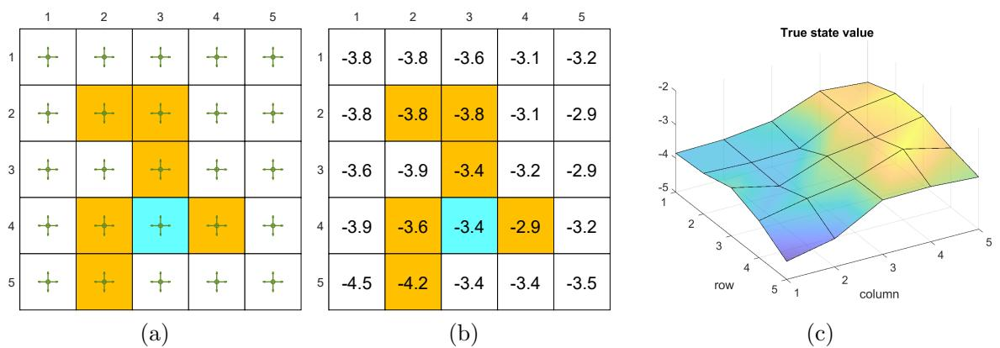  
*图8.6：（a）待评估的策略。（b）以表格形式表示的真实状态值。（c）以3D曲面表示的真实状态值。*

网格世界示例如图8.6所示。给定策略在每个状态下以0.2的概率采取任意动作。我们的目标是估计该策略下的状态值。总共有25个状态值。真实状态值如图8.6(b)所示。真实状态值在图8.6(c)中以三维曲面形式可视化。

接下来我们将展示可以使用少于25个参数来近似这些状态值。仿真设置如下：通过给定策略生成500个回合，每个回合有500步，从均匀分布的随机选择的状态-动作对开始。此外，在每次仿真试验中，参数向量$w$随机初始化，每个元素从均值为0、标准差为1的标准正态分布中抽取。我们设置$r_{\mathrm{forbidden}} = r_{\mathrm{boundary}} = -1$，$r_{\mathrm{target}} = 1$，以及$\gamma = 0.9$。

要实现TD-Linear算法，我们首先需要选择特征向量$\phi(s)$。如下所示，有不同方法可以实现这一点。

## 多项式特征向量

第一种特征向量基于多项式。在网格世界示例中，状态$s$对应一个二维位置。令$x$和$y$分别表示$s$的列索引和行索引。为避免数值问题，我们对$x$和$y$进行归一化，使其值在区间$[-1, +1]$内。略微滥用符号，归一化后的值仍用$x$和$y$表示。那么，最简单的特征向量是

$$
\phi(s) = \left[ \begin{array}{l} x \\ y \end{array} \right] \in \mathbb{R}^{2}.
$$

在这种情况下，我们有

$$
\hat{v}(s, w) = \phi^{T}(s)w = [x, y] \left[ \begin{array}{l} w_{1} \\ w_{2} \end{array} \right] = w_{1}x + w_{2}y.
$$

当$w$给定时，$\hat{v}(s, w) = w_{1}x + w_{2}y$表示一个通过原点的二维平面。由于状态值的曲面可能不通过原点，我们需要向二维平面引入偏置以更好地近似状态值。为此，我们考虑以下三维特征向量：

$$
\phi(s) = \left[ \begin{array}{l} 1 \\ x \\ y \end{array} \right] \in \mathbb{R}^{3}.
$$

在这种情况下，近似状态值为

$$
\hat{v}(s, w) = \phi^{T}(s)w = [1, x, y] \left[ \begin{array}{l} w_{1} \\ w_{2} \\ w_{3} \end{array} \right] = w_{1} + w_{2}x + w_{3}y.
$$

当$w$给定时，$\hat{v}(s, w)$对应一个可能不通过原点的平面。值得注意的是，$\phi(s)$也可以定义为$\phi(s) = [x, y, 1]^{T}$，其中元素的顺序无关紧要。

使用（8.15）中的特征向量得到的估计结果如图8.7(a)所示。可以看出，估计的状态值形成一个二维平面。尽管随着使用更多回合，估计误差会收敛，但由于二维平面的近似能力有限，误差无法减小到零。

为了增强近似能力，我们可以增加特征向量的维度。为此，考虑

$$
\phi(s) = [1, x, y, x^{2}, y^{2}, xy]^{T} \in \mathbb{R}^{6}.
$$

在这种情况下，$\hat{v}(s, w) = \phi^{T}(s)w = w_{1} + w_{2}x + w_{3}y + w_{4}x^{2} + w_{5}y^{2} + w_{6}xy$，对应一个二次三维曲面。我们可以进一步增加特征向量的维度：

$$
\phi(s) = [1, x, y, x^{2}, y^{2}, xy, x^{3}, y^{3}, x^{2}y, xy^{2}]^{T} \in \mathbb{R}^{10}.
$$

使用（8.16）和（8.17）中的特征向量得到的估计结果如图8.7(b)-(c)所示。可以看出，特征向量越长，状态值的近似越准确。然而，在所有三种情况下，估计误差都无法收敛到零，因为这些线性近似器仍然具有有限的近似能力。

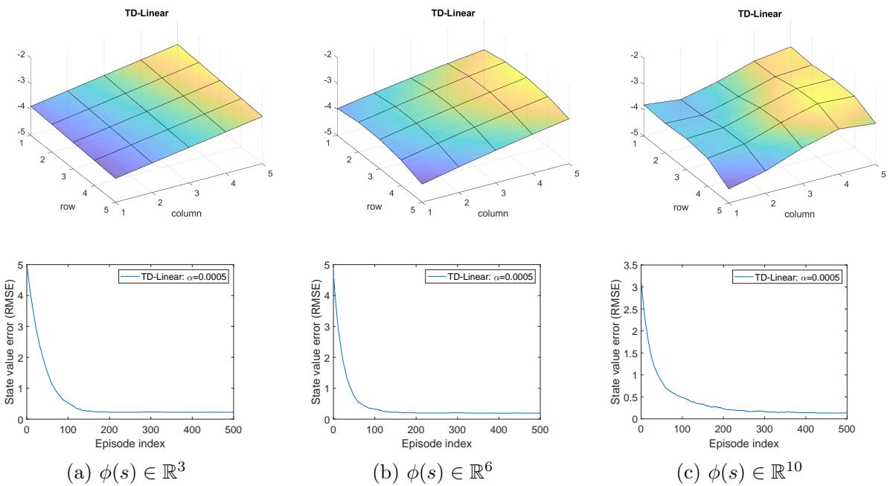  
*图8.7：使用（8.15）、（8.16）和（8.17）中的多项式特征得到的TD-Linear估计结果。*

## 傅里叶特征向量

$\diamond$ 除了多项式特征向量，还有许多其他类型的特征可用，例如傅里叶基和瓦片编码[3, 第9章]。首先，将每个状态的$x$和$y$值归一化到区间$[0, 1]$。得到的特征向量为

$$
\phi(s) = \left[ \begin{array}{c} \vdots \\ \cos \big( \pi (c_{1}x + c_{2}y) \big) \\ \vdots \end{array} \right] \in \mathbb{R}^{(q+1)^{2}},
$$

其中$\pi$表示圆周率，即$3.1415\ldots$，而不是策略。这里，$c_{1}$或$c_{2}$可以设置为$\{0, 1, \ldots, q\}$中的任意整数，其中$q$是用户指定的整数。因此，对$(c_{1}, c_{2})$有$(q+1)^{2}$种可能的取值。因此，$\phi(s)$的维度是$(q+1)^{2}$。例如，当$q = 1$时，特征向量为

$$
\phi(s) = \left[ \begin{array}{l} \cos \left( \pi (0x + 0y) \right) \\ \cos \left( \pi (0x + 1y) \right) \\ \cos \left( \pi (1x + 0y) \right) \\ \cos \left( \pi (1x + 1y) \right) \end{array} \right] = \left[ \begin{array}{l} 1 \\ \cos(\pi y) \\ \cos(\pi x) \\ \cos(\pi(x + y)) \end{array} \right] \in \mathbb{R}^{4}.
$$

使用$q = 1, 2, 3$的傅里叶特征得到的估计结果如图8.8所示。三种情况下特征向量的维度分别为$4, 9, 16$。可以看出，特征向量的维度越高，状态值的近似越准确。

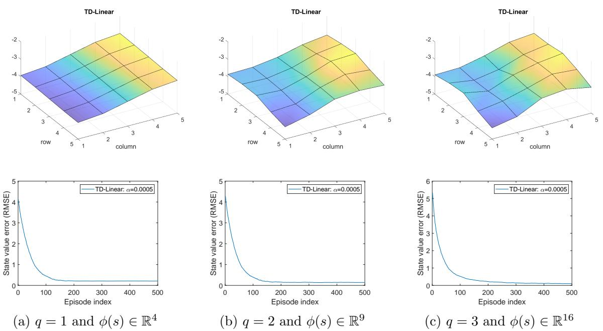  
*图8.8：使用（8.18）中的傅里叶特征得到的TD-Linear估计结果。*

# 8.2.5 理论分析

至此，我们已经完成了关于函数逼近的TD学习方法的阐述。这一阐述始于目标函数(8.3)。为了优化该目标函数，我们引入了随机算法(8.12)。随后，算法中未知的真实价值函数被近似值替代，从而推导出TD算法(8.13)。虽然这一阐述有助于理解价值函数逼近的基本思想，但它在数学上并不严谨。例如，算法(8.13)实际上并未最小化目标函数(8.3)。

接下来我们将对TD算法(8.13)进行理论分析，以揭示该算法为何能有效工作及其解决的数学问题。由于一般的非线性逼近器难以分析，本部分仅讨论线性情况。鉴于本部分涉及较多数学内容，建议读者根据兴趣选择性阅读。

# 收敛性分析

为了研究(8.13)的收敛性质，我们首先考虑以下确定性算法：

$$
\boldsymbol{w}_{t+1} = \boldsymbol{w}_t + \alpha_t \mathbb{E} \Big[ \big( \boldsymbol{r}_{t+1} + \gamma \boldsymbol{\phi}^T(\boldsymbol{s}_{t+1}) \boldsymbol{w}_t - \boldsymbol{\phi}^T(\boldsymbol{s}_t) \boldsymbol{w}_t \big) \boldsymbol{\phi}(\boldsymbol{s}_t) \Big],
$$

其中期望是关于随机变量$s_t, s_{t+1}, r_{t+1}$计算的。假设$s_t$的分布是平稳分布$d_\pi$。(8.19)中的算法是确定性的，因为在计算期望后随机变量$s_t, s_{t+1}, r_{t+1}$都消失了。

为什么我们要考虑这个确定性算法？首先，这个确定性算法的收敛性更容易（尽管不简单）分析。其次且更重要的是，这个确定性算法的收敛性意味着(8.13)中随机TD算法的收敛性。这是因为(8.13)可以看作是(8.19)的随机梯度下降(SGD)实现。因此，我们只需要研究确定性算法的收敛性质。

虽然(8.19)的表达式初看可能很复杂，但它可以被大大简化。为此，定义

$$
\Phi = \left[ \begin{array}{c} \vdots \\ \phi^T(s) \\ \vdots \end{array} \right] \in \mathbb{R}^{n \times m}, \quad D = \left[ \begin{array}{ccc} \ddots & & \\ & d_\pi(s) & \\ & & \ddots \end{array} \right] \in \mathbb{R}^{n \times n},
$$

其中$\Phi$是包含所有特征向量的矩阵，$\boldsymbol{D}$是一个对角矩阵，其对角线元素为平稳分布。这两个矩阵将经常被使用。

**引理8.1.** (8.19)中的期望可以重写为

$$
\mathbb{E} \Big[ \big( r_{t+1} + \gamma \phi^T(s_{t+1}) w_t - \phi^T(s_t) w_t \big) \phi(s_t) \Big] = b - A w_t,
$$

其中

$$
\begin{aligned}
A & \doteq \Phi^T D (I - \gamma P_\pi) \Phi \in \mathbb{R}^{m \times m}, \\
b & \doteq \Phi^T D r_\pi \in \mathbb{R}^m.
\end{aligned}
$$

这里，$P_\pi, r_\pi$是贝尔曼方程$\boldsymbol{v}_\pi = \boldsymbol{r}_\pi + \gamma \boldsymbol{P}_\pi \boldsymbol{v}_\pi$中的两个项，$I$是具有适当维度的单位矩阵。

证明在框8.3中给出。利用引理8.1中的表达式，(8.19)中的确定性算法可以重写为

$$
w_{t+1} = w_t + \alpha_t (b - A w_t),
$$

这是一个简单的确定性过程。其收敛性分析如下。

首先，$w_t$的收敛值是什么？假设地，如果$w_t$在$t \to \infty$时收敛到一个常数值$w^*$，那么(8.22)意味着$w^* = w^* + \alpha_\infty (b - A w^*)$，这表明$b - A w^* = 0$，因此

$$
w^* = A^{-1} b.
$$

关于这个收敛值的几点说明如下。

- **$A$是否可逆？** 答案是肯定的。实际上，$A$不仅可逆而且是正定的。也就是说，对于任何具有适当维度的非零向量$x$，$x^T A x > 0$。证明在框8.4中给出。

> $w^* = A^{-1} b$的解释是什么？它实际上是最小化投影贝尔曼误差的最优解。细节将在8.2.5节介绍。表格方法是特殊情况。一个有趣的结果是，当$w$的维度等于$n = |S|$且$\phi(s) = [0, \ldots, 1, \ldots, 0]^T$（其中对应$s$的条目为$1$）时，我们有
>
> $$
> w^* = A^{-1} b = v_\pi.
> $$
>
> 这个方程表明要学习的参数向量实际上是真实的状态值。这个结论与表格TD算法是TD-Linear算法的特殊情况这一事实一致，如框8.2中介绍。(8.23)的证明如下。可以验证在这种情况下$\Phi = I$，因此$A = \Phi^T D (I - \gamma P_\pi) \Phi = D (I - \gamma P_\pi)$且$b = \Phi^T D r_\pi = D r_\pi$。因此，$w^* = A^{-1} b = (I - \gamma P_\pi)^{-1} D^{-1} D r_\pi = (I - \gamma P_\pi)^{-1} r_\pi = v_\pi$。

其次，我们证明(8.22)中的$w_t$在$t \to \infty$时收敛到$w^* = A^{-1} b$。由于(8.22)是一个简单的确定性过程，可以用多种方式证明。我们给出两种证明如下。

- **证明1：** 定义收敛误差为$\delta_t \doteq w_t - w^*$。我们只需要证明$\delta_t$收敛到零。为此，将$\boldsymbol{w}_t = \boldsymbol{\delta}_t + \boldsymbol{w}^*$代入(8.22)得到

$$
\delta_{t+1} = \delta_t - \alpha_t A \delta_t = (I - \alpha_t A) \delta_t.
$$

然后有

$$
\delta_{t+1} = (I - \alpha_t A) \cdots (I - \alpha_0 A) \delta_0.
$$

考虑所有$t$的$\alpha_t = \alpha$的简单情况。那么，我们有

$$
\lVert \delta_{t+1} \rVert_2 \leq \lVert I - \alpha A \rVert_2^{t+1} \lVert \delta_0 \rVert_2.
$$

当$\alpha > 0$足够小时，我们有$\| I - \alpha A \|_2 < 1$，因此当$t \to \infty$时$\delta_t \to 0$。$\| I - \alpha A \|_2 < 1$成立的原因是$A$是正定的，因此对于任何$x$有$x^T (I - \alpha A) x < 1$。

- **证明2：** 考虑$g(w) \doteq b - A w$。由于$w^*$是$g(w) = 0$的根，该任务实际上是一个求根问题。(8.22)中的算法实际上是一个Robbins-Monro(RM)算法。虽然原始RM算法是为随机过程设计的，但它也可以应用于确定性情况。RM算法的收敛性可以揭示$w_{t+1} = w_t + \alpha_t (b - A w_t)$的收敛性。也就是说，当$\sum_t \alpha_t = \infty$且$\sum_t \alpha_t^2 < \infty$时，$w_t$收敛到$w^*$。

# 方框 8.3：引理 8.1 的证明

通过使用全期望定律，我们有

$$
\begin{array} { r l } 
& \mathbb{E} \Big [ r _ { t + 1 } \phi ( s _ { t } ) + \phi ( s _ { t } ) \big ( \gamma \phi ^ { T } ( s _ { t + 1 } ) - \phi ^ { T } ( s _ { t } ) \big ) w _ { t } \Big ] \\ 
& = \displaystyle \sum _ { s \in S } d _ { \pi } ( s ) \mathbb { E } \Big [ r _ { t + 1 } \phi ( s _ { t } ) + \phi ( s _ { t } ) \big ( \gamma \phi ^ { T } ( s _ { t + 1 } ) - \phi ^ { T } ( s _ { t } ) \big ) w _ { t } \big | s _ { t } = s \Big ] \\ 
& = \displaystyle \sum _ { s \in S } d _ { \pi } ( s ) \mathbb { E } \Big [ r _ { t + 1 } \phi ( s _ { t } ) \big | s _ { t } = s \Big ] + \displaystyle \sum _ { s \in S } d _ { \pi } ( s ) \mathbb { E } \Big [ \phi ( s _ { t } ) \big ( \gamma \phi ^ { T } ( s _ { t + 1 } ) - \phi ^ { T } ( s _ { t } ) \big ) w _ { t } \big | s _ { t } = s \Big ] .
\end{array}
$$

这里，假设 $s _ { t }$ 服从平稳分布 $d _ { \pi }$。

首先，考虑 (8.24) 中的第一项。注意

$$
\mathbb { E } \Big [ r _ { t + 1 } \phi ( s _ { t } ) \big | s _ { t } = s \Big ] = \phi ( s ) \mathbb { E } \Big [ r _ { t + 1 } \big | s _ { t } = s \Big ] = \phi ( s ) r _ { \pi } ( s ) ,
$$

其中 $r _ { \pi } ( s ) = \sum _ { a } \pi ( a \vert s ) \sum _ { r } r p ( r \vert s , a )$。那么，(8.24) 中的第一项可以重写为

$$
\sum _ { s \in \mathcal { S } } d _ { \pi } ( s ) \mathbb { E } \Big [ r _ { t + 1 } \phi ( s _ { t } ) \big | s _ { t } = s \Big ] = \sum _ { s \in \mathcal { S } } d _ { \pi } ( s ) \phi ( s ) r _ { \pi } ( s ) = \Phi ^ { T } D r _ { \pi } ,
$$

其中 $r _ { \pi } = [ \cdots , r _ { \pi } ( s ) , \cdots ] ^ { T } \in \mathbb { R } ^ { n }$。

其次，考虑 (8.24) 中的第二项。由于

$$
\begin{array} { r l } 
& \mathbb { E } \Big [ \phi ( s _ { t } ) \big ( \gamma \phi ^ { T } ( s _ { t + 1 } ) - \phi ^ { T } ( s _ { t } ) \big ) w _ { t } \big | s _ { t } = s \Big ] \\ 
& = - \mathbb { E } \Big [ \phi ( s _ { t } ) \phi ^ { T } ( s _ { t } ) w _ { t } \big | s _ { t } = s \Big ] + \mathbb { E } \Big [ \gamma \phi ( s _ { t } ) \phi ^ { T } ( s _ { t + 1 } ) w _ { t } \big | s _ { t } = s \Big ] \\ 
& = - \phi ( s ) \phi ^ { T } ( s ) w _ { t } + \gamma \phi ( s ) \mathbb { E } \Big [ \phi ^ { T } ( s _ { t + 1 } ) \big | s _ { t } = s \Big ] w _ { t } \\ 
& = - \phi ( s ) \phi ^ { T } ( s ) w _ { t } + \gamma \phi ( s ) \sum _ { s ^ { \prime } \in S } p ( s ^ { \prime } | s ) \phi ^ { T } ( s ^ { \prime } ) w _ { t } ,
\end{array}
$$

(8.24) 中的第二项变为

$$
\begin{array} { r l } 
& \displaystyle \sum _ { s \in \mathcal { S } } d _ { \pi } ( s ) \mathbb { E } \Big [ \phi ( s _ { t } ) \big ( \gamma \phi ^ { T } ( s _ { t + 1 } ) - \phi ^ { T } ( s _ { t } ) \big ) w _ { t } \big \rvert s _ { t } = s \Big ] \\ 
& = \displaystyle \sum _ { s \in \mathcal { S } } d _ { \pi } ( s ) \Big [ - \phi ( s ) \phi ^ { T } ( s ) w _ { t } + \gamma \phi ( s ) \sum _ { s ^ { \prime } \in \mathcal { S } } p ( s ^ { \prime } | s ) \phi ^ { T } ( s ^ { \prime } ) w _ { t } \Big ] \\ 
& = \displaystyle \sum _ { s \in \mathcal { S } } d _ { \pi } ( s ) \phi ( s ) \Big [ - \phi ( s ) + \gamma \displaystyle \sum _ { s ^ { \prime } \in \mathcal { S } } p ( s ^ { \prime } | s ) \phi ( s ^ { \prime } ) \Big ] ^ { T } w _ { t } \\ 
& = \displaystyle \Phi ^ { T } D ( - \Phi + \gamma P _ { \pi } \Phi ) w _ { t } \\ 
& = - \Phi ^ { T } D ( I - \gamma P _ { \pi } ) \Phi w _ { t } .
\end{array}
$$

结合 (8.25) 和 (8.26) 可得

$$
\begin{array} { r } 
\mathbb { E } \Big [ \big ( r _ { t + 1 } + \gamma \phi ^ { T } ( s _ { t + 1 } ) w _ { t } - \phi ^ { T } ( s _ { t } ) w _ { t } \big ) \phi ( s _ { t } ) \Big ] = \Phi ^ { T } D r _ { \pi } - \Phi ^ { T } D ( I - \gamma P _ { \pi } ) \Phi w _ { t } \\ 
\stackrel { } { = } b - A w _ { t } ,
\end{array}
$$

其中 $b \doteq \Phi ^ { T } D r _ { \pi }$ 且 $A \doteq \Phi ^ { T } D ( I - \gamma P _ { \pi } ) \Phi$。

# 方框 8.4：证明 $A = \Phi ^ { T } D ( I - \gamma P _ { \pi } ) \Phi$ 可逆且正定

若对于任意适当维度的非零向量 $x$ 均有 $x ^ { T } A x > 0$，则矩阵 $A$ 是正定的。若 $A$ 正定（或负定），记作 $A \succ 0$（或 $A \prec 0$）。此处需注意 $\succ$ 和 $\prec$ 与 $>$ 和 $<$ 的区别，后者表示逐元素比较。注意 $A$ 可能不对称。虽然正定矩阵通常指对称矩阵，但非对称矩阵也可能正定。

接下来我们证明 $A \succ 0$，从而 $A$ 可逆。证明 $A \succ 0$ 的思路是证明

$$
D ( I - \gamma P _ { \pi } ) \doteq M \succ 0 .
$$

显然 $M \succ 0$ 意味着 $A = \Phi ^ { T } M \Phi \succ 0$，因为 $\Phi$ 是列满秩的高矩阵（假设特征向量被选为线性无关）。注意

$$
M = \frac { M + M ^ { T } } { 2 } + \frac { M - M ^ { T } } { 2 } .
$$

由于 $M - M ^ { T }$ 是斜对称矩阵，因此对任意 $x$ 有 $x ^ { T } ( M - M ^ { T } ) x = 0$，可知 $M \succ 0$ 当且仅当 $M + M ^ { T } \succ 0$。为证明 $M + M ^ { T } \succ 0$，我们应用严格对角占优矩阵正定这一性质[4]。

首先，有

$$
( M + M ^ { T } ) \mathbf { 1 } _ { n } > 0 ,
$$

其中 $\mathbf { 1 } _ { n } = [ 1 , \ldots , 1 ] ^ { T } \in \mathbb { R } ^ { n }$。(8.29) 的证明如下。由于 $P _ { \pi } \mathbf { 1 } _ { n } = \mathbf { 1 } _ { n }$，可得 $M \mathbf { 1 } _ { n } = D ( I - \gamma P _ { \pi } ) \mathbf { 1 } _ { n } = D ( \mathbf { 1 } _ { n } - \gamma \mathbf { 1 } _ { n } ) = ( 1 - \gamma ) d _ { \pi }$。此外，$M ^ { T } \mathbf { 1 } _ { n } = ( I - \gamma P _ { \pi } ^ { T } ) D \mathbf { 1 } _ { n } = ( I - \gamma P _ { \pi } ^ { T } ) d _ { \pi } = ( 1 - \gamma ) d _ { \pi }$，最后一个等式成立是因为 $P _ { \pi } ^ { T } d _ { \pi } = d _ { \pi }$。综上，有

$$
( M + M ^ { T } ) \mathbf { 1 } _ { n } = 2 ( 1 - \gamma ) d _ { \pi } .
$$

由于 $d _ { \pi }$ 的所有元素均为正（见方框 8.1），可得 $( M + M ^ { T } ) \mathbf { 1 } _ { n } > 0$。

其次，(8.29) 的逐元素形式为

$$
\sum _ { j = 1 } ^ { n } [ M + M ^ { T } ] _ { i j } > 0 , \qquad i = 1 , \dots , n ,
$$

可进一步写为

$$
[ M + M ^ { T } ] _ { i i } + \sum _ { j \neq i } [ M + M ^ { T } ] _ { i j } > 0 .
$$

根据 (8.28) 中 $M$ 的表达式可验证，$M$ 的对角元为正，非对角元非正。因此上述不等式可重写为

$$
\left| [ M + M ^ { T } ] _ { i i } \right| > \sum _ { j \neq i } \left| [ M + M ^ { T } ] _ { i j } \right| .
$$

该不等式表明 $M + M ^ { T }$ 中第 $i$ 个对角元的绝对值大于同行非对角元绝对值之和。因此 $M + M ^ { T }$ 是严格对角占优矩阵，证明完成。

# TD学习最小化投影贝尔曼误差

虽然我们已经证明TD-Linear算法收敛到$w^{*} = A^{-1}b$，接下来我们将证明$w^{*}$是最小化投影贝尔曼误差的最优解。为此，我们回顾三个目标函数。

第一个目标函数是

$$
J_{E}(w) = \mathbb{E}[(v_{\pi}(S) - \hat{v}(S, w))^{2}],
$$

这在(8.3)中已经介绍过。根据期望的定义，$J_{E}(w)$可以用矩阵-向量形式重新表示为

$$
J_{E}(w) = \|\hat{v}(w) - v_{\pi}\|_{D}^{2},
$$

其中$v_{\pi}$是真实状态值向量，$\hat{v}(w)$是近似值向量。这里，$\|\cdot\|_{D}^{2}$是加权范数：$\|x\|_{D}^{2} = x^{T}Dx = \|D^{1/2}x\|_{2}^{2}$，其中$D$在(8.20)中给出。

这是我们在讨论函数逼近时可以想象的最简单的目标函数。然而，它依赖于未知的真实状态值。为了获得可实现的算法，我们必须考虑其他目标函数，如贝尔曼误差和投影贝尔曼误差[50-54]。

$\diamond$ 第二个目标函数是贝尔曼误差。特别地，由于$v_{\pi}$满足贝尔曼方程$v_{\pi} = r_{\pi} + \gamma P_{\pi} v_{\pi}$，期望估计值$\hat{v}(w)$也应尽可能满足该方程。因此，贝尔曼误差为

$$
J_{BE}(w) = \|\hat{v}(w) - (r_{\pi} + \gamma P_{\pi} \hat{v}(w))\|_{D}^{2} \doteq \|\hat{v}(w) - T_{\pi}(\hat{v}(w))\|_{D}^{2}.
$$

这里，$T_{\pi}(\cdot)$是贝尔曼算子。特别地，对于任意向量$x \in \mathbb{R}^{n}$，贝尔曼算子定义为

$$
T_{\pi}(x) \doteq r_{\pi} + \gamma P_{\pi} x.
$$

最小化贝尔曼误差是一个标准的最小二乘问题。解的细节在此省略。

第三，值得注意的是，(8.30)中的$J_{BE}(w)$由于逼近器的有限逼近能力可能无法最小化到零。相比之下，可以最小化到零的目标函数是投影贝尔曼误差：

$$
J_{PBE}(w) = \|\hat{v}(w) - M T_{\pi}(\hat{v}(w))\|_{D}^{2},
$$

其中$M \in \mathbb{R}^{n \times n}$是正交投影矩阵，在几何上将任意向量投影到所有近似值构成的空间上。

实际上，(8.13)中的TD学习算法旨在最小化投影贝尔曼误差$J_{PBE}$，而不是$J_{E}$或$J_{BE}$。原因如下。为简单起见，考虑线性情况$\hat{v}(w) = \Phi w$。这里，$\Phi$在(8.20)中定义。$\Phi$的值域空间是所有可能的线性近似构成的集合。那么，

$$
M = \Phi (\Phi^{T} D \Phi)^{-1} \Phi^{T} D \in \mathbb{R}^{n \times n}
$$

是投影矩阵，在几何上将任意向量投影到值域空间$\Phi$上：由于$\hat{v}(w)$在$\Phi$的值域空间中，我们总能找到一个$w$值将$J_{PBE}(w)$最小化到零。可以证明最小化$J_{PBE}(w)$的解是$w^{*} = A^{-1}b$。即

$$
w^{*} = A^{-1}b = \arg \min_{w} J_{PBE}(w),
$$

证明在框8.5中给出。

## 框8.5：证明$w^{*} = A^{-1}b$最小化$J_{PBE}(w)$

我们接下来证明$w^{*} = A^{-1}b$是最小化$J_{PBE}(w)$的最优解。由于$J_{PBE}(w) = 0 \Leftrightarrow \hat{v}(w) - M T_{\pi}(\hat{v}(w)) = 0$，我们只需要研究以下方程的根：

$$
\hat{v}(w) = M T_{\pi}(\hat{v}(w)).
$$

在线性情况下，将$\hat{v}(w) = \Phi w$和$M$的表达式代入上述方程得到

$$
\Phi w = \Phi (\Phi^{T} D \Phi)^{-1} \Phi^{T} D (r_{\pi} + \gamma P_{\pi} \Phi w).
$$

由于$\Phi$是列满秩的，对于任意$x, y$有$\Phi x = \Phi y \Leftrightarrow x = y$。因此，(8.31)意味着

$$
\begin{aligned}
& w = (\Phi^{T} D \Phi)^{-1} \Phi^{T} D (r_{\pi} + \gamma P_{\pi} \Phi w) \\
& \Longleftrightarrow \Phi^{T} D (r_{\pi} + \gamma P_{\pi} \Phi w) = (\Phi^{T} D \Phi) w \\
& \Longleftrightarrow \Phi^{T} D r_{\pi} + \gamma \Phi^{T} D P_{\pi} \Phi w = (\Phi^{T} D \Phi) w \\
& \Longleftrightarrow \Phi^{T} D r_{\pi} = \Phi^{T} D (I - \gamma P_{\pi}) \Phi w \\
& \Longleftrightarrow w = (\Phi^{T} D (I - \gamma P_{\pi}) \Phi)^{-1} \Phi^{T} D r_{\pi} = A^{-1} b,
\end{aligned}
$$

其中$A, b$在(8.21)中给出。因此，$w^{*} = A^{-1}b$是最小化$J_{PBE}(w)$的最优解。

由于TD算法旨在最小化$J_{PBE}$而不是$J_{E}$，很自然地会问估计值$\hat{v}(w)$与真实状态值$v_{\pi}$有多接近。在线性情况下，最小化投影贝尔曼误差的估计值是$\hat{v}(w^{*}) = \Phi w^{*}$。它与真实状态值$v_{\pi}$的偏差满足

$$
\|\hat{v}(w^{*}) - v_{\pi}\|_{D} = \|\Phi w^{*} - v_{\pi}\|_{D} \leq \frac{1}{1 - \gamma} \min_{w} \|\hat{v}(w) - v_{\pi}\|_{D} = \frac{1}{1 - \gamma} \min_{w} \sqrt{J_{E}(w)}.
$$

该不等式的证明在框8.6中给出。不等式(8.32)表明$\Phi w^{*}$与$v_{\pi}$之间的差异以$J_{E}(w)$的最小值为上界：然而，这个界是宽松的，特别是当$\gamma$接近1时。因此它主要具有理论价值。

## 框8.6：(8.32)中误差界的证明

注意

$$
\begin{aligned}
& \|\Phi w^{*} - v_{\pi}\|_{D} = \|\Phi w^{*} - M v_{\pi} + M v_{\pi} - v_{\pi}\|_{D} \\
& \qquad \leq \|\Phi w^{*} - M v_{\pi}\|_{D} + \|M v_{\pi} - v_{\pi}\|_{D} \\
& \qquad = \|M T_{\pi}(\Phi w^{*}) - M T_{\pi}(v_{\pi})\|_{D} + \|M v_{\pi} - v_{\pi}\|_{D},
\end{aligned}
$$

其中最后一个等式是因为$\Phi w^{*} = M T_{\pi}(\Phi w^{*})$和$v_{\pi} = T_{\pi}(v_{\pi})$。将

$$
M T_{\pi}(\Phi w^{*}) - M T_{\pi}(v_{\pi}) = M (r_{\pi} + \gamma P_{\pi} \Phi w^{*}) - M (r_{\pi} + \gamma P_{\pi} v_{\pi}) = \gamma M P_{\pi} (\Phi w^{*} - v_{\pi})
$$

代入(8.33)得到

$$
\begin{aligned}
& \|\Phi w^{*} - v_{\pi}\|_{D} \leq \|\gamma M P_{\pi} (\Phi w^{*} - v_{\pi})\|_{D} + \|M v_{\pi} - v_{\pi}\|_{D} \\
& \qquad \leq \gamma \|M\|_{D} \|P_{\pi} (\Phi w^{*} - v_{\pi})\|_{D} + \|M v_{\pi} - v_{\pi}\|_{D} \\
& \qquad = \gamma \|P_{\pi} (\Phi w^{*} - v_{\pi})\|_{D} + \|M v_{\pi} - v_{\pi}\|_{D} \qquad \text{(因为$\|M\|_{D} = 1$)} \\
& \qquad \leq \gamma \|\Phi w^{*} - v_{\pi}\|_{D} + \|M v_{\pi} - v_{\pi}\|_{D} \qquad \text{(因为$\|P_{\pi} x\|_{D} \leq \|x\|_{D}$)}
\end{aligned}
$$

$\|M\|_{D} = 1$和$\|P_{\pi} x\|_{D} \leq \|x\|_{D}$的证明推迟到本框末尾。由上述不等式可得

$$
\begin{aligned}
& \|\Phi w^{*} - v_{\pi}\|_{D} \leq \frac{1}{1 - \gamma} \|M v_{\pi} - v_{\pi}\|_{D} \\
& \qquad = \frac{1}{1 - \gamma} \min_{w} \|\hat{v}(w) - v_{\pi}\|_{D},
\end{aligned}
$$

其中最后一个等式是因为$\|M v_{\pi} - v_{\pi}\|_{D}$是$v_{\pi}$与其在所有可能近似空间上的正交投影之间的误差。因此，它是$v_{\pi}$与任意$\hat{v}(w)$之间误差的最小值。

我们接下来证明一些有用的事实，这些事实已在上述证明中使用。

# 矩阵加权范数的性质

根据定义，

$$
\|x\|_D = \sqrt{x^T D x} = \|D^{1/2} x\|_2
$$

诱导矩阵范数为

$$
\|A\|_D = \max_{x \neq 0} \frac{\|Ax\|_D}{\|x\|_D} = \|D^{1/2} A D^{-1/2}\|_2
$$

对于具有适当维度的矩阵 $A, B$，我们有

$$
\|ABx\|_D \leq \|A\|_D \|B\|_D \|x\|_D
$$

证明如下：

$$
\begin{aligned}
\|ABx\|_D &= \|D^{1/2} A B x\|_2 \\
&= \|D^{1/2} A D^{-1/2} D^{1/2} B D^{-1/2} D^{1/2} x\|_2 \\
&\leq \|D^{1/2} A D^{-1/2}\|_2 \|D^{1/2} B D^{-1/2}\|_2 \|D^{1/2} x\|_2 \\
&= \|A\|_D \|B\|_D \|x\|_D
\end{aligned}
$$

## $\|M\|_D = 1$ 的证明

该等式成立是因为：

$$
\begin{aligned}
\|M\|_D &= \|\Phi (\Phi^T D \Phi)^{-1} \Phi^T D\|_D \\
&= \|D^{1/2} \Phi (\Phi^T D \Phi)^{-1} \Phi^T D D^{-1/2}\|_2 = 1
\end{aligned}
$$

其中最后一个等式成立是因为 $L_2$ 范数中的矩阵是正交投影矩阵，而任何正交投影矩阵的 $L_2$ 范数都等于 1。

## 对任意 $x \in \mathbb{R}^n$ 证明 $\|P_\pi x\|_D \leq \|x\|_D$

首先，

$$
\begin{aligned}
\|P_\pi x\|_D^2 &= x^T P_\pi^T D P_\pi x \\
&= \sum_{i,j} x_i [P_\pi^T D P_\pi]_{ij} x_j \\
&= \sum_{i,j} x_i \left( \sum_k [P_\pi^T]_{ik} [D]_{kk} [P_\pi]_{kj} \right) x_j
\end{aligned}
$$

重组上述方程可得：

$$
\begin{aligned}
\|P_\pi x\|_D^2 &= \sum_k [D]_{kk} \left( \sum_i [P_\pi]_{ki} x_i \right)^2 \\
&\leq \sum_k [D]_{kk} \left( \sum_i [P_\pi]_{ki} x_i^2 \right) \quad \text{(根据詹森不等式 [55,56])} \\
&= \sum_i \left( \sum_k [D]_{kk} [P_\pi]_{ki} \right) x_i^2 \\
&= \sum_i [D]_{ii} x_i^2 \quad \text{(由于 } d_\pi^T P_\pi = d_\pi^T \text{)} \\
&= \|x\|_D^2
\end{aligned}
$$

# 最小二乘时序差分

接下来我们介绍一种称为最小二乘时序差分（LSTD）的算法[57]。与线性TD算法类似，LSTD的目标是最小化投影贝尔曼误差。但它相比线性TD算法具有一些优势。

回顾最小化投影贝尔曼误差的最优参数为 $w^{*} = A^{-1}b$，其中 $A = \Phi^{T}D(I - \gamma P_{\pi})\Phi$ 且 $b = \Phi^{T}Dr_{\pi}$。实际上，从公式(8.27)可知 $A$ 和 $b$ 还可以表示为

$$
\begin{aligned}
A &= \mathbb{E}\left[\phi(s_{t})\left(\phi(s_{t}) - \gamma\phi(s_{t+1})\right)^{T}\right], \\
b &= \mathbb{E}\left[r_{t+1}\phi(s_{t})\right].
\end{aligned}
$$

以上两个方程表明 $A$ 和 $b$ 是 $s_{t}, s_{t+1}, r_{t+1}$ 的期望值。LSTD的思想很简单：如果我们能用随机样本直接获得 $A$ 和 $b$ 的估计值，记为 $\hat{A}$ 和 $\hat{b}$，那么最优参数可以直接估计为 $w^{*} \approx \hat{A}^{-1}\hat{b}$。

具体来说，假设 $(s_{0}, r_{1}, s_{1}, \ldots, s_{t}, r_{t+1}, s_{t+1}, \ldots)$ 是通过遵循给定策略 $\pi$ 获得的轨迹。令 $\hat{A}_{t}$ 和 $\hat{b}_{t}$ 分别表示在时间 $t$ 时对 $A$ 和 $b$ 的估计值。它们计算为样本的平均值：

$$
\begin{aligned}
\hat{A}_{t} &= \sum_{k=0}^{t-1} \phi(s_{k})\left(\phi(s_{k}) - \gamma\phi(s_{k+1})\right)^{T}, \\
\hat{b}_{t} &= \sum_{k=0}^{t-1} r_{k+1}\phi(s_{k}).
\end{aligned}
$$

那么，估计的参数为

$$
w_{t} = \hat{A}_{t}^{-1}\hat{b}_{t}.
$$

读者可能会疑惑公式(8.34)右侧是否缺少系数 $1/t$。实际上，为了简化而被省略了，因为省略后 $w_{t}$ 的值保持不变。由于 $\hat{A}_{t}$ 可能不可逆（特别是在 $t$ 较小时），通常会对 $\hat{A}_{t}$ 加上一个小常数矩阵 $\sigma I$ 的偏置，其中 $I$ 是单位矩阵，$\sigma$ 是一个小的正数。

LSTD的优势在于它比TD方法更高效地使用经验样本且收敛更快。这是因为该算法是基于最优解表达式的知识专门设计的。我们对问题理解得越好，就能设计出更好的算法。

LSTD的缺点如下：首先，它只能估计状态值。相比之下，TD算法可以扩展为估计动作值，如下一节所示。此外，TD算法允许非线性近似器，而LSTD不行。这是因为该算法是基于 $w^{*}$ 的表达式专门设计的。其次，LSTD的计算成本高于TD，因为LSTD在每次更新步骤中更新一个 $m \times m$ 矩阵，而TD更新一个 $m$ 维向量。更重要的是，在每一步中，LSTD需要计算 $\hat{A}_{t}$ 的逆矩阵，其计算复杂度为 $O(m^{3})$。解决这个问题的常用方法是直接更新 $\hat{A}_{t}$ 的逆矩阵而不是更新 $\hat{A}_{t}$。具体来说，$\hat{A}_{t+1}$ 可以按如下方式递归计算：

$$
\begin{aligned}
\hat{A}_{t+1} &= \sum_{k=0}^{t} \phi(\boldsymbol{s}_{k})\left(\phi(\boldsymbol{s}_{k}) - \gamma\phi(\boldsymbol{s}_{k+1})\right)^{T} \\
&= \sum_{k=0}^{t-1} \phi(\boldsymbol{s}_{k})\left(\phi(\boldsymbol{s}_{k}) - \gamma\phi(\boldsymbol{s}_{k+1})\right)^{T} + \phi(\boldsymbol{s}_{t})\left(\phi(\boldsymbol{s}_{t}) - \gamma\phi(\boldsymbol{s}_{t+1})\right)^{T} \\
&= \hat{A}_{t} + \phi(\boldsymbol{s}_{t})\left(\phi(\boldsymbol{s}_{t}) - \gamma\phi(\boldsymbol{s}_{t+1})\right)^{T}.
\end{aligned}
$$

上述表达式将 $\hat{A}_{t+1}$ 分解为两个矩阵的和。其逆矩阵可以计算为[58]：

$$
\begin{aligned}
\hat{A}_{t+1}^{-1} &= \left(\hat{A}_{t} + \phi(s_{t})\left(\phi(s_{t}) - \gamma\phi(s_{t+1})\right)^{T}\right)^{-1} \\
&= \hat{A}_{t}^{-1} + \frac{\hat{A}_{t}^{-1}\phi(s_{t})\left(\phi(s_{t}) - \gamma\phi(s_{t+1})\right)^{T}\hat{A}_{t}^{-1}}{1 + \left(\phi(s_{t}) - \gamma\phi(s_{t+1})\right)^{T}\hat{A}_{t}^{-1}\phi(s_{t})}.
\end{aligned}
$$

因此，我们可以直接存储和更新 $\hat{A}_{t}^{-1}$ 以避免计算矩阵逆。这种递归算法不需要步长参数。但是，它需要设置 $\hat{A}_{0}^{-1}$ 的初始值。这种递归算法的初始值可以选择为 $\hat{A}_{0}^{-1} = \sigma I$，其中 $\sigma$ 是一个正数。关于递归最小二乘方法的优秀教程可以在[59]中找到。

# 8.3 基于函数近似的动作值TD学习

虽然8.2节介绍了状态值估计问题，但本节将介绍如何估计动作值。我们将表格型Sarsa算法和表格型Q-learning算法扩展到值函数近似的情况。读者将会看到这种扩展是直接明了的。

# 8.3.1 基于函数近似的 Sarsa 算法

通过将状态值替换为动作值，可以很容易地从（8.13）式推导出基于函数近似的 Sarsa 算法。具体而言，假设 $q_{\pi}(s,a)$ 由 $\hat{q}(s,a,w)$ 近似表示。将（8.13）式中的 $\hat{v}(s,w)$ 替换为 $\hat{q}(s,a,w)$，可得：

$$
w_{t+1} = w_{t} + \alpha_{t} \Big[ r_{t+1} + \gamma \hat{q} \big( s_{t+1} , a_{t+1} , w_{t} \big) - \hat{q} \big( s_{t} , a_{t} , w_{t} \big) \Big] \nabla_{w} \hat{q} \big( s_{t} , a_{t} , w_{t} \big) .
$$

（8.35）式的分析与（8.13）式类似，此处不再赘述。当使用线性函数时，有：

$$
\hat{q}(s,a,w) = \phi^{T}(s,a)w ,
$$

其中 $\phi(s,a)$ 是特征向量。此时，$\nabla_{w} \hat{q}(s,a,w) = \phi(s,a)$。

（8.35）式中的价值估计步骤可以与策略改进步骤相结合，以学习最优策略。该过程的总结见算法 8.2。需要注意的是，准确估计给定策略的动作值需要（8.35）式运行足够多次。然而，在切换到策略改进步骤之前，（8.35）式仅执行一次。这与表格型 Sarsa 算法类似。此外，算法 8.2 中的实现旨在解决从预设起始状态到目标状态寻找良好路径的任务。因此，它无法为每个状态找到最优策略。然而，如果有足够的经验数据可用，可以轻松调整实现过程以找到每个状态的最优策略。

图 8.9 展示了一个说明性示例。在此示例中，任务是从左上角状态出发，找到一个能够引导智能体到达目标的良好策略。总奖励和每幕的长度都逐渐收敛到稳定值。在此示例中，线性特征向量选择为五阶傅里叶函数。傅里叶特征向量的表达式在（8.18）式中给出。

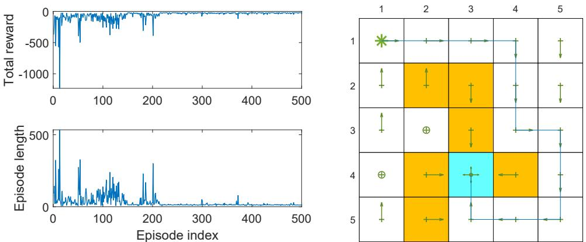  
图 8.9：使用线性函数近似的 Sarsa 算法。其中 $\gamma = 0.9$，$\epsilon = 0.1$，$r_{\mathrm{boundary}} = r_{\mathrm{forbidden}} = -10$，$r_{\mathrm{target}} = 1$，$\alpha = 0.001$。

# 算法 8.2：使用函数近似的 Sarsa

**初始化：**
- 初始参数 $w_{0}$
- 初始策略 $\pi_{0}$
- 对所有 $t$，$\alpha_{t} = \alpha > 0$
- $\epsilon \in (0,1)$

**目标：** 学习一个最优策略，能够使智能体从初始状态 $s_{0}$ 到达目标状态

**对每个回合执行：**
1. 根据 $\pi_{0}(s_{0})$ 在 $s_{0}$ 生成 $a_{0}$
2. 如果 $s_{t}$ $(t = 0, 1, 2, \ldots)$ 不是目标状态，则执行：
   - 收集给定 $(s_{t}, a_{t})$ 的经验样本 $(r_{t+1}, s_{t+1}, a_{t+1})$：
     - 通过与环境的交互生成 $r_{t+1}, s_{t+1}$
     - 根据 $\pi_{t}(s_{t+1})$ 生成 $a_{t+1}$
   - 更新 $q$ 值：
     $$
     w_{t+1}' = w_{t} + \alpha_{t} \Big[ r_{t+1} + \gamma \hat{q}(s_{t+1}, a_{t+1}, w_{t}) - \hat{q}(s_{t}, a_{t}, w_{t}) \Big] \nabla_{w} \hat{q}(s_{t}, a_{t}, w_{t})
     $$
   - 更新策略：
     $$
     \pi_{t+1}(a|s_{t}) = 
     \begin{cases}
     1 - \frac{\epsilon}{|A(s_{t})|}(|A(s_{t})| - 1) & \text{若 } a = \arg\max_{a \in \mathcal{A}(s_{t})} \hat{q}(s_{t}, a, w_{t+1}) \\
     \frac{\epsilon}{|A(s_{t})|} & \text{否则}
     \end{cases}
     $$
   - $s_{t} \gets s_{t+1}, a_{t} \gets a_{t+1}$

# 8.3.2 使用函数近似的 Q-learning

表格型 Q-learning 也可以扩展到函数近似的情况。其更新规则为：

$$
w_{t+1} = w_t + \alpha_t \left[ r_{t+1} + \gamma \max_{a \in \mathcal{A}(s_{t+1})} \hat{q}(s_{t+1}, a, w_t) - \hat{q}(s_t, a_t, w_t) \right] \nabla_w \hat{q}(s_t, a_t, w_t).
$$

上述更新规则与 (8.35) 类似，不同之处在于 (8.35) 中的 $\hat{q}(s_{t+1}, a_{t+1}, w_t)$ 被替换为 $\max_{a \in \mathcal{A}(s_{t+1})} \hat{q}(s_{t+1}, a, w_t)$。

与表格型情况类似，(8.36) 可以以同策略或异策略的方式实现。算法 8.3 给出了一个同策略版本。图 8.10 展示了一个演示同策略版本的示例。在此示例中，任务是找到一个能够将智能体从左上角状态引导至目标状态的优良策略。

**算法 8.3：使用函数近似的 Q-learning（同策略版本）**

- **初始化**：初始化参数 $w_0$。初始化策略 $\pi_0$。对所有 $t$，设置 $\alpha_t = \alpha > 0$。设置 $\gamma \in (0,1)$。目标：学习一个能够将智能体从初始状态 $S_0$ 引导至目标状态的最优路径。

- **对于每个回合，执行**：
  - 如果 $s_t$ ($t = 0,1,2,\ldots$) 不是目标状态，则执行：
    - 收集给定 $s_t$ 的经验样本 $(a_t, r_{t+1}, s_{t+1})$：根据 $\pi_t(s_t)$ 生成 $a_t$；通过与环境的交互生成 $r_{t+1}$ 和 $s_{t+1}$。
    - 更新 Q 值：
      $$
      w_{t+1} = w_t + \alpha_t \left[ r_{t+1} + \gamma \max_{a \in \mathcal{A}(s_{t+1})} \hat{q}(s_{t+1}, a, w_t) - \hat{q}(s_t, a_t, w_t) \right] \nabla_w \hat{q}(s_t, a_t, w_t)
      $$
    - 更新策略：
      $$
      \pi_{t+1}(a|s_t) =
      \begin{cases}
      1 - \frac{\epsilon}{|\mathcal{A}(s_t)|} & \text{如果 } a = \arg\max_{a \in \mathcal{A}(s_t)} \hat{q}(s_t, a, w_{t+1}) \\
      \frac{\epsilon}{|\mathcal{A}(s_t)|} & \text{否则}
      \end{cases}
      $$

可以看出，使用线性函数近似的 Q-learning 能够成功学习到最优策略。这里使用了五阶线性傅里叶基函数。异策略版本将在第 8.4 节介绍深度 Q-learning 时进行演示。

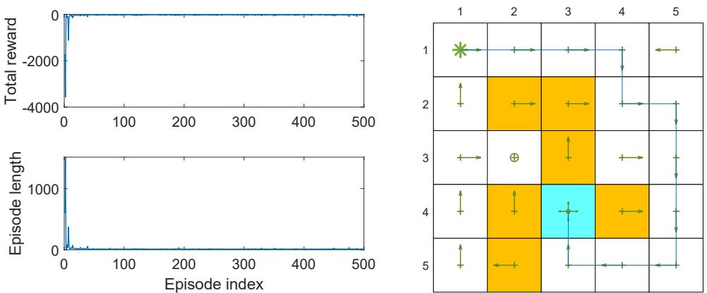

**图 8.10**：使用线性函数近似的 Q-learning。此处，$\gamma = 0.9$，$\epsilon = 0.1$，$r_{\text{forbidden}} = -10$，$r_{\text{target}} = 1$，$\alpha = 0.001$。

在算法 8.2 和算法 8.3 中，可能会注意到，虽然价值是用函数表示的，但策略 $\pi(a|s)$ 仍然以表格形式表示。因此，它仍然假设状态和动作的数量是有限的。在第 9 章中，我们将看到策略也可以表示为函数，从而能够处理连续的状态和动作空间。

# 8.4 深度 Q 学习

我们可以将深度神经网络整合到 Q 学习中，从而得到一种称为深度 Q 学习或深度 Q 网络（DQN）的方法 [22,60,61]。深度 Q 学习是最早且最成功的深度强化学习算法之一。值得注意的是，神经网络并不一定需要很深。对于简单任务（例如我们的网格世界示例），具有一或两个隐藏层的浅层网络可能就足够了。

深度 Q 学习可以视为（8.36）中算法的扩展。然而，其数学公式和实现技术存在显著差异，值得特别关注。

# 8.4.1 算法描述

从数学角度讲，深度 Q 学习旨在最小化以下目标函数：

$$
J = \mathbb{E} \left[ \left( R + \gamma \max_{a \in A(S^{\prime})} \hat{q}(S^{\prime}, a, w) - \hat{q}(S, A, w) \right)^2 \right],
$$

其中 $(S, A, R, S^{\prime})$ 是表示状态、动作、即时奖励和下一状态的随机变量。该目标函数可被视为贝尔曼最优误差的平方。这是因为

$$
q(s, a) = \mathbb{E} \left[ R_{t+1} + \gamma \max_{a \in A(S_{t+1})} q(S_{t+1}, a) \Big| S_t = s, A_t = a \right], \quad \text{对所有 } s, a
$$

是贝尔曼最优方程（证明见方框 7.5）。因此，当 $\hat{q}(S, A, w)$ 能准确近似最优动作值时，$R + \gamma \max_{a \in \mathcal{A}(S^{\prime})} \hat{q}(S^{\prime}, a, w) - \hat{q}(S, A, w)$ 在期望意义上应等于零。

为最小化 (8.37) 中的目标函数，我们可以使用梯度下降算法。为此，需要计算 $J$ 关于 $w$ 的梯度。需注意参数 $w$ 不仅出现在 $\hat{q}(S, A, w)$ 中，还出现在 $y \doteq R + \gamma \max_{a \in \mathcal{A}(S^{\prime})} \hat{q}(S^{\prime}, a, w)$ 中。因此，梯度计算并非易事。为简化起见，假设 $y$ 中的 $w$ 值固定（在短时间内），这样梯度计算会变得容易得多。具体来说，我们引入两个网络：一个是表示 $\hat{q}(s, a, w)$ 的主网络，另一个是目标网络 $\hat{q}(s, a, w_T)$。此时目标函数变为

$$
J = \mathbb{E} \left[ \left( R + \gamma \max_{a \in \mathcal{A}(S^{\prime})} \hat{q}(S^{\prime}, a, w_T) - \hat{q}(S, A, w) \right)^2 \right],
$$

其中 $w_T$ 是目标网络的参数。当 $w_T$ 固定时，$J$ 的梯度为

$$
\nabla_w J = -\mathbb{E} \left[ \left( R + \gamma \max_{a \in A(S^{\prime})} \hat{q}(S^{\prime}, a, w_T) - \hat{q}(S, A, w) \right) \nabla_w \hat{q}(S, A, w) \right],
$$

其中不失一般性地省略了一些常数系数。

要使用 (8.38) 中的梯度来最小化目标函数，需要注意以下技术。

## 技术要点

### 第一项技术：双网络结构

第一项技术是使用两个网络——主网络和目标网络，正如我们在计算 (8.38) 中的梯度时所提到的。具体实现细节如下。令 $w$ 和 $w_T$ 分别表示主网络和目标网络的参数，初始时它们被设置为相同值。

在每次迭代中，我们从回放缓冲区（稍后将解释回放缓冲区）中抽取一个小批量的样本 $\{(s, a, r, s^{\prime})\}$。主网络的输入是 $s$ 和 $a$，输出 $y = \hat{q}(s, a, w)$ 是估计的 q 值。输出的目标值为 $y_T \doteq r + \gamma \max_{a \in \mathcal{A}(s^{\prime})} \hat{q}(s^{\prime}, a, w_T)$。主网络通过最小化样本 $\{(s, a, y_T)\}$ 上的 TD 误差（也称为损失函数）$\sum (y - y_T)^2$ 来进行更新。

主网络中 $w$ 的更新并不显式使用 (8.38) 中的梯度，而是依赖于现有的神经网络训练软件工具。因此，我们需要用小批量的样本来训练网络，而不是基于 (8.38) 使用单个样本来更新主网络。这是深度与非深度强化学习算法之间的一个显著区别。

主网络在每次迭代中都会更新，而目标网络则每隔一定迭代次数被设置成与主网络相同，以满足计算 (8.38) 梯度时 $w_T$ 固定的假设。

### 第二项技术：经验回放

第二项技术是经验回放 [22,60,62]。即在收集到一些经验样本后，我们不按照它们被收集的顺序使用这些样本，而是将它们存储在一个称为回放缓冲区的数据集中。具体来说，令 $(s, a, r, s^{\prime})$ 为一个经验样本，$B \doteq \{(s, a, r, s^{\prime})\}$ 为回放缓冲区。每次更新主网络时，我们可以从回放缓冲区中抽取一个小批量的经验样本。样本的抽取（或称经验回放）应遵循均匀分布。

为什么深度 Q 学习中需要经验回放，且回放必须遵循均匀分布？答案在于 (8.37) 中的目标函数。具体来说，为了明确定义目标函数，我们必须指定 $S, A, R, S^{\prime}$ 的概率分布。一旦给定 $(S, A)$，$R$ 和 $S^{\prime}$ 的分布就由系统模型决定。描述状态-动作对 $(S, A)$ 分布的最简单方法是假设其服从均匀分布。

然而，状态-动作样本在实践中可能并非均匀分布，因为它们是依据行为策略生成的样本序列。为了满足均匀分布的假设，需要打破序列中样本之间的相关性。为此，我们可以使用经验回放技术，通过从回放缓冲区中均匀抽取样本来实现。这就是为什么需要经验回放以及经验回放必须遵循均匀分布的数学原因。随机抽样的一个好处是每个经验样本可能被多次使用，这可以提高数据效率。当我们数据量有限时，这一点尤其重要。

## 算法实现

**算法 8.3：深度 Q 学习（离策略版本）**

**初始化：** 具有相同初始参数的主网络和目标网络。

**目标：** 从给定行为策略 $\pi_b$ 生成的经验样本中学习一个最优目标网络，以近似最优动作值。

1. 将 $\pi_b$ 生成的经验样本存储在回放缓冲区 $B = \{(s, a, r, s^{\prime})\}$ 中
2. 对每次迭代，执行：
   - 从 $B$ 中均匀抽取一个小批量的样本
   - 对每个样本 $(s, a, r, s^{\prime})$，计算目标值 $y_T = r + \gamma \max_{a \in A(s^{\prime})} \hat{q}(s^{\prime}, a, w_T)$，其中 $w_T$ 是目标网络的参数
   - 使用小批量样本更新主网络以最小化 $(y_T - \hat{q}(s, a, w))^2$

深度 Q 学习的实现过程总结在算法 8.3 中。此实现是离策略的。如果需要，也可以调整为同策略版本。

# 8.4.2 示例说明

图8.11给出了一个演示算法8.3的示例。该示例旨在学习每个状态-动作对的最优动作值。一旦获得最优动作值，即可立即得到最优贪心策略。

通过图8.11(a)所示的行为策略生成单个回合。该行为策略具有探索性，因为在任何状态下采取任何动作的概率均相同。如图8.11(b)所示，该回合仅包含1,000步。虽然只有1,000步，但由于行为策略强大的探索能力，该回合中几乎访问了所有状态-动作对。回放缓冲区包含1,000个经验样本集合。小批量大小为100，意味着每次从回放缓冲区中均匀抽取100个样本。

主网络和目标网络具有相同结构：包含一个具有100个神经元的隐藏层（层数和神经元数量可调）。该神经网络有三个输入和一个输出。前两个输入是状态归一化后的行索引和列索引。第三个输入是归一化后的动作索引。这里的"归一化"指将值转换到[0,1]区间。网络输出是估计值。将输入设计为状态的行列坐标而非状态索引的原因在于，我们知道状态对应网格中的二维位置。设计网络时使用的状态信息越丰富，网络性能就越好。此外，神经网络也可以采用其他设计方式。例如，可以设计为两个输入和五个输出，其中两个输入是状态归一化后的行列坐标，输出是对应输入状态的五个估计动作值[22]。

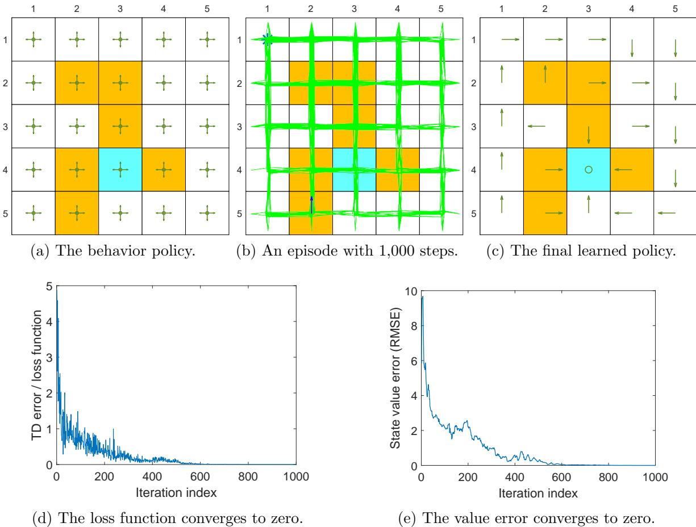  
图8.11：通过深度Q学习实现最优策略学习。其中$\gamma = 0.9$，$r_{\mathrm{boundary}} = r_{\mathrm{forbidden}} = -10$，$r_{\mathrm{target}} = 1$。批处理大小为100。

如图8.11(d)所示，定义为每个小批量TD误差平方均值的损失函数收敛至零，表明网络能很好拟合训练样本。如图8.11(e)所示，状态值估计误差也收敛至零，表明最优动作值的估计已足够精确。此时对应的贪心策略即为最优策略。

本示例展示了深度Q学习的高效性。特别值得注意的是，此处仅需1,000步的短回合即可获得最优策略。相比之下，如表格式Q学习（图7.4所示）需要100,000步的回合。高效性的原因之一在于函数逼近方法具有强大的泛化能力，另一原因在于经验样本可以被重复使用。

接下来我们通过考虑经验样本更少的场景来刻意挑战深度Q学习算法。图8.12展示了仅包含100步回合的示例。在此示例中，虽然从损失函数收敛至零的角度看网络仍能得到良好训练，但状态估计误差无法收敛至零。这意味着网络能恰当拟合给定的经验样本，但经验样本数量过少以致无法准确估计最优动作值。

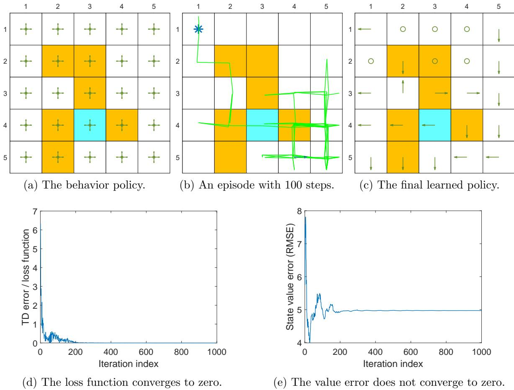  
图8.12：通过深度Q学习实现最优策略学习。其中$\gamma = 0.9$，$r_{\mathrm{boundary}} = r_{\mathrm{forbidden}} = -10$，$r_{\mathrm{target}} = 1$。批处理大小为50。

# 8.5 本章小结

本章继续介绍 TD 学习算法，但重点从表格型方法转向了函数逼近方法。理解函数逼近方法的关键在于认识到它是一个优化问题。最简单的目标函数是真实状态值与估计值之间的均方误差。此外还有其他目标函数，如贝尔曼误差和投影贝尔曼误差。我们证明了 TD-Linear 算法实际上是最小化投影贝尔曼误差。本章还介绍了多种优化算法，例如采用值函数逼近的 Sarsa 和 Q-learning。

值函数逼近方法的重要性在于它使得人工神经网络能够与强化学习相结合。例如，深度 Q-learning 就是最成功的深度强化学习算法之一。

尽管神经网络作为非线性函数逼近器已被广泛使用，但本章全面介绍了线性函数的情况。充分理解线性情况对于更好地理解非线性情况至关重要。感兴趣的读者可参阅文献[63]了解函数逼近的 TD 学习算法的深入分析。关于深度 Q-learning 更理论化的讨论可参考文献[61]。

本章引入了平稳分布这一重要概念。平稳分布在值函数逼近方法中对于定义合适的目标函数起着重要作用，在第九章使用函数逼近策略时也将发挥关键作用。关于该主题的精彩介绍可参考文献[49]第四章。本章内容严重依赖矩阵分析，部分结论直接使用而未加解释。关于矩阵分析和线性代数的优秀参考文献可查阅[4,48]。

# 8.6 问答环节

## 问：表格化方法与函数逼近方法有何区别？

**答：** 一个重要区别在于值的更新和检索方式。

**如何检索值：** 当值由表格表示时，若要检索某个值，可直接读取表格中的对应条目。然而，当值由函数表示时，我们需要将状态索引 $s$ 输入函数并计算函数值。若函数是人工神经网络，则需要进行从输入到输出的前向传播过程。

**如何更新值：** 当值由表格表示时，若要更新某个值，可直接重写表格中的对应条目。然而，当值由函数表示时，我们必须通过更新函数参数来间接改变值。

## 问：函数逼近方法相比表格化方法有哪些优势？

**答：** 由于状态值的检索方式，函数逼近方法在存储效率上更高。具体而言，表格化方法需要存储 $|S|$ 个值，而函数逼近方法仅需存储一个维度通常远小于 $|S|$ 的参数向量。

由于状态值的更新方式，函数逼近方法还有另一个优点：其泛化能力比表格化方法更强。原因如下：使用表格化方法时，更新一个状态值不会改变其他状态值；而使用函数逼近方法时，更新函数参数会影响多个状态的值。

因此，一个状态的经验样本可以泛化以帮助估计其他状态的值。

## 问：能否统一表格化方法和函数逼近方法？

**答：** 可以。表格化方法可视为函数逼近方法的一个特例。相关细节见框8.2。

## 问：什么是平稳分布？为何它很重要？

**答：** 平稳分布描述了马尔可夫决策过程的长期行为。更具体地说，当智能体执行给定策略足够长时间后，智能体访问某个状态的概率可由该平稳分布描述。更多信息见框8.1。

这一概念在本章出现的原因在于，它是定义有效目标函数的必要条件。具体而言，目标函数涉及状态的概率分布，通常选择平稳分布作为该分布。平稳分布不仅对值逼近方法重要，对第9章将介绍的策略梯度方法也很重要。

## 问：线性函数逼近方法有哪些优缺点？

**答：** 线性函数逼近是最简单的情形，其理论性质可被彻底分析。然而，该方法的逼近能力有限。对于复杂任务，选择合适的特征向量也非易事。相比之下，人工神经网络可作为黑盒通用非线性逼近器来逼近值函数，使用更为便捷。尽管如此，研究线性情形对于更好地理解函数逼近方法的思想仍具有重要意义。此外，线性情形的强大之处在于表格化方法可视为其特例（框8.2）。

## 问：为什么深度Q学习需要经验回放？

**答：** 原因在于公式(8.37)中的目标函数。具体而言，为明确定义目标函数，必须指定 $S, A, R, S^{\prime}$ 的概率分布。当 $(S, A)$ 给定时，$R$ 和 $S^{\prime}$ 的分布由系统模型决定。描述状态-动作对 $(S, A)$ 分布的最简方式是假设其服从均匀分布。然而，实际中状态-动作样本可能并非均匀分布，因为它们是由行为策略生成的序列。需要打破序列中样本间的相关性以满足均匀分布假设。为此，可使用经验回放技术从回放缓冲区均匀抽取样本。经验回放的一个好处是每个经验样本可被多次使用，从而提高数据效率。

## 问：表格化Q学习能否使用经验回放？

**答：** 虽然表格化Q学习不需要经验回放，但也可以使用经验回放而不会出现问题。这是因为Q学习由于其离策略属性，对样本获取方式没有要求。使用经验回放的一个好处是样本可被重复使用，因而更高效。

## 问：为什么深度Q学习需要两个网络？

**答：** 根本原因是为了简化公式(8.37)的梯度计算。由于 $w$ 不仅出现在 $\hat{q}(S, A, w)$ 中，还出现在 $R + \gamma \max_{a \in \mathcal{A}(S^{\prime})} \hat{q}(S^{\prime}, a, w)$ 中，计算关于 $w$ 的梯度并非易事。一方面，若固定 $R + \gamma \max_{a \in \mathcal{A}(S^{\prime})} \hat{q}(S^{\prime}, a, w)$ 中的 $w$，则可如公式(8.38)所示轻松计算梯度。该梯度表明应维护两个网络：主网络参数在每次迭代中更新，目标网络参数在特定周期内固定。另一方面，目标网络参数不能永久固定，应每隔一定迭代次数进行更新。

## 问：当使用人工神经网络作为非线性函数逼近器时，应如何更新其参数？

**答：** 必须注意不应直接使用例如公式(8.36)的方法更新参数向量，而应遵循网络训练流程来更新参数。该流程可基于当前成熟且广泛可用的神经网络训练工具包实现。